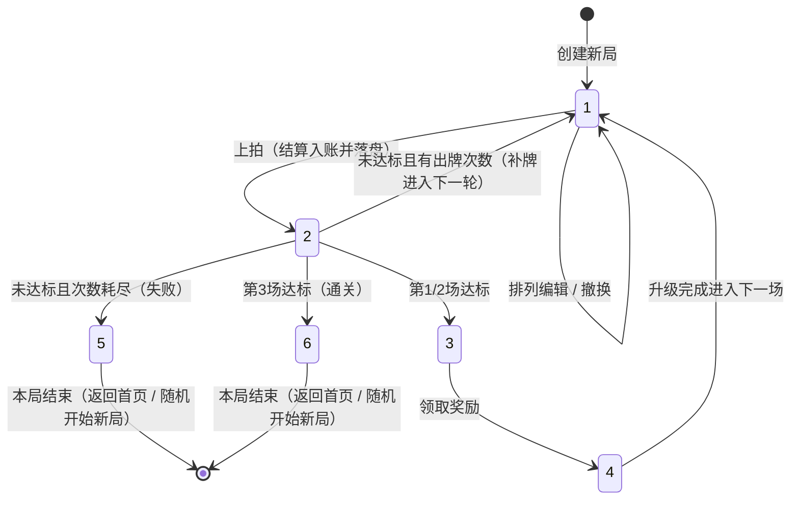
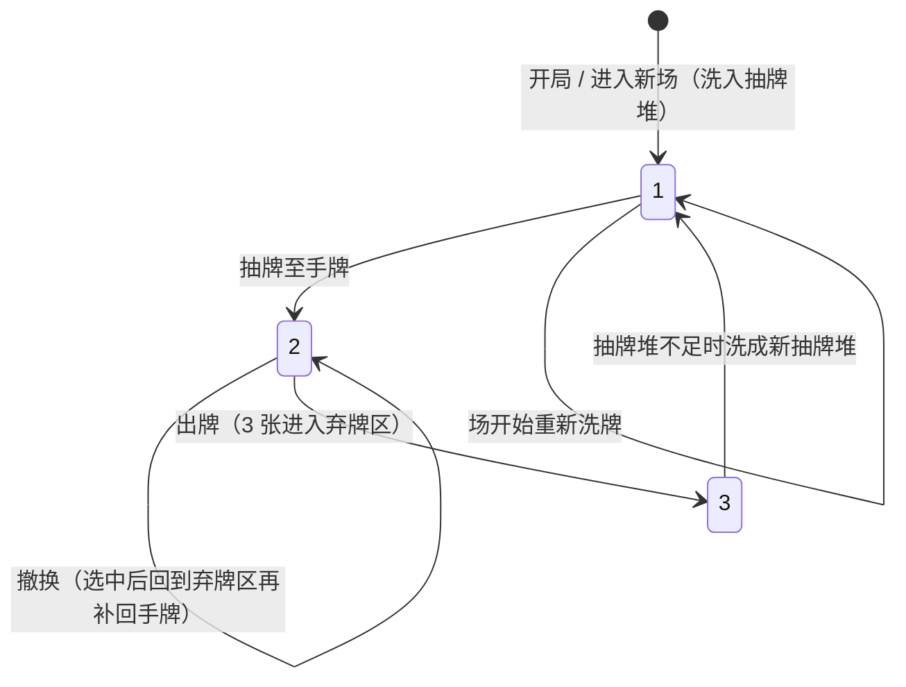

# 数据模型与 DDL · 午夜落槌 · 藏品连锁

> 生成日期：2026-09-20
> PRD 来源：《午夜落槌 · 藏品连锁》从0到1产品需求文档（工作流节点「AI-Spec生成」任务描述）
> 原型来源：无
> 现有表盘点来源：无（全新项目）。目标仓库 `RR9-cn/roguelike-card-game`（commit `606b0c5`）仅含 `README.md`，无 `.sql`、无 migration 目录、无 `.fshows/db-config.yaml`、无服务端数据库。
> 配套 Spec：`midnight-hammer-spec.md`（本文件为其 §12、§17、REQ-014 的数据模型展开）

---

## 一、设计概述

### 1.1 已有表（不新建、不改造，仅关联）

**无。** 本项目为 0→1 全新工程，不存在任何既有业务表、既有数据库连接或既有迁移脚本。

### 1.2 新建表

| 序号 | 表名 | 说明 |
| :---: | --- | --- |
| 1 | `mh_card_template` | 卡牌模板配置（12 种模板的名称、基础点数、类别、能力键与能力文案） |
| 2 | `mh_save_slot` | 存档槽（对局主表：种子、阶段、场次进度、资源、随机流状态、结算结果摘要） |
| 3 | `mh_save_card` | 实牌（每张具体卡：所属存档、模板、永久点数加成、所在牌区与牌区内顺序） |
| 4 | `mh_save_line_slot` | 排列槽（本轮选定的 3 张实牌及其固定顺序） |
| 5 | `mh_save_reward_candidate` | 奖励候选（奖励阶段的 3 个互不相同模板） |
| 6 | `mh_save_settlement_event` | 结算流水（每轮触发/额外触发/热度变化/概率判定事件序列） |
| 7 | `mh_run_history` | 对局历史（已结束对局的结果统计，用于回看与回归比对） |

### 1.3 设计约定

+ **方言适配说明（重要）**：本项目用户已确认产出 **SQLite 建表 DDL**（U-04），而 `ddl-conventions.md` 的强制项（`ENGINE=InnoDB`、`COLLATE utf8mb4_general_ci`、`bigint unsigned auto_increment`、`ON UPDATE CURRENT_TIMESTAMP`、列级 `COMMENT`）为 MySQL 专属语法。本文件按 **SQLite 方言**落地，并对规范强制项做等价替换，逐项列明如下：

| 规范项 | SQLite 等价落地 |
|---|---|
| `id bigint unsigned not null auto_increment` | `id INTEGER PRIMARY KEY AUTOINCREMENT`（SQLite 唯一自增形式） |
| 表级 / 字段级 `COMMENT` | 使用行尾 `-- 注释`，并保证每个字段必有注释（SQLite 无 COMMENT 语法） |
| `ENGINE` / `CHARSET` / `COLLATE` | SQLite 无表空间与排序规则声明，统一使用 UTF-8 文本（`TEXT`/`VARCHAR`） |
| `ON UPDATE CURRENT_TIMESTAMP` | SQLite 不支持，`update_time` 由**应用层**在每次写入时显式赋值（写入契约，见 §1.4 A4） |
| `datetime default CURRENT_TIMESTAMP` | `datetime NOT NULL DEFAULT (datetime('now'))` |
| 每张表 `create_time` + `KEY idx_createtime (create_time)` | 保留 `create_time` 字段与普通索引，但**索引名按表前缀化**（`idx_mh_save_slot_createtime` 等）：规范中的 `idx_createtime` 命名依赖 MySQL「索引名在表内唯一」的语义，而 SQLite 的索引名空间是**库级全局唯一**，7 张表同名 `idx_createtime` 会导致第 2 张表起建索引失败（已实测报错 `index idx_createtime already exists`）。字段语义与索引列完全一致，仅索引标识符加表名前缀 |

+ 表名统一前缀 `mh_`（midnight hammer），与未来可能的其他模块隔离。
+ 表间关联一律使用**业务编码**（`save_id`、`card_id`、`template_id`、`event_id`），**禁止物理外键**；关联目标在字段注释中标注。
+ 每个业务实体表必有业务编码字段并加唯一约束；索引命名遵循「去掉字段内下划线后用下划线连接」：如 `uniq_saveid_cardid`、`idx_saveid_zone`。
+ 状态/类型字段使用 `INTEGER` + 注释完整列出枚举值；枚举值在 Spec 与代码中保持一致。
+ 时间字段统一为 UTC ISO-8601 文本（`datetime`），未发生的时间使用 `1970-01-01 00:00:00`（仅 `mh_run_history.finished_time` 使用）。
+ 软删除统一使用 `is_del INTEGER NOT NULL DEFAULT 0`（`0=未删除，1=已删除`），与 `ddl-conventions.md` 一致；运行时 localStorage 快照不含该字段（单槽固定 `auto`，无删除/重建场景）。
+ **`is_del` 适用范围**：仅 `mh_save_slot`、`mh_save_card` 两张「记录可被逻辑删除」的业务表携带 `is_del`。`mh_save_line_slot`、`mh_save_reward_candidate` 属**整体重建的派生表**（每次提交按快照整表替换，无单条逻辑删除语义），`mh_save_settlement_event`、`mh_run_history` 属**只插不改的追加型表**（沿用 `ddl-conventions.md` 对追加型表的豁免），`mh_card_template` 属**配置表**（用 `enabled` 表达启停）。上述表不加 `is_del` 以避免永不被写入的死字段；若未来出现按单条删除的诉求，再按规范补齐并同步快照契约。
+ 单存档槽设计：`mh_save_slot.save_id` 固定为 `auto`（PRD §15 只要求一份自动存档）；表结构保留多槽扩展能力。
+ 运行时持久化默认使用 **localStorage 单键 JSON 快照**（U-03），其字段与本章表结构 1:1 映射（见第六章）；SQLite 表结构作为**规范数据模型**，并作为桌面壳（Tauri v2）可选适配器的建表依据（U-04、D-04）。

### 1.4 设计假设与待确认项

| 编号 | 模糊点 | 当前假设 | 状态 |
|---|---|---|---|
| A1 | 木槌读取额外触发计数的口径（PRD §8.3 与 §9.2 存在两种读法） | 按 Spec D-01：计数在额外触发派发时 +1，能力读取本次触发开始前的快照 → 木槌被额外触发时不计入自身；`木槌→镜子→镜子` = 18 点 × 3 热度 = 54 | 待确认（Spec §19.4 Q-01） |
| A2 | 桌面壳是否强制以 SQLite 为唯一持久化载体 | 默认沿用 localStorage；SQLite 为可选适配器，两实现共享同一 `save_schema_version` 与迁移链 | 待确认（Spec §19.4 Q-02） |
| A3 | 是否需要保留对局历史（PRD 未要求） | 保留 `mh_run_history`（含 localStorage 快照中的 `runHistory` 数组，最多 20 条），用于通关/失败页回看与回归比对；不参与结算 | 已确认（Agent 默认决策，成本极低且提升可验证性） |
| A4 | `update_time` 在 SQLite 下无自动更新能力 | 由应用层在每次写入时显式赋值（写入契约）；localStorage 路径同样维护 `updatedAt` | 已确认 |
| A5 | 结算流水的存储形态 | 关系表 `mh_save_settlement_event`（规范模型）+ 快照内 `settlementTrace` 数组（运行时）；两者字段一一对应 | 已确认 |
| A6 | 是否需要「撤换选择集」持久化 | 不持久化（属瞬时 UI 状态，PRD §15.2 未列入存档内容）；刷新后撤换选择清空 | 已确认 |
| A7 | 排列槽 `lineSlots` 的落盘时机 | 每次排列编辑（选择/移动/移除/清空）即作为一次持久化命令落盘，保证"内存与存档恒等"；属对 PRD §15.1 保存时机的补充（PRD 为最低要求） | 已确认（Spec §12.3） |

---

## 二、表关系总览

```plain
mh_card_template (卡牌模板 · 12 条参考数据)
        ▲
        │ (template_id) 被引用，不建物理外键
        │
mh_save_slot (存档槽 · 一局一档)
        │
        ├── 1:N ──► mh_save_card (实牌)
        │               ▲
        │               │ (card_id)
        │               │
        ├── 0:3 ──► mh_save_line_slot (排列槽)
        │               ▲
        │               │ (card_id 必须存在于 mh_save_card 且 zone=hand)
        │               │
        ├── 0:3 ──► mh_save_reward_candidate (奖励候选)
        │               ▲
        │               │ (template_id 引用 mh_card_template)
        │               │
        └── 0:N ──► mh_save_settlement_event (结算流水)

mh_run_history (对局历史 · 独立追加型表，通过 run_id / seed 关联，不建物理外键)

关系说明：
  mh_save_slot 1:N mh_save_card              —— 一份存档包含该局全部实牌（开局 10 张，两次奖励后 12 张）
  mh_save_slot 1:N mh_save_line_slot         —— 一份存档最多 3 个排列槽（当前轮次选定顺序）
  mh_save_slot 1:N mh_save_reward_candidate  —— 奖励阶段恰好 3 个候选，其余阶段为 0
  mh_save_slot 1:N mh_save_settlement_event  —— 每轮结算产生 N 条事件（触发/额外触发/热度/概率）
  mh_card_template 1:N mh_save_card          —— 模板被实牌引用（同名实牌可多张）
  mh_card_template 1:N mh_save_reward_candidate —— 候选引用模板
  mh_save_card 1:0..1 mh_save_line_slot      —— 一张实牌最多占一个排列槽
  跨表不变量：mh_save_card 中 zone ∈ {hand, draw, discard} 的并集 = 该存档全部实牌；card_id 在同一 save_id 内唯一
```

---

## 三、关键状态流转

### 3.1 对局阶段状态机（`mh_save_slot.phase`）



#### 状态转换明细

| 当前状态 | 触发事件 | 目标状态 | 操作角色 |
| --- | --- | --- | --- |
| — | 创建新局 | `1 = hand` | 玩家 |
| `1 = hand` | 排列编辑 / 撤换 | `1 = hand` | 玩家 |
| `1 = hand` | 上拍（PLAY，成交价入账） | `2 = settlement` | 玩家 |
| `2 = settlement` | 结算继续：未达标且 `plays_left > 0` | `1 = hand` | 玩家 |
| `2 = settlement` | 结算继续：第 1/2 场达标 | `3 = reward_pick` | 系统 |
| `2 = settlement` | 结算继续：第 3 场达标 | `6 = run_won`（直接通关，**不进入奖励与升级**） | 系统 |
| `2 = settlement` | 结算继续：未达标且 `plays_left = 0` | `5 = run_lost` | 系统 |
| `3 = reward_pick` | 领取 1 个候选模板 | `4 = upgrade_pick` | 玩家 |
| `4 = upgrade_pick` | 选择 1 张实牌 +2 点 | `1 = hand`（下一场） | 玩家 |

> 说明：PRD §11 规定第 1、2 场胜利后「依次执行三选一收集 → 点数升级」，因此 `reward_pick` 必然跟随 `upgrade_pick`；PRD §12 规定第 3 场胜利**直接进入通关页**，不再发放奖励与升级，因此 `2 → 6 = run_won`（对局结束，写入 `mh_run_history`）。该判定顺序与 Spec §7.2 ACTION-007、`tech-analysis` §4.4.1 完全一致。

#### `phase` 枚举值（与 Spec §7.1 一一对应）

| 取值 | 含义 |
| --- | --- |
| `1` | `hand` 手牌阶段 |
| `2` | `settlement` 结算阶段 |
| `3` | `reward_pick` 奖励三选一 |
| `4` | `upgrade_pick` 点数升级 |
| `5` | `run_lost` 本局失败 |
| `6` | `run_won` 本局通关 |

### 3.2 实牌位置状态机（`mh_save_card.zone`）



| 当前状态 | 触发事件 | 目标状态 | 说明 |
| --- | --- | --- | --- |
| — | 开局 / 进入新场 | `1 = draw`（抽牌堆） | 完整收藏洗入抽牌堆 |
| `1 = draw` | 抽牌至手牌 | `2 = hand` | 手牌上限 6 |
| `2 = hand` | 撤换 | `3 = discard` → 立即补牌回 `2 = hand` | 消耗 1 次撤换次数 |
| `2 = hand` | 出牌 | `3 = discard` | 3 张已出牌 |
| `3 = discard` | 抽牌堆不足 | `1 = draw` | 弃牌区洗成新抽牌堆 |

> `zone` 枚举：`1 = draw` 抽牌堆，`2 = hand` 手牌，`3 = discard` 弃牌区。排列槽不改变 `zone`（槽位中的实牌仍属 `hand`）。

---

## 四、DDL 建表语句

### 4.1 mh_card_template（卡牌模板）

```sql
CREATE TABLE `mh_card_template` (
    `id` INTEGER PRIMARY KEY AUTOINCREMENT,                              -- 主键
    `template_id` VARCHAR(32) NOT NULL,                                  -- 模板业务编码（如 coin / mirror）
    `name` VARCHAR(64) NOT NULL,                                         -- 卡牌名称
    `base_points` INTEGER NOT NULL DEFAULT 0,                            -- 基础点数（>= 0）
    `category` VARCHAR(16) NOT NULL,                                     -- 类别：collectible=藏品，tool=工具，oddity=诡物
    `ability_key` VARCHAR(32) NOT NULL DEFAULT '',                       -- 能力实现键（对应 ABILITY_REGISTRY）；空串表示无能力
    `ability_text` VARCHAR(255) NOT NULL DEFAULT '',                     -- 能力文案（展示与规则弹窗使用）
    `enabled` INTEGER NOT NULL DEFAULT 1,                                -- 是否启用：0=停用，1=启用
    `create_time` DATETIME NOT NULL DEFAULT (datetime('now')),           -- 创建时间（UTC）
    `update_time` DATETIME NOT NULL DEFAULT (datetime('now')),           -- 修改时间（UTC，由应用层写入）
    UNIQUE (`template_id`)
);
CREATE INDEX `idx_mh_card_template_createtime` ON `mh_card_template` (`create_time`);
```

**种子数据（12 种模板，必须与 Spec REQ-006 完全一致）**

```sql
INSERT INTO `mh_card_template` (`template_id`, `name`, `base_points`, `category`, `ability_key`, `ability_text`) VALUES
('coin',      '染血银币', 6, 'collectible', 'coin',      '左侧牌当前点数低于自己时，热度+2。'),
('mirror',    '裂纹镜',   2, 'tool',        'mirror',    '让左侧牌完整额外触发一次。'),
('hammer',    '封印木槌', 4, 'tool',        'hammer',    '每次触发时，已经发生的每次额外触发使热度+1。'),
('vase',      '鎏金古瓶', 9, 'collectible', 'none',      '没有额外能力，只贡献点数。'),
('candle',    '长明烛',   3, 'oddity',      'candle',    '每次触发，热度+2。'),
('bell',      '回声铃',   3, 'tool',        'bell',      '左侧牌与自己类别相同时，让左侧牌完整额外触发一次。'),
('glove',     '红手套',   4, 'oddity',      'glove',     '有50%概率让左侧牌完整额外触发一次。'),
('ledger',    '旧账簿',   4, 'collectible', 'ledger',    '三张出牌中，每有一张当前点数不大于4的牌，热度+1。'),
('mask',      '无面假面', 5, 'oddity',      'mask',      '左侧牌与自己类别不同时，热度+3。'),
('prism',     '异色棱晶', 4, 'collectible', 'prism',     '三张出牌包含三种不同类别时，热度+4。'),
('hourglass', '逆流沙漏', 2, 'tool',        'hourglass', '自己位于第三位时，让第一位卡牌完整额外触发一次。'),
('crown',     '空王冠',   8, 'collectible', 'crown',     '三张出牌的当前点数均不小于5时，热度+5。');
```

### 4.2 mh_save_slot（存档槽 / 对局主表）

```sql
CREATE TABLE `mh_save_slot` (
    `id` INTEGER PRIMARY KEY AUTOINCREMENT,                              -- 主键
    `save_id` VARCHAR(32) NOT NULL,                                      -- 存档业务编码（单槽固定 auto）
    `save_schema_version` INTEGER NOT NULL DEFAULT 1,                    -- 存档结构版本（当前 1）
    `rules_version` VARCHAR(16) NOT NULL DEFAULT '1.0.0',                -- 规则版本（主.次.修订）
    `seed` VARCHAR(100) NOT NULL,                                        -- 本局种子（1-100 字符）
    `op_seq` INTEGER NOT NULL DEFAULT 0,                                 -- 操作序号（递增，用于过期拒绝与幂等）
    `phase` INTEGER NOT NULL DEFAULT 1,                                  -- 阶段：1=hand，2=settlement，3=reward_pick，4=upgrade_pick，5=run_lost，6=run_won
    `act_index` INTEGER NOT NULL DEFAULT 1,                              -- 当前场次：1/2/3
    `act_score` INTEGER NOT NULL DEFAULT 0,                              -- 本场累计成交（进入新场归零）
    `round_no` INTEGER NOT NULL DEFAULT 1,                               -- 本场当前轮次（1-4）
    `plays_left` INTEGER NOT NULL DEFAULT 4,                             -- 剩余出牌次数（0-4）
    `mulligans_left` INTEGER NOT NULL DEFAULT 2,                         -- 剩余撤换次数（0-2）
    `best_round` INTEGER NOT NULL DEFAULT 0,                             -- 本局最高单轮成交价
    `next_card_seq` INTEGER NOT NULL DEFAULT 11,                         -- 下一个实牌序号（用于生成 card_id）
    `rng_draw_state` VARCHAR(64) NOT NULL DEFAULT '',                    -- 抽牌随机流状态（格式 state:increment）
    `rng_reward_state` VARCHAR(64) NOT NULL DEFAULT '',                  -- 奖励随机流状态（格式同上）
    `rng_chance_state` VARCHAR(64) NOT NULL DEFAULT '',                  -- 概率随机流状态（格式同上）
    `pending_points` INTEGER NOT NULL DEFAULT 0,                         -- 最近一次结算累计点数（恢复结算用）
    `pending_heat` INTEGER NOT NULL DEFAULT 1,                           -- 最近一次结算最终热度
    `pending_price` INTEGER NOT NULL DEFAULT 0,                          -- 最近一次结算成交价
    `floor_price` INTEGER NOT NULL DEFAULT 0,                            -- 最近一次结算的保底成交价（不变量基准）
    `collected_reward` INTEGER NOT NULL DEFAULT 0,                       -- 本场奖励是否已领取：0=否，1=是
    `upgraded` INTEGER NOT NULL DEFAULT 0,                               -- 本场升级是否已执行：0=否，1=是
    `run_finished` INTEGER NOT NULL DEFAULT 0,                           -- 本局是否已结束：0=进行中，1=已结束
    `is_del` INTEGER NOT NULL DEFAULT 0,                                 -- 软删除：0=未删除，1=已删除
    `create_time` DATETIME NOT NULL DEFAULT (datetime('now')),           -- 创建时间（UTC）
    `update_time` DATETIME NOT NULL DEFAULT (datetime('now')),           -- 修改时间（UTC，由应用层写入）
    UNIQUE (`save_id`)
);
CREATE INDEX `idx_mh_save_slot_createtime` ON `mh_save_slot` (`create_time`);
```

### 4.3 mh_save_card（实牌）

```sql
CREATE TABLE `mh_save_card` (
    `id` INTEGER PRIMARY KEY AUTOINCREMENT,                              -- 主键
    `card_id` VARCHAR(32) NOT NULL,                                      -- 实牌业务编码（格式 c<正整数>，同一局内唯一）
    `save_id` VARCHAR(32) NOT NULL,                                      -- 存档业务编码（关联 mh_save_slot.save_id）
    `template_id` VARCHAR(32) NOT NULL,                                  -- 模板业务编码（关联 mh_card_template.template_id）
    `point_bonus` INTEGER NOT NULL DEFAULT 0,                            -- 永久点数加成（>= 0，每次升级 +2）
    `zone` INTEGER NOT NULL DEFAULT 1,                                   -- 所在牌区：1=draw 抽牌堆，2=hand 手牌，3=discard 弃牌区
    `zone_order` INTEGER NOT NULL DEFAULT 0,                             -- 牌区内顺序（洗牌与补牌顺序，用于恢复）
    `is_del` INTEGER NOT NULL DEFAULT 0,                                 -- 软删除：0=未删除，1=已删除
    `create_time` DATETIME NOT NULL DEFAULT (datetime('now')),           -- 创建时间（UTC）
    `update_time` DATETIME NOT NULL DEFAULT (datetime('now')),           -- 修改时间（UTC，由应用层写入）
    UNIQUE (`save_id`, `card_id`)
);
CREATE INDEX `idx_mh_save_card_createtime` ON `mh_save_card` (`create_time`);
CREATE INDEX `idx_saveid_zone` ON `mh_save_card` (`save_id`, `zone`);
```

### 4.4 mh_save_line_slot（排列槽）

```sql
CREATE TABLE `mh_save_line_slot` (
    `id` INTEGER PRIMARY KEY AUTOINCREMENT,                              -- 主键
    `line_slot_id` VARCHAR(32) NOT NULL,                                 -- 排列槽业务编码（格式 <save_id>-<slot_index>）
    `save_id` VARCHAR(32) NOT NULL,                                      -- 存档业务编码（关联 mh_save_slot.save_id）
    `slot_index` INTEGER NOT NULL,                                       -- 槽位序号：0/1/2（即触发顺序）
    `card_id` VARCHAR(32) NOT NULL,                                      -- 实牌业务编码（关联 mh_save_card.card_id，必须属本存档且 zone=hand）
    `create_time` DATETIME NOT NULL DEFAULT (datetime('now')),           -- 创建时间（UTC）
    `update_time` DATETIME NOT NULL DEFAULT (datetime('now')),           -- 修改时间（UTC，由应用层写入）
    UNIQUE (`save_id`, `slot_index`),
    UNIQUE (`save_id`, `card_id`)
);
CREATE INDEX `idx_mh_save_line_slot_createtime` ON `mh_save_line_slot` (`create_time`);
```

### 4.5 mh_save_reward_candidate（奖励候选）

```sql
CREATE TABLE `mh_save_reward_candidate` (
    `id` INTEGER PRIMARY KEY AUTOINCREMENT,                              -- 主键
    `candidate_id` VARCHAR(32) NOT NULL,                                 -- 候选业务编码（格式 <save_id>-r<index>）
    `save_id` VARCHAR(32) NOT NULL,                                      -- 存档业务编码（关联 mh_save_slot.save_id）
    `candidate_index` INTEGER NOT NULL,                                  -- 候选序号：0/1/2
    `template_id` VARCHAR(32) NOT NULL,                                  -- 候选模板业务编码（关联 mh_card_template.template_id）
    `picked` INTEGER NOT NULL DEFAULT 0,                                 -- 是否已领取：0=未领取，1=已领取
    `create_time` DATETIME NOT NULL DEFAULT (datetime('now')),           -- 创建时间（UTC）
    `update_time` DATETIME NOT NULL DEFAULT (datetime('now')),           -- 修改时间（UTC，由应用层写入）
    UNIQUE (`save_id`, `candidate_index`),
    UNIQUE (`save_id`, `template_id`)
);
CREATE INDEX `idx_mh_save_reward_candidate_createtime` ON `mh_save_reward_candidate` (`create_time`);
```

### 4.6 mh_save_settlement_event（结算流水）

```sql
CREATE TABLE `mh_save_settlement_event` (
    `id` INTEGER PRIMARY KEY AUTOINCREMENT,                              -- 主键
    `event_id` VARCHAR(40) NOT NULL,                                     -- 事件业务编码（格式 <save_id>-<act_index>-<round_no>-<event_index>）
    `save_id` VARCHAR(32) NOT NULL,                                      -- 存档业务编码（关联 mh_save_slot.save_id）
    `act_index` INTEGER NOT NULL,                                        -- 场次：1/2/3
    `round_no` INTEGER NOT NULL,                                         -- 轮次：1-4
    `event_index` INTEGER NOT NULL,                                      -- 事件序号（从 0 递增，即播放顺序）
    `event_type` VARCHAR(16) NOT NULL,                                   -- 事件类型：trigger=普通触发，extra_trigger=额外触发，heat=热度变化，roll=概率判定
    `card_id` VARCHAR(32) NOT NULL DEFAULT '',                           -- 事件主体实牌业务编码（关联 mh_save_card.card_id）
    `slot_index` INTEGER NOT NULL DEFAULT 0,                             -- 主体卡槽位：0/1/2
    `source_card_id` VARCHAR(32) NOT NULL DEFAULT '',                    -- 触发来源实牌业务编码；普通触发为空串
    `points_delta` INTEGER NOT NULL DEFAULT 0,                           -- 本次贡献点数（仅 trigger/extra_trigger 非 0）
    `total_points_after` INTEGER NOT NULL DEFAULT 0,                     -- 事件后的累计点数
    `heat_delta` INTEGER NOT NULL DEFAULT 0,                             -- 热度变化量（heat 事件为 +N）
    `heat_after` INTEGER NOT NULL DEFAULT 1,                             -- 事件后的热度
    `extra_count_after` INTEGER NOT NULL DEFAULT 0,                      -- 事件后的额外触发计数
    `effect_text` VARCHAR(255) NOT NULL DEFAULT '',                      -- 效果文案（含"再次举牌成功/未触发"、"未计入保底"等）
    `roll_success` INTEGER NOT NULL DEFAULT -1,                          -- 概率判定结果：-1=非概率事件，0=未触发，1=成功
    `create_time` DATETIME NOT NULL DEFAULT (datetime('now')),           -- 创建时间（UTC）
    UNIQUE (`save_id`, `act_index`, `round_no`, `event_index`)
);
CREATE INDEX `idx_mh_save_settlement_event_createtime` ON `mh_save_settlement_event` (`create_time`);
CREATE INDEX `idx_saveid_actindex_roundno` ON `mh_save_settlement_event` (`save_id`, `act_index`, `round_no`);
```

### 4.7 mh_run_history（对局历史）

```sql
CREATE TABLE `mh_run_history` (
    `id` INTEGER PRIMARY KEY AUTOINCREMENT,                              -- 主键
    `run_id` VARCHAR(32) NOT NULL,                                       -- 对局业务编码
    `seed` VARCHAR(100) NOT NULL,                                        -- 本局种子（1-100 字符）
    `rules_version` VARCHAR(16) NOT NULL DEFAULT '1.0.0',                -- 结束时使用的规则版本
    `outcome` INTEGER NOT NULL,                                          -- 结果：0=失败，1=通关
    `best_round` INTEGER NOT NULL DEFAULT 0,                             -- 本局最高单轮成交价
    `collection_size` INTEGER NOT NULL DEFAULT 0,                        -- 结束时收藏实牌数量
    `final_act_index` INTEGER NOT NULL DEFAULT 1,                        -- 结束时所在场次：1/2/3
    `finished_time` DATETIME NOT NULL DEFAULT '1970-01-01 00:00:00',     -- 结束时间（UTC；未结束为默认值）
    `create_time` DATETIME NOT NULL DEFAULT (datetime('now')),           -- 创建时间（UTC）
    UNIQUE (`run_id`)
);
CREATE INDEX `idx_mh_run_history_createtime` ON `mh_run_history` (`create_time`);
CREATE INDEX `idx_seed` ON `mh_run_history` (`seed`);
```

> 追加型表（只插不改），按 `ddl-conventions.md` 允许省略 `update_time`。

---

## 五、涉及的原有业务表清单

**无。** 本项目为 0→1 全新工程，本次需求不涉及任何既有业务表（无查询、无修改、无关联）。

- 仓库内不存在 `.sql`、migration 脚本或 DDL 文件；
- 项目未配置 `.fshows/db-config.yaml`，无法也不需要通过 `fshows --json db` 查询真实表结构；
- 因此本文件第四章的 DDL 即本项目全部表结构来源。

---

## 六、运行时持久化契约（localStorage 单键 JSON）与字段映射

> 依据 U-03（运行时载体 = localStorage 单键 JSON）与 U-04（规范数据模型 = SQLite DDL）。两者字段 1:1 映射，SQLite 适配器执行第四章 DDL 后可无损承载同一快照。

### 6.1 键与信封

| 项 | 值 |
|---|---|
| 主存档键 | `mnh.save.auto` |
| 损坏备份键 | `mnh.save.corrupted.<ISO 时间戳>`（最多保留 3 份） |
| AI 会话独立键（`persist: true` 时） | `mnh.ai.session.<sessionId>` |
| 写入方式 | 单键整体覆盖（原子替换）+ 写入后回读校验 |
| 编码 | UTF-8 JSON 文本（禁止 `eval`，仅 `JSON.parse`） |

```json
{
  "saveSchemaVersion": 1,
  "rulesVersion": "1.0.0",
  "saveId": "auto",
  "seed": "review-01",
  "opSeq": 7,
  "phase": "hand",
  "actIndex": 1,
  "actScore": 36,
  "roundNo": 2,
  "playsLeft": 3,
  "mulligansLeft": 2,
  "bestRound": 36,
  "nextCardSeq": 11,
  "rng": { "draw": "123456:789", "reward": "234567:890", "chance": "345678:901" },
  "collection": [
    { "cardId": "c1", "templateId": "vase", "pointBonus": 0, "zone": "hand", "zoneOrder": 0 }
  ],
  "lineSlots": ["c1", "c4", "c7"],
  "pendingSettlement": { "points": 18, "heat": 2, "price": 36, "floorPrice": 36, "trace": [] },
  "rewardCandidates": ["coin", "mask", "prism"],
  "collectedReward": false,
  "upgraded": false,
  "runFinished": false,
  "runHistory": [],
  "createdAt": "2026-09-20T00:00:00Z",
  "updatedAt": "2026-09-20T00:10:00Z"
}
```

### 6.2 字段映射表

| SQLite 表.字段 | JSON 路径 | 类型 | 备注 |
|---|---|---|---|
| `mh_save_slot.save_schema_version` | `saveSchemaVersion` | integer | 迁移入口 |
| `mh_save_slot.rules_version` | `rulesVersion` | string | 可复现性声明 |
| `mh_save_slot.save_id` | `saveId` | string | 单槽固定 `auto` |
| `mh_save_slot.seed` | `seed` | string | — |
| `mh_save_slot.op_seq` | `opSeq` | integer | 幂等与并发检测 |
| `mh_save_slot.phase` | `phase` | string（JSON）/ integer（SQLite） | JSON 用语义枚举，SQLite 用 1–6 |
| `mh_save_slot.act_index` | `actIndex` | integer | — |
| `mh_save_slot.act_score` | `actScore` | integer | — |
| `mh_save_slot.round_no` | `roundNo` | integer | — |
| `mh_save_slot.plays_left` | `playsLeft` | integer | — |
| `mh_save_slot.mulligans_left` | `mulligansLeft` | integer | — |
| `mh_save_slot.best_round` | `bestRound` | integer | — |
| `mh_save_slot.next_card_seq` | `nextCardSeq` | integer | — |
| `mh_save_slot.rng_draw_state` | `rng.draw` | string | `state:increment` |
| `mh_save_slot.rng_reward_state` | `rng.reward` | string | 同上 |
| `mh_save_slot.rng_chance_state` | `rng.chance` | string | 同上 |
| `mh_save_slot.pending_points` | `pendingSettlement.points` | integer | — |
| `mh_save_slot.pending_heat` | `pendingSettlement.heat` | integer | — |
| `mh_save_slot.pending_price` | `pendingSettlement.price` | integer | — |
| `mh_save_slot.floor_price` | `pendingSettlement.floorPrice` | integer | — |
| `mh_save_slot.collected_reward` | `collectedReward` | boolean | — |
| `mh_save_slot.upgraded` | `upgraded` | boolean | — |
| `mh_save_slot.run_finished` | `runFinished` | boolean | — |
| `mh_save_card.card_id` | `collection[].cardId` | string | — |
| `mh_save_card.template_id` | `collection[].templateId` | string | — |
| `mh_save_card.point_bonus` | `collection[].pointBonus` | integer | — |
| `mh_save_card.zone` | `collection[].zone` | string（JSON）/ integer（SQLite） | `hand`/`draw`/`discard` |
| `mh_save_card.zone_order` | `collection[].zoneOrder` | integer | 恢复洗牌与补牌顺序 |
| `mh_save_line_slot.slot_index` / `.card_id` | `lineSlots[]` | array\<string\> | 数组下标即 `slot_index` |
| `mh_save_reward_candidate.template_id` | `rewardCandidates[]` | array\<string\> | 数组下标即 `candidate_index` |
| `mh_save_settlement_event.*` | `pendingSettlement.trace[]` | array\<object\> | 字段名转为 camelCase（见 §6.3） |
| `mh_run_history.*` | `runHistory[]` | array\<object\> | 最多保留 20 条 |

### 6.3 流水事件字段映射

| SQLite 字段 | JSON 字段 | 说明 |
|---|---|---|
| `event_index` | `index` | 播放顺序 |
| `event_type` | `type` | `trigger` / `extra_trigger` / `heat` / `roll` |
| `card_id` | `cardId` | — |
| `slot_index` | `slotIndex` | — |
| `source_card_id` | `sourceCardId`（空串转 `null`） | — |
| `points_delta` | `pointsDelta` | — |
| `total_points_after` | `totalPointsAfter` | — |
| `heat_delta` | `heatDelta` | — |
| `heat_after` | `heatAfter` | — |
| `extra_count_after` | `extraCountAfter` | — |
| `effect_text` | `effect` | — |
| `roll_success` | `rollSuccess`（`-1` 转 `null`） | — |

### 6.4 加载校验清单（存档视为不可信输入）

| 序号 | 校验项 | 失败处理 |
|---|---|---|
| 1 | JSON 可解析且为对象 | `SAVE_CORRUPTED` |
| 2 | `saveSchemaVersion` 受支持（或可迁移） | 迁移 / `SAVE_CORRUPTED` |
| 3 | 必填字段齐全（§6.2 全部映射字段） | `SAVE_CORRUPTED` |
| 4 | 类型正确（整数/字符串/布尔/数组） | `SAVE_CORRUPTED` |
| 5 | 值域合法（`phase`、`zone`、`slotIndex` 0–2、`pointBonus ≥ 0`、`opSeq ≥ 0`、`playsLeft` 0–4、`mulligansLeft` 0–2） | `SAVE_CORRUPTED` |
| 6 | `collection[].cardId` 唯一且与 `nextCardSeq` 一致（无重复、无空洞语义冲突） | `SAVE_CORRUPTED` |
| 7 | `lineSlots` 元素均存在于 `collection` 且 `zone === 'hand'`，长度 ≤ 3，无重复 | `SAVE_CORRUPTED` |
| 8 | 牌区并集 = `collection`（每张实牌恰有一个 `zone`） | `SAVE_CORRUPTED` |
| 9 | `hand` 区实牌数 ≤ 6 | `SAVE_CORRUPTED` |
| 10 | 三条随机流状态格式可解析（`state:increment`） | `SAVE_CORRUPTED` |
| 11 | `rewardCandidates` 长度为 0 或 3，元素互不相同且属于 12 个模板；`phase = reward_pick` 时必须为 3 | `SAVE_CORRUPTED` |
| 12 | `phase = settlement` 时 `pendingSettlement.trace` 非空且 `price = points × heat` | `SAVE_CORRUPTED` |
| 13 | `phase ∈ {run_won, run_lost}` 时 `runFinished = true` | `SAVE_CORRUPTED` |

### 6.5 迁移规则

| 迁移 | 输入 | 输出 | 规则 |
|---|---|---|---|
| （预留）`v1 → v2` | 当前结构 | 未来结构 | 迁移函数为纯函数，只做结构转换；每级迁移后重新执行 §6.4 全量校验 |
| 版本高于当前应用 | 任意 | — | 走损坏流程，保留原文并提示"存档来自更高版本" |
| 迁移链缺失 | 任意 | — | 走损坏流程 |

> 当前 `saveSchemaVersion = 1` 为初始版本，尚无实际迁移；框架与单测样本需在编码阶段一并落地（Spec NFR-006、TC-049）。

---

> **基于**：《午夜落槌 · 藏品连锁》从0到1产品需求文档；`midnight-hammer-spec.md`（REQ-014、REQ-015、§12、§15、§17）；用户决策 U-01–U-05。
> **关联产物**：`midnight-hammer-spec.md`、`task-split/task.md`、`task-split/decision-log.md`、`tech-analysis/midnight-hammer-tech-analysis.md`。

---

## 附录 A：DDL 执行验证记录

> 第四章 DDL 已在 SQLite 3.37（`sqlite3` 内存库）中**逐条实际执行验证**，而非仅做静态检查。

| 验证项 | 方法 | 结果 |
|---|---|---|
| DDL 可执行性 | 提取第四章全部 SQL 语句顺序执行 | 18 条语句全部成功，0 失败 |
| 建表结果 | `sqlite_master` 查询 | 7 张业务表全部创建（`mh_card_template`、`mh_save_slot`、`mh_save_card`、`mh_save_line_slot`、`mh_save_reward_candidate`、`mh_save_settlement_event`、`mh_run_history`） |
| 索引结果 | `sqlite_master` 查询 | 10 个索引全部创建（7 个 `idx_<表名>_createtime` + `idx_saveid_zone` + `idx_saveid_actindex_roundno` + `idx_seed`） |
| 种子数据 | `SELECT count(*) FROM mh_card_template` | 12 条，`template_id` / `base_points` / `category` 与 Spec REQ-006 逐行一致 |
| 写入冒烟 | 插入 1 份存档 + 10 张实牌 + 3 个排列槽 + 3 个奖励候选 + 1 条流水 + 1 条历史 | 全部成功 |
| 唯一约束有效性 | 重复插入 `card_id` / `slot_index` / `candidate_index` / `template_id` | 4 项均被 `UNIQUE` 拒绝（`IntegrityError`），约束生效 |

**验证中发现并已修正的缺陷（记录备查）**：

| # | 缺陷 | 影响 | 修正 |
|---|---|---|---|
| 1 | 7 张表共用索引名 `idx_createtime` | **阻断**：SQLite 索引名空间为库级全局唯一，第 2 张表起报错 `index idx_createtime already exists`，第四章 DDL 无法整体执行 | 索引名加表名前缀（`idx_<表名>_createtime`），并在 §1.3 方言适配表逐项说明与 `ddl-conventions.md` 的偏离原因 |
| 2 | §3.1 状态机将「第 3 场达标」指向 `4 = upgrade_pick` | 与 PRD §12、Spec §7.2/§7.3、`tech-analysis` §4.4.1 矛盾；`6 = run_won` 无入边，第 3 场胜利无法进入通关 | 修正为 `2 → 6 = run_won`（直接通关，不发奖励），并补齐 `run_won` / `run_lost` 的终态出边 |

> 说明：修正后的 DDL 为**唯一可执行版本**，编码阶段可直接用于 SQLite 适配器建表；若后续改为 MySQL 方言，需按 `ddl-conventions.md` 恢复 `idx_createtime` 命名与 MySQL 专属语法（`ENGINE` / `COLLATE` / `ON UPDATE CURRENT_TIMESTAMP` / 列级 `COMMENT`）。
