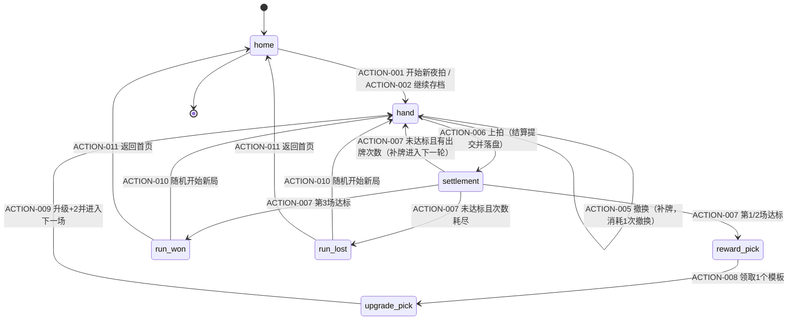
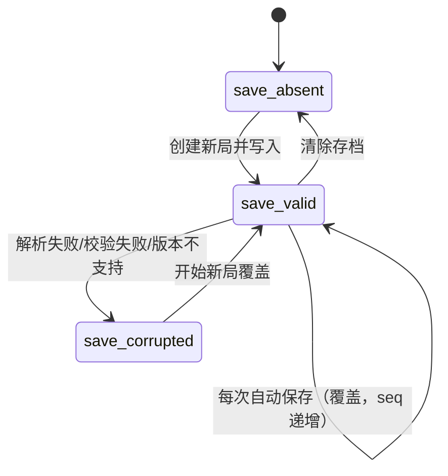
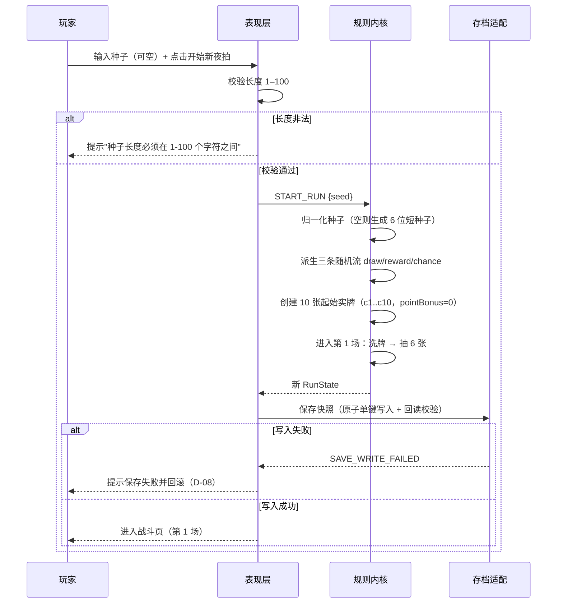
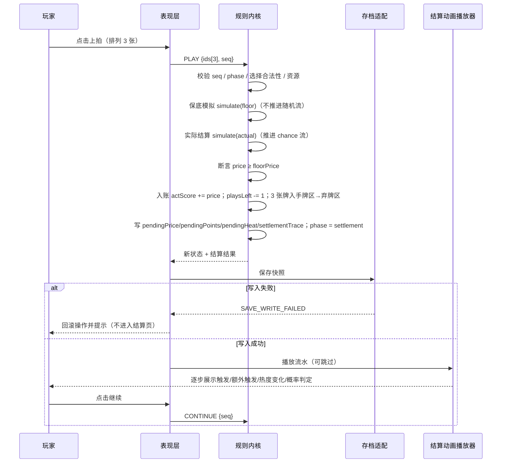
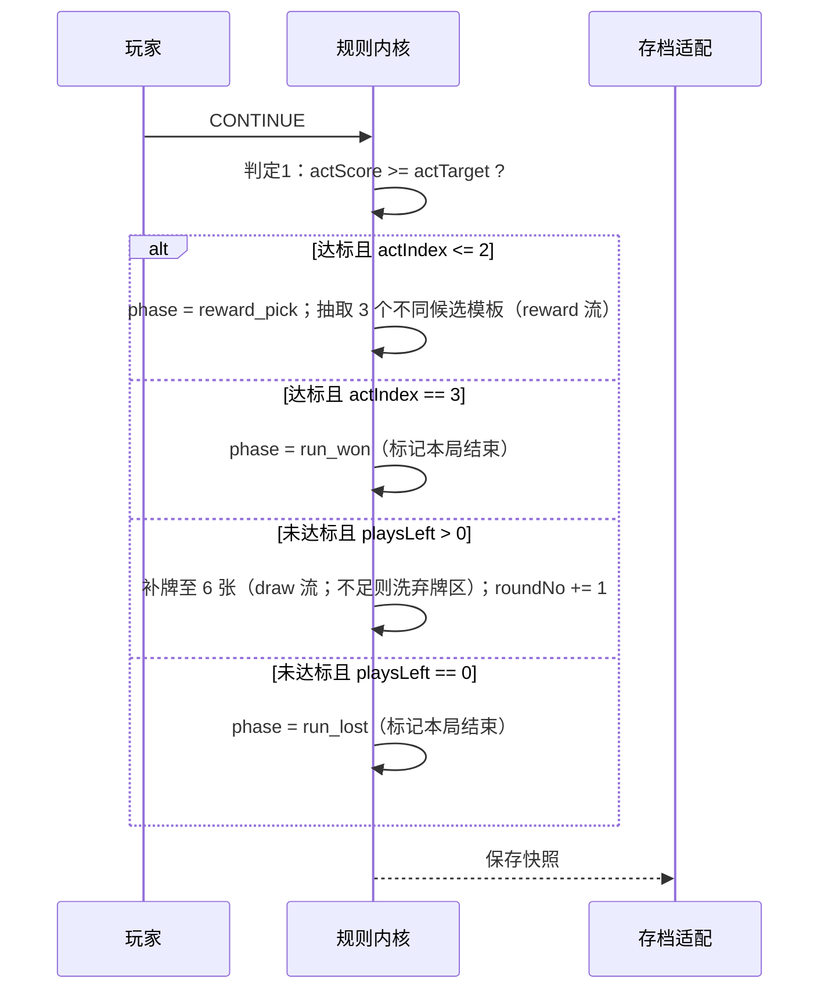
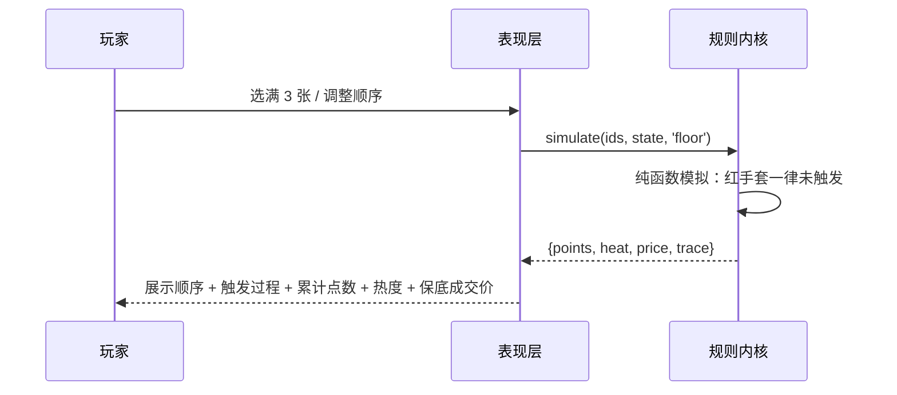
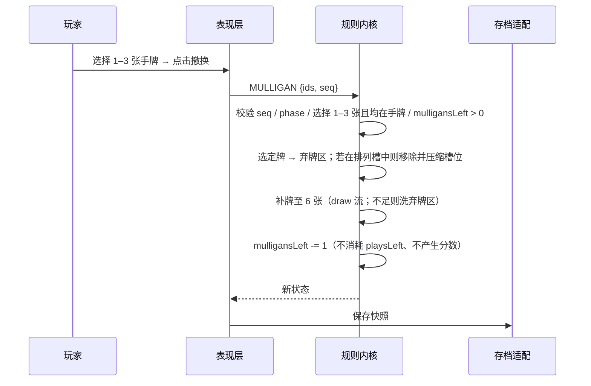
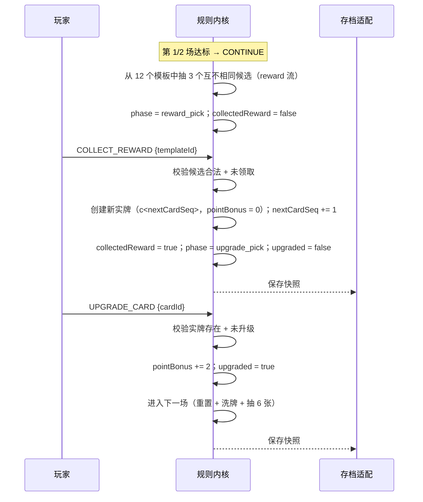

# Spec: 午夜落槌 · 藏品连锁（三场卡牌肉鸽原型）

# 0. 文档元信息

## 0.1 基本信息

- **文档类型**: ☑ 新增需求（0→1 全新项目）
- **适用产品范围**: PC 横屏单人卡牌肉鸽游戏，包含确定性规则内核、7 个界面阶段、本地存档、本地 AI JSON 接口、浏览器版与 PC 桌面离线壳版
- **版本基线说明**: 无线上基线。目标仓库 `RR9-cn/roguelike-card-game` 当前仅有 `README.md`（`main` 与 `feat/midnight-hammer-roguelike-svev` 均无业务代码），本次为从 0 到 1 交付，无历史存档与历史接口兼容负担。

**章节编号说明**：本文在 `需求Spec模板` 的 §0–§9 之后追加 §10–§20 以满足工作流节点「AI-Spec生成」对模块边界、核心流程、事务与一致性、并发与幂等、权限与安全、缓存与异步任务、失败恢复、可观测性、兼容性、测试点与风险兜底的要求；`追溯矩阵` 顺延至 §20，作为全文最后一章。

## 0.2 证据来源

| 来源 | 用途 | 可信度 | 备注 |
|------|------|--------|------|
| 《午夜落槌 · 藏品连锁》从0到1产品需求文档（20 节） | 全部产品规则、卡牌内容、页面清单、存档与 AI 接口要求、验收用例 | 高 | 本次任务描述即 PRD 全文，作为唯一权威产品输入 |
| 目标仓库 `repos/RR9-cn_roguelike-card-game`（commit `606b0c5`） | 工程现状确认 | 高 | 仅含 `README.md`，无既有代码、配置、DDL、测试 |
| `artifacts/_manifest.json`（`complete: true, items: []`） | 上游产物盘点 | 高 | 上游「需求澄清」节点未同步任何产物，无历史决策可继承 |
| `knowledge/context/`、`knowledge/design-system/` | 知识与设计系统 | 高 | 均为空（`design-system.configured = false`），无既有设计系统约束 |
| `knowledge/template/`（需求Spec模板、技术设计模板、任务拆分规范等） | 文档结构规范 | 高 | 本文结构遵循该模板 |
| 用户 Human In Loop 回答（2026-09-20） | 交付范围、技术栈、持久化、数据模型产物形态、桌面壳方案 | 高 | 5 项关键决策已确认，见 §19.1 |

> 说明：本 Spec 不含任何"待确认占位"。凡 PRD 未明确、由 Agent 依据 PRD 语义与工程惯例推断的决策，一律标注为 **默认决策（D-xx）**，写明依据、影响与验证方式，并在 §19.2 汇总、§19.3 列为待授权风险项。

---

# 1. 需求背景

- **需求类型**: ☑ 战略规划（产品从 0 到 1 立项原型）☑ 竞品驱动（卡牌肉鸽品类）
- **背景 / 驱动**: 需要一个可独立运行、可被自动化回归验证的三场卡牌肉鸽原型，用来验证"顺序触发 + 完整额外触发 + 热度乘数"这一核心连锁公式是否成立、是否可读、是否具备重复游玩的构筑空间。原型必须离线可玩、规则确定性可复现，并具备无 UI 的本地 JSON 接口以支撑批量回归。
- **用户价值**: 单人玩家在 10–20 分钟内，通过"六选三 + 定序"反复做出取舍；同一组三张牌因顺序不同产生不同成交价，使"理解连锁"本身成为主要乐趣；每场结束的收集与升级让构筑在单局内成形。
- **关联重点特性**: 确定性连锁结算、保底预览与实际概率结算的分离、未选牌保留形成的"当前收益 vs 下一轮准备"取舍、单局内成长（收集 + 升级）、本地存档与无 UI 回归接口。

| 用户角色 | 核心场景 | 痛点 | 相关 SA |
|----------|----------|------|---------|
| 单人玩家（主角色） | 深夜打开游戏，输入种子或直接开局，连续完成三场拍卖 | 卡牌游戏的结算若不可预测，玩家无法建立策略；若纯随机，则"顺序"失去意义 | 本 Spec 全部功能需求 |
| 玩法验证者 / 策划 | 反复用固定种子复现同一局，验证数值曲线（150/260/420 目标是否可达） | 手动重复操作成本高，且需要确定复现 | REQ-001、REQ-016、REQ-018 |
| 自动化回归 / AI 代理 | 通过本地 JSON 接口批量跑完整局，比对结算结果 | 需要不依赖 UI、可脚本驱动、且能拿到完整流水 | REQ-016、§18 |

---

# 2. 目标与边界

## 2.1 目标

| 目标 ID | 类目 | 目标描述 | 可度量指标 | 目标值 |
|---------|------|----------|------------|--------|
| GOAL-001 | 业务 | 交付可独立运行的三场卡牌肉鸽原型，PRD §19 验收用例全部通过 | PRD §19 全部用例通过率 | 100% |
| GOAL-002 | 技术 | 规则内核与界面完全解耦，UI 与本地 AI 接口复用同一内核 | 内核模块对 DOM / 平台 API 的依赖数；UI 与 AI 路径结算结果一致性用例 | 0 个依赖；一致性用例全部通过 |
| GOAL-003 | 用户 | 确定性可复现：同一种子 + 完全相同操作 → 相同抽牌、奖励与概率结果 | 固定种子回归用例数 | ≥ 3 条端到端固定种子用例 |
| GOAL-004 | 用户 | 保底可预测：实际成交价永不低于同顺序保底价 | 单调性不变量断言 + 随机压力用例 | 断言在全部回归中零违反 |
| GOAL-005 | 技术 | 单局完整流程可在无网络环境下完成，生产构建不依赖开发服务器 | 离线加载验证；构建产物网络请求数 | 0 次外部请求 |
| GOAL-006 | 技术 | 结算性能满足动画实时播放 | 单轮结算（含 128 事件上限路径）计算耗时 | < 16 ms |

## 2.2 非目标

| 非目标 ID | 不做的内容 | 原因 / 后续规划 |
|-----------|------------|------------------|
| NG-001 | 扑克牌型、对子/顺子、固定牌型倍率 | PRD §4 明确排除；会与"顺序触发"核心公式冲突 |
| NG-002 | 角色、贵宾、遗物、装备等第二套被动构筑系统 | 会稀释"三张牌定序"的核心决策 |
| NG-003 | 商店、货币、利息、出售、刷新、购买价格 | 收集仅通过战后三选一与升级，避免引入经济系统 |
| NG-004 | 局外成长、账号等级、每日任务、联网排行榜 | 本地离线单机，不引入账号与服务端 |
| NG-005 | 敌方回合、生命值、攻击与防御 | 本作为单人计分式，无对抗单位 |
| NG-006 | 多人模式、联网服务、实时大模型调用 | 离线确定性要求与联网冲突 |
| NG-007 | 超过三场的流程、Boss、无尽模式 | 原型范围锁定三场 |
| NG-008 | 服务端数据库与后端服务 | 用户已确认：运行时持久化为本地单键 JSON；SQLite DDL 仅作为规范数据模型与可选适配器（见 D-04、§12） |
| NG-009 | 正式插画与音频资源 | PRD §14 明确"不强制"；本 Spec 只要求功能状态具备清晰视觉反馈 |
| NG-010 | 存档在浏览器与桌面壳之间的互通 | 两者 localStorage 相互独立（不同 origin），PRD 未要求互通 |

---

# 3. 核心概念

| 概念 / 术语 | 描述 | 备注 |
|-------------|------|------|
| 卡牌模板 | 一种卡牌固定的名称、基础点数、类别与能力；共 12 种 | 配置化，见 REQ-006 |
| 实牌（CardInstance） | 收藏中的一张具体卡，字段为 `cardId / templateId / pointBonus`；同名卡可分别升级 | 实牌 ID 全局唯一 |
| 当前点数 | `基础点数 + 该实牌的永久点数加成`（`pointBonus`） | 所有能力判定与点数贡献均使用当前点数 |
| 类别 | 藏品 / 工具 / 诡物，只供能力判定，本身无加成 | `collectible / tool / oddity` |
| 触发（Trigger） | 一个触发事件：先贡献当前点数，再执行该模板能力 | 事件是结算流水的原子单位 |
| 额外触发（ExtraTrigger） | 因另一张卡的能力，再次对排列中的某张卡执行一次完整触发 | 递归执行，受 128 事件上限约束 |
| 触发事件上限 | 单轮内触发事件（普通 + 额外）总数上限 128，达到即终止并报告规则错误 | 安全网，正常玩法不会触发 |
| 热度 | 本轮乘数，每轮从 1 开始，只在本轮有效；不跨轮、不跨场保留 | 只能被能力增加 |
| 累计点数 | 本轮所有触发贡献的点数之和 | 每轮从 0 开始 |
| 成交价 | `累计点数 × 热度`，本轮入账一次 | 整数 |
| 保底成交价 | 按同一顺序、把红手套全部视为失败时得到的确定性成交价 | 预览与不变量基准 |
| 收藏 | 本局玩家持有的全部实牌 | 开局 10 张，两次奖励后 12 张 |
| 手牌 | 当前从收藏中抽出的最多 6 张公开实牌 | 上限 6 |
| 排列 / 三个槽位 | 本轮选定的 3 张实牌及其固定顺序（槽位 0/1/2） | 结算期间固定不变 |
| 左侧牌 | 排列中紧邻左侧位置的卡；槽位 0 无左侧牌 | 语义固定于排列，不随额外触发改变 |
| 三张出牌 | 本轮最初排列的 3 张，不含额外触发事件 | 账簿 / 棱晶 / 王冠的统计口径 |
| 牌区 | 手牌区、抽牌堆、弃牌区；同一实牌只能存在于一个牌区 | 排列槽是独立于牌区的引用列表 |
| 撤换（Mulligan） | 消耗 1 次撤换次数，将 1–3 张手牌放入弃牌区并立即补至 6 张 | 不消耗出牌次数、不产生分数 |
| 场次（Act） | 三场之一：开门试拍 / 回声藏室 / 午夜落槌 | 目标 150 / 260 / 420 |
| 回合（Round） | 一次"排列三张 → 结算入账"的完整过程 | 每场最多 4 轮 |
| 操作序号 `seq` | 每个变更类操作必须携带的递增序号，用于过期拒绝与防重复结算 | 见 REQ-015 |
| 规则版本 | 内核规则与卡牌配置的版本标识，随存档记录 | 见 §17 |
| 存档 schemaVersion | 存档结构的版本号，与 AI 协议 `schemaVersion` 相互独立 | 见 §17 |

---

# 4. 页面与信息架构

## 4.1 入口路径

| 入口 ID | 入口位置 | 目标页面 | 权限 / 前置条件 | 备注 |
|---------|----------|----------|------------------|------|
| ENTRY-001 | 应用启动 | 首页（PAGE-001） | 无 | 存在有效存档时首页展示"继续" |
| ENTRY-002 | 首页 · 开始新夜拍 | 战斗页（PAGE-002，第 1 场） | 无；若存在未结束的有效存档需二次确认覆盖（D-07） | — |
| ENTRY-003 | 首页 · 继续 | 由存档 `phase` 决定落点 | 存档有效 | 结算阶段落结算页，手牌阶段落战斗页等 |
| ENTRY-004 | 顶栏 · 收藏按钮 | 收藏弹窗（PAGE-008） | 任意阶段可用 | 展示全部实牌与当前点数 |
| ENTRY-005 | 顶栏 · 规则按钮 | 规则弹窗（PAGE-009） | 任意阶段可用 | 内容见 REQ-017 |
| ENTRY-006 | 结算页 · 继续 | 战斗页 / 奖励页 / 通关页 / 失败页 | 结算完成 | 由 §7.2 判定顺序决定 |

## 4.2 页面清单

| 页面 ID | 页面名称 | 页面用途 | 主要操作 | 关联 REQ |
|---------|----------|----------|----------|----------|
| PAGE-001 | 首页 | 开局入口、种子输入、示例展示、继续存档 | 输入种子、开始新夜拍、继续 | REQ-001、REQ-014、REQ-018 |
| PAGE-002 | 战斗页 | 手牌浏览、排列编辑、保底预览、出牌、撤换 | 点击选牌/定序、左右移动、移除、清空、撤换、上拍 | REQ-003、REQ-004、REQ-008、REQ-018 |
| PAGE-003 | 结算页 | 逐步播放触发流水、展示公式与成交价 | 跳过动画、继续 | REQ-010、REQ-018 |
| PAGE-004 | 奖励页（三选一） | 从 3 个候选模板中选择 1 个加入收藏 | 选择候选 | REQ-012 |
| PAGE-005 | 升级页 | 从全部实牌中选择 1 张永久 +2 点 | 选择实牌 | REQ-013 |
| PAGE-006 | 通关页 | 展示本局结果与统计 | 随机开始新局、返回首页 | REQ-018 |
| PAGE-007 | 失败页 | 展示本局结果与统计 | 随机开始新局、返回首页 | REQ-018 |
| PAGE-008 | 收藏弹窗 | 展示全部具体实牌与当前点数 | 关闭 | REQ-017 |
| PAGE-009 | 规则弹窗 | 展示公式与关键规则说明 | 关闭 | REQ-017 |

> 实现约定（D-06）：采用单入口应用壳，视图由存档 `phase` 驱动；同时暴露 hash 路由（`#/home`、`#/act`、`#/settlement`、`#/reward`、`#/upgrade`、`#/won`、`#/lost`）便于刷新定位与自动化测试。URL 不是状态真相源，刷新后以存档 `phase` 为准。

## 4.3 页面关系

| 起点 | 用户动作 | 终点 | 说明 |
|------|----------|------|------|
| 首页 | 开始新夜拍（含种子） | 战斗页 · 第 1 场 | 创建 10 张起始收藏并抽至 6 张 |
| 首页 | 继续 | 存档阶段对应页面 | 见 §15 恢复行为 |
| 战斗页 | 上拍（选满 3 张） | 结算页 | 结算在跳转前已提交并落盘 |
| 战斗页 | 撤换 | 战斗页（同轮） | 立即补牌，不跳转 |
| 结算页 | 继续 | 战斗页（下一轮）/ 奖励页 / 通关页 / 失败页 | 按 §7.2 判定顺序 |
| 奖励页 | 选择 1 个模板 | 升级页 | 新实牌入收藏 |
| 升级页 | 选择 1 张实牌 | 战斗页 · 下一场 | 下一场重置出牌/撤换次数并抽至 6 张 |
| 通关页 / 失败页 | 随机开始新局 | 战斗页 · 第 1 场 | 使用随机短种子 |
| 通关页 / 失败页 | 返回首页 | 首页 | 存档标记为已结束，首页不再显示继续 |

---

# 5. 功能需求

> 说明：`Priority` 全部为 P0（PRD §20 要求交付完成以 §19 全部验收用例通过为准，无 P1/P2 裁剪空间）。

## REQ-001: 新局创建与种子

**User Story**
> As a 单人玩家, I want 输入或自动生成种子并立即开始第 1 场, so that 我能复现同一局或快速开局。

**Priority**: P0

**需求描述**
玩家在首页输入种子（1–100 字符）或留空，点击"开始新夜拍"。系统创建一局：初始化收藏（10 张起始实牌）、初始化三条独立随机流、直接进入第 1 场（无角色选择、无初始奖励），并抽至 6 张手牌。

**Acceptance Requirements**
- **REQ-001.1**: The system **shall** 接受长度 1–100 的种子字符串；输入长度超过 100 时拒绝开始并提示，不改变任何状态。
- **REQ-001.2**: **When** 种子留空（或去除首尾空白后为空），the system **shall** 自动生成 6 位大写字母数字短种子（`A-Z0-9`），并在开局后于通关/失败页可回显。
- **REQ-001.3**: The system **shall** 保证「相同种子 + 完全相同的操作序列」产生相同的抽牌顺序、奖励候选与概率判定结果（同一规则版本内）。
- **REQ-001.4**: The system **shall** 创建恰好 10 张起始实牌，模板与数量为：鎏金古瓶 ×2、染血银币 ×2、长明烛 ×2、裂纹镜 ×1、封印木槌 ×1、无面假面 ×1、旧账簿 ×1；所有实牌 `pointBonus = 0`。
- **REQ-001.5**: The system **shall** 保证实牌 ID 在同一局内唯一且不重复（格式 `c<递增序号>`，从 `c1` 开始），洗牌不改变 ID。
- **REQ-001.6**: **When** 开局完成，the system **shall** 立即进入第 1 场并抽至 6 张手牌，无需任何额外选择步骤。
- **REQ-001.7**: **If** 已存在未结束的有效存档，**then** the system **shall** 在开始新局前要求二次确认，确认后覆盖存档（D-07）。

**用户交互**

| 步骤 | 用户动作 | 产品响应 |
|------|----------|----------|
| 1 | 在首页输入种子或留空 | 输入框校验长度 ≤ 100 |
| 2 | 点击"开始新夜拍" | 校验通过后创建新局，写入存档，进入第 1 场战斗页 |
| 3 | — | 战斗页展示 6 张手牌、场次信息、剩余出牌 4 次、剩余撤换 2 次 |

**实现映射**: §11.1 开局流程, §12.3 提交模型, §19 REQ-001

---

## REQ-002: 场次配置与场次重置

**User Story**
> As a 单人玩家, I want 每场有明确的目标与资源，并在进入新场时重置, so that 我能按场次规划连锁强度。

**Priority**: P0

**需求描述**
三场配置固定：第 1 场「开门试拍」目标 150、出牌 4 次、撤换 2 次；第 2 场「回声藏室」目标 260、出牌 4 次、撤换 2 次；第 3 场「午夜落槌」目标 420、出牌 4 次、撤换 2 次。每场开始时：本场累计成交归零、完整收藏重新洗牌、抽至 6 张、出牌次数恢复 4、撤换次数恢复 2；热度不跨轮跨场保留。

**Acceptance Requirements**
- **REQ-002.1**: The system **shall** 使用固定场次配置表（目标 150/260/420，出牌 4/4/4，撤换 2/2/2）。
- **REQ-002.2**: **When** 进入新一场，the system **shall** 将本场累计成交置 0、将全部实牌（含手牌、弃牌区、排列槽中的卡）洗入抽牌堆、清空弃牌区与排列槽、抽至 6 张手牌、`playsLeft = 4`、`mulligansLeft = 2`。
- **REQ-002.3**: The system **shall** 保证热度、累计点数与额外触发计数每轮重置（热度 = 1、累计点数 = 0、额外触发计数 = 0），且不跨轮、不跨场保留。
- **REQ-002.4**: The system **shall** 保证同一场内每轮消耗 1 次出牌次数，最多 4 轮。

**实现映射**: §11.3 场次流转流程, §12.3

---

## REQ-003: 手牌与牌区规则

**User Story**
> As a 单人玩家, I want 未选的牌留在手里、已出的牌进弃牌区并自动补牌, so that 我能在"本轮收益"与"下轮准备"之间取舍。

**Priority**: P0

**需求描述**
手牌上限 6。每次出牌必须选择 3 张不同实牌；未选的 3 张继续留在手中；已出牌进入弃牌区；下一轮从抽牌堆补至 6 张；抽牌堆不足时把弃牌区洗成新抽牌堆后继续补牌。

**Acceptance Requirements**
- **REQ-003.1**: The system **shall** 维持 `手牌数 ≤ 6`，且同一实牌不同时存在于多个牌区（不变量校验）。
- **REQ-003.2**: **When** 出牌成功，the system **shall** 立即把 3 张已出牌移入手牌区之外的弃牌区，并保留未选的 3 张在手牌。
- **REQ-003.3**: **When** 进入下一轮，the system **shall** 从抽牌堆补牌至 6 张。
- **REQ-003.4**: **If** 抽牌堆不足，**then** the system **shall** 将弃牌区全部洗成新抽牌堆后继续补牌；弃牌区也为空且手牌不足 6 时，保持当前手牌数（不报错）。
- **REQ-003.5**: The system **shall** 保证补牌后手牌恢复为 6 张（收藏总数 ≥ 10，正常流程必然满足）。

**实现映射**: §11.2 出牌结算流程, §11.5 撤换流程

---

## REQ-004: 排列编辑与可用性

**User Story**
> As a 单人玩家, I want 用点击顺序排列三张牌，并能在确认前调整, so that 我能精确控制触发顺序。

**Priority**: P0

**需求描述**
战斗页提供三个编号顺序槽。点击手牌即按点击顺序加入槽位；确认前允许左右移动、移除单张、清空全部。

**Acceptance Requirements**
- **REQ-004.1**: The system **shall** 以点击顺序作为默认排列顺序（槽位 0/1/2）。
- **REQ-004.2**: **When** 排列未满 3 张，the system **shall** 禁用"上拍"。
- **REQ-004.3**: The system **shall** 支持左移/右移交换相邻槽位、移除指定槽位（后续槽位前移保持相对顺序）、清空全部槽位。
- **REQ-004.4**: **When** 选择/移动/移除/清空发生，the system **shall** 立即更新保底预览。
- **REQ-004.5**: **If** 排列未满 3 张 或 撤换次数为 0 或 未选择任何撤换目标，**then** the system **shall** 禁用"撤换"。
- **REQ-004.6**: The system **shall** 把排列编辑视为持久化命令（走 §12.3 同一提交管线），使刷新后可恢复未完成的排列；撤换选择集不持久化（D-13 说明见 §12.3）。

**实现映射**: §11.2, §11.4 保底预览

---

## REQ-005: 触发结算内核（顺序触发与额外触发）

**User Story**
> As a 单人玩家, I want 三张牌从左到右依次触发，且额外触发会完整再执行一次, so that 顺序与连锁成为核心策略。

**Priority**: P0

**需求描述**
三张牌按槽位 0 → 1 → 2 依次触发。每次触发先贡献当前点数，再执行模板能力；能力要求额外触发时，立即完整执行目标卡（点数 + 能力），子连锁全部结束后再继续原顺序中的下一张。额外触发每次使额外触发计数 +1。

**Acceptance Requirements**
- **REQ-005.1**: The system **shall** 以固定排列顺序处理三张牌的普通触发；额外触发采用深度优先、立即嵌套执行。
- **REQ-005.2**: The system **shall** 在每次额外触发事件派发时立即将额外触发计数 +1；卡牌能力读取「本次触发事件开始前」的计数快照（D-01）。
- **REQ-005.3**: The system **shall** 保证"左侧牌"始终指固定排列中紧邻左侧的槽位；槽位 0 无左侧牌，依赖左侧牌的能力不发动。
- **REQ-005.4**: The system **shall** 保证"三张出牌"始终指本轮最初排列的三张，不包含额外触发事件。
- **REQ-005.5**: The system **shall** 保证被额外触发的卡仍处于原固定位置，其能力读取的左侧牌与条件统计口径不变。
- **REQ-005.6**: **If** 单轮触发事件数达到 128，**then** the system **shall** 终止结算并报告规则错误 `RULE_TRIGGER_LIMIT_EXCEEDED`，不改变任何状态、不消耗出牌次数。
- **REQ-005.7**: The system **shall** 按 §11.6 的确定性伪代码实现结算，且 PRD §8.4 与 §19.1 的示例必须逐位复现（36 / 90 / 105）。

**实现映射**: §11.6 结算算法, §18 测试点

---

## REQ-006: 卡牌模板与能力补充定义

**User Story**
> As a 单人玩家, I want 12 种卡各有清晰、可预测的能力, so that 我能围绕它们构筑连锁。

**Priority**: P0

**需求描述**
必须实现 12 种卡牌模板（配置化）。能力语义严格按 PRD §9 与 §9.2 补充定义执行，全部能力只能增加热度（不存在负向效果）。

**Acceptance Requirements**
- **REQ-006.1**: The system **shall** 内置以下 12 个模板，`templateId` 与能力一一对应：

| ID | 名称 | 基础点数 | 类别 | 能力 |
| --- | --- | ---: | --- | --- |
| `coin` | 染血银币 | 6 | 藏品 | 左侧牌当前点数低于自己时，热度 +2 |
| `mirror` | 裂纹镜 | 2 | 工具 | 让左侧牌完整额外触发一次 |
| `hammer` | 封印木槌 | 4 | 工具 | 每次触发时，已经发生的每次额外触发使热度 +1 |
| `vase` | 鎏金古瓶 | 9 | 藏品 | 无额外能力，只贡献点数 |
| `candle` | 长明烛 | 3 | 诡物 | 每次触发，热度 +2 |
| `bell` | 回声铃 | 3 | 工具 | 左侧牌与自己类别相同时，让左侧牌完整额外触发一次 |
| `glove` | 红手套 | 4 | 诡物 | 有 50% 概率让左侧牌完整额外触发一次 |
| `ledger` | 旧账簿 | 4 | 藏品 | 三张出牌中每有一张当前点数 ≤ 4 的牌，热度 +1 |
| `mask` | 无面假面 | 5 | 诡物 | 左侧牌与自己类别不同时，热度 +3 |
| `prism` | 异色棱晶 | 4 | 藏品 | 三张出牌包含三种不同类别时，热度 +4 |
| `hourglass` | 逆流沙漏 | 2 | 工具 | 自己位于槽位 2 时，让槽位 0 完整额外触发一次 |
| `crown` | 空王冠 | 8 | 藏品 | 三张出牌的当前点数均不小于 5 时，热度 +5 |

- **REQ-006.2**: The system **shall** 遵循以下补充定义（PRD §9.2）：银币被额外触发时仍检查固定位置左侧的卡；镜子位于槽位 0 时只贡献点数；木槌读取自身本次触发前的额外触发计数、不追溯后续事件，被额外触发时重新读取当时计数；长明烛每次普通或额外触发都 +2 热度；回声铃位于槽位 0 或左侧类别不同时只贡献点数；红手套位于槽位 0 时不判定概率，每次自身触发分别判定；旧账簿每次自身触发都按固定三张重新统计；无面假面位于槽位 0 时只贡献点数；异色棱晶要求固定三张恰好覆盖藏品、工具、诡物；逆流沙漏只有固定槽位为 2 时发动，被额外触发时仍可再次发动；空王冠读取固定三张牌的当前点数，与类别、顺序无关。
- **REQ-006.3**: The system **shall** 保证所有能力的效果为单调非负（只增加热度或派发额外触发），用于支撑保底不变量（GOAL-004）。
- **REQ-006.4**: The system **shall** 以配置数据（而非散落的分支代码）定义模板，新增模板只需追加配置与能力实现注册，不改结算调度器。

**实现映射**: §11.6, §12.2 能力注册表

---

## REQ-007: 热度、累计点数与成交价

**User Story**
> As a 单人玩家, I want 清楚看到本轮累计点数与热度如何形成成交价, so that 我能理解结果来源。

**Priority**: P0

**需求描述**
每轮开始时累计点数 = 0、热度 = 1、额外触发计数 = 0。全部触发结束后 `本轮成交价 = 累计点数 × 热度`，并自动加入本场累计成交，每轮只能入账一次。

**Acceptance Requirements**
- **REQ-007.1**: The system **shall** 在每轮开始重置累计点数 = 0、热度 = 1、额外触发计数 = 0。
- **REQ-007.2**: The system **shall** 计算 `成交价 = 累计点数 × 热度`（整数）。
- **REQ-007.3**: **When** 出牌结算完成，the system **shall** 将成交价加入本场累计成交，且仅入账一次；"继续"操作不得重复入账（幂等）。
- **REQ-007.4**: The system **shall** 维护本局最高单轮 = 所有已完成轮次成交价的最大值。

**实现映射**: §11.2, §12.4 幂等

---

## REQ-008: 保底预览

**User Story**
> As a 单人玩家, I want 选满三张后立刻看到确定性的保底结果, so that 我能在确定性与随机惊喜之间做决策。

**Priority**: P0

**需求描述**
玩家选满 3 张后，界面显示三张顺序、确定触发过程、累计点数、热度与保底成交价。保底预览不得判定红手套、不得消耗随机状态、不得改变任何游戏状态。

**Acceptance Requirements**
- **REQ-008.1**: **When** 排列恰好 3 张，the system **shall** 展示顺序、确定性触发流水、累计点数、热度与保底成交价。
- **REQ-008.2**: The system **shall** 以"红手套全部判定失败"作为保底口径，且预览过程中不读取/推进概率随机流，不修改任何游戏状态（含内存与存档）。
- **REQ-008.3**: The system **shall** 在预览流水中把红手套标记为"未计入保底（50% 概率，成功时更高）"，与真实结算的"再次举牌成功/未触发"文案区分。
- **REQ-008.4**: The system **shall** 保证同一顺序、同一状态的保底预览结果恒定（多次调用结果一致，且不因调用次数改变后续结算）。
- **REQ-008.5**: **If** 保底模拟触发 128 事件上限，**then** the system **shall** 展示规则错误提示且不允许上拍（D-09）。

**实现映射**: §11.4 保底预览流程

---

## REQ-009: 实际结算与概率

**User Story**
> As a 单人玩家, I want 结算时概率事件真实发生且不低于保底, so that 随机带来惊喜而不破坏保底承诺。

**Priority**: P0

**需求描述**
实际结算时红手套每次具备左侧目标且自身触发时，以 50% 概率判定；成功立即额外触发左侧卡，失败继续后续结算。流水必须显示"再次举牌成功"或"再次举牌未触发"。实际成交价不得低于同一顺序的保底成交价。

**Acceptance Requirements**
- **REQ-009.1**: **When** 红手套自身触发且存在左侧目标，the system **shall** 从概率随机流取一次判定（成功阈值 50%），每次自身触发独立判定。
- **REQ-009.2**: The system **shall** 在流水中输出 `再次举牌成功` 或 `再次举牌未触发`。
- **REQ-009.3**: The system **shall** 保证 `实际成交价 ≥ 同顺序保底成交价`；运行时断言该不变量，违反时按实现缺陷处理（报告 `RULE_FLOOR_VIOLATION` 并拒绝本次出牌，不改变状态）。
- **REQ-009.4**: The system **shall** 在红手套位于槽位 0 时不消耗概率随机数、不判定概率。

**实现映射**: §11.6, §18 测试点

---

## REQ-010: 结算播放与恢复

**User Story**
> As a 单人玩家, I want 逐步看到触发过程并能在刷新后恢复同一结算, so that 我能理解结果且不丢失进度。

**Priority**: P0

**需求描述**
结算页按实际顺序逐步播放触发：显示来源、卡名、效果文字、当前累计点数与热度；额外触发使用区别于普通触发的视觉反馈；最后显示完整公式与成交价；提供跳过动画与继续按钮。刷新后恢复相同完整结算，不重新判定概率、不重复入账。

**Acceptance Requirements**
- **REQ-010.1**: **When** 进入结算页，the system **shall** 按已提交的流水顺序逐步播放，普通触发与额外触发使用可区分的视觉反馈。
- **REQ-010.2**: The system **shall** 在结算页显示来源（触发来源卡）、卡名、效果文字、当前累计点数、当前热度，并在最后显示完整公式与成交价。
- **REQ-010.3**: The system **shall** 提供"跳过动画"（立即显示完整结果）与"继续"按钮。
- **REQ-010.4**: **When** 页面在结算动画中刷新，the system **shall** 从存档恢复同一流水与成交价，不重新判定概率、不重复入账。
- **REQ-010.5**: **When** 系统偏好为"减少动态效果"，the system **shall** 直接显示完整结果（仍可手动重播）。

**实现映射**: §11.2, §14 动画播放器

---

## REQ-011: 胜负判定

**User Story**
> As a 单人玩家, I want 每轮结束后明确知道胜负与下一步, so that 我清楚当前进度。

**Priority**: P0

**需求描述**
每轮结算入账后，玩家点击继续，系统按固定顺序判定：① 本场累计成交达到目标 → 本场胜利；② 第 1/2 场胜利 → 进入奖励；③ 第 3 场胜利 → 进入通关页；④ 未达目标且仍有出牌次数 → 补牌并继续下一轮；⑤ 未达目标且出牌次数为 0 → 本局失败。

**Acceptance Requirements**
- **REQ-011.1**: The system **shall** 严格按上述顺序判定，最后一轮同时满足"次数耗尽"与"达到目标"时优先判定胜利。
- **REQ-011.2**: **When** 进入下一轮，the system **shall** 补牌至 6 张且不重置本场累计成交。
- **REQ-011.3**: **When** 第 1/2 场胜利，the system **shall** 进入奖励页；第 3 场胜利进入通关页；失败进入失败页。
- **REQ-011.4**: The system **shall** 在进入通关/失败页时标记本局结束（首页不再提供继续）。

**实现映射**: §7 状态机, §11.3

---

## REQ-012: 战后奖励（三选一收集）

**User Story**
> As a 单人玩家, I want 每场胜利后从三个新模板中选一个加入收藏, so that 我的构筑逐渐成形。

**Priority**: P0

**需求描述**
第 1、2 场胜利后进入奖励页：从 12 种模板中随机抽取 3 种不同模板，展示名称、基础点数、类别与能力，玩家必须选择 1 种，创建一张新实牌加入收藏（`pointBonus = 0`，ID 唯一）。奖励只能领取一次，重复操作不得再次创建实牌。

**Acceptance Requirements**
- **REQ-012.1**: The system **shall** 从奖励随机流抽取 3 个互不相同的模板，且从全部 12 种模板中抽取（允许与已有收藏重复）。
- **REQ-012.2**: The system **shall** 展示候选的名称、基础点数、类别与能力文案。
- **REQ-012.3**: **When** 玩家选择 1 个候选，the system **shall** 创建 1 张新实牌（`pointBonus = 0`、ID = `c<nextCardSeq>` 且全局唯一）并加入收藏，随即进入升级页。
- **REQ-012.4**: **If** 奖励已被领取（阶段不是奖励页 或 已领取标记为真），**then** the system **shall** 拒绝重复领取，不改变状态。
- **REQ-012.5**: **If** 选择的模板不在当前候选列表中，**then** the system **shall** 拒绝操作并返回 `RULE_INVALID_REWARD_CHOICE`。

**实现映射**: §11.7 奖励与升级流程

---

## REQ-013: 点数升级

**User Story**
> As a 单人玩家, I want 每场胜利后给一张实牌永久 +2 点, so that 我能强化构筑中的关键卡。

**Priority**: P0

**需求描述**
升级页展示收藏中的全部具体实牌（含当前点数），玩家选择 1 张使其永久点数加成 +2，并显示"卡牌名称：升级前点数 → 升级后点数"。同名实牌分别显示与选择。完成后立即进入下一场。升级只能执行一次。

**Acceptance Requirements**
- **REQ-013.1**: The system **shall** 展示收藏中全部实牌，含名称、类别、能力、`当前点数 = 基础点数 + pointBonus`；同名实牌独立成行、独立可选。
- **REQ-013.2**: **When** 玩家选择 1 张实牌，the system **shall** 将 `pointBonus += 2`，展示升级前后点数，并立即进入下一场（重置出牌/撤换次数、重新洗牌、抽至 6 张）。
- **REQ-013.3**: **If** 升级已执行（阶段不是升级页 或 已升级标记为真），**then** the system **shall** 拒绝重复升级。
- **REQ-013.4**: The system **shall** 保证升级后的当前点数参与银币、账簿、王冠等全部点数条件判定。

**实现映射**: §11.7

---

## REQ-014: 本地存档与恢复

**User Story**
> As a 单人玩家, I want 进度自动保存并能在刷新后继续, so that 我随时可以中断与恢复。

**Priority**: P0

**需求描述**
在指定时机自动保存；存档内容覆盖规则版本、种子、操作序号、抽牌与概率随机状态、阶段、场次、分数、轮数、撤换次数、完整收藏、三个牌区、奖励候选、结算流水与最高单轮。有效存档在首页显示继续按钮；损坏存档显示错误并允许开始新局，不得白屏；恢复结算时不重新判定概率、不重复入账。

**Acceptance Requirements**
- **REQ-014.1**: The system **shall** 在以下时机保存：创建新局、出牌完成并入账、撤换完成、结算继续、领取新卡、完成升级并进入下一场、进入通关或失败。
- **REQ-014.2**: The system **shall** 保存 §6.1 列出的全部字段（含三条随机流状态、结算流水、最高单轮）。
- **REQ-014.3**: **When** 存在通过校验的有效存档，the system **shall** 在首页展示"继续"按钮，并按存档阶段恢复到对应页面。
- **REQ-014.4**: **If** 存档缺失、JSON 解析失败、schema 校验失败或值域/交叉校验失败，**then** the system **shall** 展示明确的存档错误提示、允许开始新局、保留损坏原文用于排查，且不出现白屏。
- **REQ-014.5**: **When** 在结算阶段恢复，the system **shall** 直接呈现已保存的流水与成交价，不重新判定概率、不重复入账。
- **REQ-014.6**: **If** 存档写入失败（配额不足、隐私模式等），**then** the system **shall** 回滚本次操作（内存与存档保持一致）、提示保存失败并提供重试（D-08）。

**实现映射**: §15 失败恢复, data-model.md

---

## REQ-015: 操作一致性与幂等

**User Story**
> As a 自动化回归 / AI 代理, I want 每个操作可校验、可拒绝且不产生副作用, so that 回归结果稳定可复现。

**Priority**: P0

**需求描述**
抽牌、奖励与红手套概率使用可保存的确定性随机状态；抽牌随机与概率随机相互独立；预览不改变任一状态。每个有效操作携带当前递增序号。序号过期、阶段错误、ID 不存在、ID 重复或资源不足时拒绝操作，且被拒绝的操作不改变状态与随机序列。同一个有效操作不得结算两次。

**Acceptance Requirements**
- **REQ-015.1**: The system **shall** 维护单调递增的 `seq`；每个变更类操作必须携带 `seq`，且 `seq` 必须等于当前会话序号，成功后 `seq += 1`。
- **REQ-015.2**: The system **shall** 维护三条相互独立的随机流：`draw`（抽牌/洗牌）、`reward`（奖励候选）、`chance`（红手套概率）；三条流的推进互不影响。
- **REQ-015.3**: **If** 序号过期、阶段错误、实牌 ID 不存在、ID 重复、资源不足（出牌次数/撤换次数耗尽）或选择数量非法，**then** the system **shall** 拒绝操作、返回对应错误码，且不改变状态、不推进任何随机流。
- **REQ-015.4**: The system **shall** 保证同一有效操作不会结算两次（重复提交同一 `seq` 被拒绝；结算入账只在出牌时发生一次）。
- **REQ-015.5**: The system **shall** 保证校验先于任何状态变更（校验-应用-持久化-提交 顺序，见 §12.3）。

**实现映射**: §12.3, §12.4

---

## REQ-016: 本地 AI JSON 接口

**User Story**
> As a 自动化回归 / AI 代理, I want 通过本地 JSON 接口无 UI 地驱动整局游戏, so that 我能批量回归与验证规则。

**Priority**: P0

**需求描述**
提供无需操作 UI 的本地 JSON 接口。请求使用 `schemaVersion: 2`；开始请求返回持久会话 ID；后续行动携带最新 `seq`；只返回公开手牌、收藏、奖励与结算，不返回未来牌序与随机状态。支持开始、观察、预览、出牌、撤换、结算继续、收集、升级、历史和关闭。

**Acceptance Requirements**
- **REQ-016.1**: The system **shall** 接受 `{"schemaVersion":2,"operation":"start","seed":"<1-100字符>"}` 并返回会话 ID 与公开初始视图。
- **REQ-016.2**: The system **shall** 要求后续变更类请求携带 `sessionId` 与 `seq`，`seq` 不匹配时返回 `RULE_STALE_SEQ`。
- **REQ-016.3**: The system **shall** 支持操作：`start`、`observe`、`preview`、`act`（`decision.type ∈ {play, mulligan, continue, collect, upgrade}`）、`history`、`close`。
- **REQ-016.4**: The system **shall** 保证返回体只包含公开信息：手牌、收藏、当前阶段、场次进度、排列槽、奖励候选（奖励阶段）、最近一次结算流水与公式；**不得**包含抽牌堆顺序、弃牌区顺序之外的未来信息、任何随机流状态或内部序号种子。
- **REQ-016.5**: The system **shall** 保证 `preview` 不改变会话状态与随机流。
- **REQ-016.6**: The system **shall** 提供批量回归入口：以 JSONL（每行一个请求，每行一个响应）方式驱动整局，用于自动化回归（D-05）。
- **REQ-016.7**: The system **shall** 保证 AI 会话默认不写入玩家存档键（会话独立），可通过 `start` 的 `persist: true` 显式绑定存档用于调试（D-05）。
- **REQ-016.8**: **If** `schemaVersion` 不等于 2、`operation` 未知或 `sessionId` 无效，**then** the system **shall** 返回结构化错误且不创建副作用。

**实现映射**: §8 API 设计, api-spec.md

---

## REQ-017: 全局顶栏与弹窗

**User Story**
> As a 单人玩家, I want 随时查看收藏与规则, so that 我不用记忆卡牌与公式。

**Priority**: P0

**需求描述**
全局顶栏显示产品名、三场验证版标识、收藏按钮（含数量）、规则按钮。收藏弹窗显示全部具体实牌与当前点数；规则弹窗说明公式、六选三、顺序触发、完整额外触发、未选牌保留、红手套不计入保底，以及 36 分示例。

**Acceptance Requirements**
- **REQ-017.1**: The system **shall** 在所有阶段展示顶栏，含产品名、三场验证版标识、收藏按钮 + 数量、规则按钮。
- **REQ-017.2**: The system **shall** 在收藏弹窗列出全部实牌的名称、类别、能力与当前点数（同名实牌分行）。
- **REQ-017.3**: The system **shall** 在规则弹窗覆盖：核心公式、六选三、顺序触发、完整额外触发（点数 + 能力）、未选牌保留、红手套不计入保底、36 分示例（银币 6 → 镜子 2 → 木槌 4 = 18 点 × 2 热度 = 36）。
- **REQ-017.4**: The system **shall** 保证弹窗可通过按钮与 Esc 关闭，且不改变游戏状态。

**实现映射**: §4.2, §11.8 界面契约

---

## REQ-018: 各页面内容契约

**User Story**
> As a 单人玩家, I want 每个页面展示我此刻需要的信息, so that 我能顺畅完成整局。

**Priority**: P0

**需求描述**
首页：产品名 + 一句话介绍 + "银币 → 镜子 → 木槌"示例 + 种子输入框 + 开始新夜拍按钮 +（存在有效存档时）继续按钮。战斗页状态区：场次、累计成交与目标、剩余出牌次数、撤换次数、最高单轮；操作区：三个编号顺序槽、清空、左右移动、移除、保底公式、撤换、上拍、六张完整手牌（卡牌无需悬停即可看到点数、类别、名称、能力）。结算页见 REQ-010。通关/失败页：结果、本局最高单轮、最终收藏数量、种子、随机开始新局、返回首页。

**Acceptance Requirements**
- **REQ-018.1**: The system **shall** 在首页展示产品名、一句话介绍、"银币 → 镜子 → 木槌"示例、种子输入框、开始新夜拍按钮，并在存在有效存档时展示继续按钮。
- **REQ-018.2**: The system **shall** 在战斗页状态区展示场次、累计成交/目标、剩余出牌次数、撤换次数、最高单轮；操作区展示三个编号顺序槽、清空、左右移动、移除、保底公式、撤换、上拍与六张完整手牌。
- **REQ-018.3**: The system **shall** 保证卡牌点数、类别、名称、能力无需悬停即可见，当前点数在卡牌左上角突出显示。
- **REQ-018.4**: The system **shall** 在通关/失败页展示结果、本局最高单轮、最终收藏数量、种子，并提供"随机开始新局"与"返回首页"。
- **REQ-018.5**: The system **shall** 在"随机开始新局"时生成新的随机短种子并立即进入第 1 场。

**实现映射**: §4.2, §11.8

---

## REQ-019: 视觉与动效

**User Story**
> As a 单人玩家, I want 关键事件有清晰视觉反馈, so that 我能跟上连锁过程。

**Priority**: P0

**需求描述**
午夜拍卖主题（暗绿、黑、旧金、纸张色）；藏品卡暖金、工具卡冷绿、诡物卡暗红；普通触发显示卡牌点亮与点数入账；额外触发依次高亮来源与目标；热度增加时热度数字单独反馈；概率成功使用更强反馈；最终落槌显示完整成交公式；开启减少动态效果时直接显示完整结果；1000×700 及以上窗口不得出现横向滚动。

**Acceptance Requirements**
- **REQ-019.1**: The system **shall** 使用午夜拍卖主题配色，并按类别区分卡牌配色（藏品暖金 / 工具冷绿 / 诡物暗红）。
- **REQ-019.2**: The system **shall** 为普通触发（卡牌点亮 + 点数入账）、额外触发（来源→目标依次高亮）、热度变化（热度数字单独反馈）、概率成功（更强反馈）、最终落槌（完整公式）提供可区分的视觉反馈。
- **REQ-019.3**: **When** 系统偏好为"减少动态效果"，the system **shall** 跳过动画并直接呈现完整结果。
- **REQ-019.4**: The system **shall** 在窗口宽度 ≥ 1000px 且高度 ≥ 700px 时无横向滚动，核心操作区不被遮挡。

**实现映射**: §11.8, §14

---

## REQ-020: 离线运行与桌面壳安全

**User Story**
> As a 单人玩家, I want 完全离线可玩且不弹外部窗口, so that 游戏安全稳定。

**Priority**: P0

**需求描述**
单人离线完整运行，页面加载后无需网络；规则内核与界面解耦，UI 与 AI 接口使用同一规则；规则内核不得依赖 DOM、桌面壳或平台 API；生产构建不得依赖开发服务器；桌面应用禁止未授权外部窗口与导航；本地游戏不收集个人信息；浏览器或桌面窗口失焦不得改变结果。

**Acceptance Requirements**
- **REQ-020.1**: The system **shall** 在无网络环境下完整可玩（页面加载后 0 次外部网络请求）。
- **REQ-020.2**: The system **shall** 保证规则内核不引用 DOM、window、Tauri/Electron API 或 Node 专有 API（可在纯 Node 环境运行测试）。
- **REQ-020.3**: The system **shall** 保证 UI 与 AI 接口调用同一内核实现，同一输入产生同一结果。
- **REQ-020.4**: The system **shall** 以静态构建产物运行（不依赖开发服务器）；桌面壳直接加载本地构建产物。
- **REQ-020.5**: The system **shall** 在桌面壳中禁止未授权外部窗口、外部导航与远程资源加载（CSP + 导航拦截）。
- **REQ-020.6**: The system **shall** 不采集、不上报任何个人信息，不含遥测与大模型调用。
- **REQ-020.7**: The system **shall** 保证窗口失焦不改变任何游戏结果（无基于时间的自动推进逻辑）。

**实现映射**: §13 权限与安全, §14, tech-analysis

---

# 6. 字段与校验

## 6.1 存档与状态字段

> 存档结构以「单键 JSON 快照」承载（D-04），字段与 `data-model.md` 中的规范表结构 1:1 映射。

| 字段 ID | 字段名称 | 类型 | 必填 | 默认值 | 约束 / 校验 | 使用页面 / 展示位置 | 关联 REQ |
|---------|----------|------|------|--------|-------------|----------------------|----------|
| FIELD-001 | `seed` | string | 是 | — | 长度 1–100（去空白后非空）；留空时由系统生成 6 位 `A-Z0-9` | 首页输入框、通关/失败页 | REQ-001 |
| FIELD-002 | `cardId` | string | 是 | — | 格式 `c<正整数>`；同一局内唯一 | 手牌、槽位、收藏弹窗、AI `ids` | REQ-001、REQ-003 |
| FIELD-003 | `templateId` | string | 是 | — | 必须属于 12 个已知模板 ID | 卡牌展示、AI 奖励选择 | REQ-006 |
| FIELD-004 | `pointBonus` | integer | 是 | 0 | ≥ 0；每次升级 +2 | 收藏弹窗、升级页 | REQ-013 |
| FIELD-005 | `currentPoints` | integer | 是（派生） | — | `基础点数 + pointBonus`，≥ 0 | 卡牌左上角 | REQ-006、REQ-013 |
| FIELD-006 | `zone` | enum | 是 | `hand` | `hand` / `draw` / `discard`；同一实牌仅属一个牌区 | 战斗页、AI 公开视图 | REQ-003 |
| FIELD-007 | `slotIndex` | integer | 否 | — | 0–2，仅排列槽使用；同一实牌最多占一个槽位 | 战斗页顺序槽 | REQ-004 |
| FIELD-008 | `seq` | integer | 是 | 0 | ≥ 0；单调递增；必须等于当前会话序号才可执行变更类操作 | AI 请求、内部一致性 | REQ-015 |
| FIELD-009 | `saveSchemaVersion` | integer | 是 | 1 | 必须为受支持的版本，否则走迁移或损坏流程 | 存档校验 | REQ-014、§17 |
| FIELD-010 | `rulesVersion` | string | 是 | `1.0.0` | 形如 `主.次.修订`；用于结果可复现性声明 | 存档、通关/失败页（可选展示） | REQ-014、§17 |
| FIELD-011 | `phase` | enum | 是 | `hand` | `hand` / `settlement` / `reward_pick` / `upgrade_pick` / `run_won` / `run_lost` | 视图路由 | REQ-011、§7 |
| FIELD-012 | `actIndex` | integer | 是 | 1 | 1–3 | 战斗页状态区 | REQ-002 |
| FIELD-013 | `actScore` | integer | 是 | 0 | ≥ 0；进入新场归零 | 战斗页状态区 | REQ-002、REQ-007 |
| FIELD-014 | `actTarget` | integer | 是（派生） | 150 | 由 `actIndex` 派生：150 / 260 / 420 | 战斗页状态区 | REQ-002 |
| FIELD-015 | `playsLeft` | integer | 是 | 4 | 0–4 | 战斗页状态区 | REQ-002、REQ-011 |
| FIELD-016 | `mulligansLeft` | integer | 是 | 2 | 0–2 | 战斗页状态区 | REQ-003、REQ-004 |
| FIELD-017 | `bestRound` | integer | 是 | 0 | ≥ 0；本局所有轮次成交价最大值 | 战斗页、通关/失败页 | REQ-007、REQ-018 |
| FIELD-018 | `nextCardSeq` | integer | 是 | 11 | ≥ 11；用于生成唯一 `cardId` | 存档、奖励 | REQ-001、REQ-012 |
| FIELD-019 | `rngDraw` | string | 是 | — | 抽牌随机流状态，格式 `state:increment`（十进制或 hex），必须可解析 | 存档、回归 | REQ-015 |
| FIELD-020 | `rngReward` | string | 是 | — | 奖励随机流状态，格式同上 | 存档、回归 | REQ-015 |
| FIELD-021 | `rngChance` | string | 是 | — | 概率随机流状态，格式同上 | 存档、回归 | REQ-015 |
| FIELD-022 | `settlementTrace` | array | 是 | `[]` | 结算事件数组，元素结构见 §6.2；`settlement` 阶段必非空 | 结算页、AI `history` | REQ-010 |
| FIELD-023 | `pendingPrice` | integer | 是 | 0 | ≥ 0；最近一次结算成交价（恢复结算用） | 结算页 | REQ-010、REQ-014 |
| FIELD-024 | `pendingPoints` | integer | 是 | 0 | ≥ 0；最近一次结算累计点数 | 结算页 | REQ-010 |
| FIELD-025 | `pendingHeat` | integer | 是 | 1 | ≥ 1；最近一次结算最终热度 | 结算页 | REQ-010 |
| FIELD-026 | `rewardCandidates` | array\<string\> | 是 | `[]` | 恰好 3 个互不相同的 `templateId`；仅奖励阶段非空 | 奖励页 | REQ-012 |
| FIELD-027 | `collectedReward` | boolean | 是 | false | 本场奖励是否已领取（防重复） | 存档 | REQ-012 |
| FIELD-028 | `upgraded` | boolean | 是 | false | 本场升级是否已执行（防重复） | 存档 | REQ-013 |
| FIELD-029 | `roundNo` | integer | 是 | 1 | 1–4；本场当前轮次 | 战斗页（可选展示） | REQ-002 |
| FIELD-030 | `lineSlots` | array\<string\> | 是 | `[]` | 长度 0–3；元素为 `cardId` 且必须存在于手牌；无重复 | 战斗页顺序槽 | REQ-004 |

## 6.2 结算流水事件结构

| 字段 | 类型 | 说明 |
|------|------|------|
| `index` | integer | 事件序号，从 0 递增 |
| `type` | enum | `trigger`（普通触发）/ `extra_trigger`（额外触发）/ `heat`（热度变化）/ `roll`（概率判定） |
| `cardId` | string | 事件主体卡（`heat`/`roll` 为触发该能力的卡） |
| `slotIndex` | integer | 主体卡在排列中的槽位 0–2 |
| `sourceCardId` | string \| null | 触发来源卡；普通触发为 `null` |
| `pointsDelta` | integer | 本次贡献点数（仅 `trigger`/`extra_trigger` 非 0） |
| `totalPointsAfter` | integer | 事件后的累计点数 |
| `heatDelta` | integer | 热度变化量（`heat` 事件为 +N，其余为 0） |
| `heatAfter` | integer | 事件后的热度 |
| `extraCountAfter` | integer | 事件后的额外触发计数 |
| `effect` | string | 效果文案，例如"能力未发动（第一位无左侧牌）"、"左侧牌点数 4 < 6，热度 +2" |
| `rollSuccess` | boolean \| null | 仅 `roll` 事件：`true` 文案"再次举牌成功"，`false` 文案"再次举牌未触发"，保底预览为 `null` 且 `effect` 标注"未计入保底" |

## 6.3 校验规则汇总

| 校验项 | 规则 | 失败错误码 |
|--------|------|-----------|
| 种子长度 | 1–100 字符（去首尾空白） | `RULE_INVALID_SEED` |
| `seq` 匹配 | 必须等于当前会话 `seq` | `RULE_STALE_SEQ` |
| 阶段合法性 | 操作必须与当前 `phase` 匹配 | `RULE_INVALID_PHASE` |
| 出牌选择 | 恰好 3 张、互不相同、全部在手牌 | `RULE_INVALID_SELECTION` |
| 撤换选择 | 1–3 张、互不相同、全部在手牌、`mulligansLeft > 0` | `RULE_INVALID_MULLIGAN` |
| 资源充足 | `playsLeft > 0` / `mulligansLeft > 0` | `RULE_RESOURCE_EXHAUSTED` |
| 实牌存在 | `cardId` 必须存在于收藏 | `RULE_CARD_NOT_FOUND` |
| 奖励候选 | `templateId` 必须属于当前候选列表且未领取 | `RULE_INVALID_REWARD_CHOICE` |
| 升级目标 | `cardId` 必须存在于收藏且本场未升级 | `RULE_INVALID_UPGRADE_CHOICE` |
| 事件上限 | 单轮触发事件 ≤ 128 | `RULE_TRIGGER_LIMIT_EXCEEDED` |
| 保底不变量 | 实际成交价 ≥ 保底成交价 | `RULE_FLOOR_VIOLATION` |
| 牌区不变量 | 实牌不重复、手牌 ≤ 6、牌区并集 = 收藏 | `RULE_STATE_INVARIANT_BROKEN` |
| 存档校验 | schema/值域/交叉校验全部通过 | `SAVE_CORRUPTED` |
| 存档并发 | 存储中的 `seq` 必须等于内存 `seq` | `SAVE_CONFLICT` |
| 存档写入 | `setItem` 成功且回读校验通过 | `SAVE_WRITE_FAILED` |
| 协议版本 | `schemaVersion === 2` | `PROTOCOL_VERSION_UNSUPPORTED` |
| 会话有效 | `sessionId` 必须存在且未关闭 | `SESSION_NOT_FOUND` |

---

# 7. 状态与流转

## 7.1 状态定义

| 状态 ID | 状态名称 | 含义 | 进入条件 | 退出条件 |
|---------|----------|------|----------|----------|
| STATE-001 | `home` | 首页，无进行中对局 | 应用启动且无有效存档；或从对局返回首页 | 开始新夜拍 / 继续存档 |
| STATE-002 | `hand` | 手牌阶段，等待排列、撤换或上拍 | 开局、进入新场、结算继续后进入下一轮 | 上拍成功 / 本场胜利 / 本场失败 |
| STATE-003 | `settlement` | 结算阶段，流水已提交待播放/待继续 | 上拍成功 | 继续（触发 §7.2 判定） |
| STATE-004 | `reward_pick` | 三选一奖励阶段 | 第 1/2 场胜利并继续 | 领取 1 个模板 |
| STATE-005 | `upgrade_pick` | 点数升级阶段 | 奖励领取完成 | 选择 1 张实牌升级 |
| STATE-006 | `run_won` | 本局通关 | 第 3 场胜利并继续 | 随机开始新局 / 返回首页 |
| STATE-007 | `run_lost` | 本局失败 | 出牌次数耗尽且未达标 | 随机开始新局 / 返回首页 |
| STATE-008 | `save_absent` | 无存档 | 首次运行 / 存档被清除 | 开始新局 |
| STATE-009 | `save_valid` | 存档有效 | 存档通过全量校验 | 存档被覆盖 / 清除 |
| STATE-010 | `save_corrupted` | 存档损坏 | 解析或校验失败 | 开始新局（覆盖）/ 用户清除 |

## 7.2 操作流转

| 操作 ID | 用户动作 | 前置状态 | 目标状态 | 生效时机 | 失败处理 | 关联 REQ |
|---------|----------|----------|----------|----------|----------|----------|
| ACTION-001 | 开始新夜拍（含种子） | STATE-001 / STATE-006 / STATE-007 / STATE-010 | STATE-002（第 1 场） | 校验通过并落盘后立即 | 种子非法 → `RULE_INVALID_SEED`，不改变状态 | REQ-001 |
| ACTION-002 | 继续存档 | STATE-001（存在有效存档） | 由 `phase` 决定 | 立即 | 存档无效 → 进入 STATE-010 | REQ-014 |
| ACTION-003 | 选择 / 移动 / 移除 / 清空排列槽 | STATE-002 | STATE-002 | 立即（**持久化命令**，走 §12.3 同一提交管线：校验 → 计算 → 落盘 → 提交内存） | 落盘失败 → 回滚该次编辑并提示；选择非法 → `RULE_INVALID_SELECTION` | REQ-004 |
| ACTION-004 | 选择撤换目标（1–3 张） | STATE-002 | STATE-002 | 立即（**纯 UI 瞬时态**：不属于 `RunState`、不落盘、不占用 `seq`） | 无（选择集非法时仅禁用按钮，不产生状态变更） | REQ-004 |
| ACTION-005 | 撤换 | STATE-002（`mulligansLeft > 0`） | STATE-002 | 补牌完成后落盘 | 选择非法 → `RULE_INVALID_MULLIGAN`；次数耗尽 → `RULE_RESOURCE_EXHAUSTED` | REQ-003、REQ-015 |
| ACTION-006 | 上拍（出牌） | STATE-002（`playsLeft > 0`、排列 3 张） | STATE-003 | 结算提交并落盘后跳转 | 选择非法 / 阶段错误 / 事件超限 → 拒绝且不改变状态 | REQ-005、REQ-007、REQ-009 |
| ACTION-007 | 结算继续 | STATE-003 | STATE-002 / STATE-004 / STATE-006 / STATE-007 | 立即（判定顺序见下） | 阶段错误 → `RULE_INVALID_PHASE` | REQ-011 |
| ACTION-008 | 领取奖励（三选一） | STATE-004 | STATE-005 | 新实牌入收藏并落盘后 | 候选非法 / 重复领取 → 拒绝且不改变状态 | REQ-012 |
| ACTION-009 | 升级实牌（+2） | STATE-005 | STATE-002（下一场） | 升级并落盘后立即进入下一场 | 目标非法 / 重复升级 → 拒绝且不改变状态 | REQ-013 |
| ACTION-010 | 随机开始新局 | STATE-006 / STATE-007 | STATE-002（第 1 场） | 生成随机短种子后立即 | 无 | REQ-018 |
| ACTION-011 | 返回首页 | STATE-006 / STATE-007 | STATE-001 | 立即（标记本局结束） | 无 | REQ-018 |
| ACTION-012 | 观察 / 预览（非变更类） | 任意 | 不变 | 立即 | 阶段错误 → `RULE_INVALID_PHASE` | REQ-008、REQ-016 |

**ACTION-007 判定顺序（必须严格按序执行，最后一轮达标优先判胜）**

1. `actScore >= actTarget` → 本场胜利：
   - `actIndex ∈ {1,2}` → STATE-004（奖励页）
   - `actIndex === 3` → STATE-006（通关页）
2. 未达标 且 `playsLeft > 0` → STATE-002（补牌至 6 张，进入下一轮）
3. 未达标 且 `playsLeft === 0` → STATE-007（失败页）

## 7.3 状态机



## 7.4 存档状态机



| 当前状态 | 触发事件 | 目标状态 | 操作角色 |
| --- | --- | --- | --- |
| — | 首次启动，无存档键 | `save_absent` | 系统 |
| `save_absent` | 创建新局 | `save_valid` | 玩家 |
| `save_valid` | 出牌/撤换/继续/领取/升级/结束 | `save_valid` | 玩家 |
| `save_valid` | 读取时解析或校验失败 | `save_corrupted` | 系统 |
| `save_corrupted` | 玩家开始新局 | `save_valid` | 玩家 |

## 7.5 存档状态与对局状态的组合

| 存档状态 | 对局 `phase` | 首页表现 | 恢复落点 |
|----------|--------------|----------|----------|
| `save_absent` | — | 仅"开始新夜拍" | — |
| `save_valid` | `hand` | 显示"继续" | 战斗页（当前场次） |
| `save_valid` | `settlement` | 显示"继续" | 结算页（重放已存流水） |
| `save_valid` | `reward_pick` | 显示"继续" | 奖励页 |
| `save_valid` | `upgrade_pick` | 显示"继续" | 升级页 |
| `save_valid` | `run_won` / `run_lost` | 不显示"继续"（本局已结束） | 首页 |
| `save_corrupted` | — | 显示存档错误 + 仅"开始新夜拍" | — |

---

# 8. API 设计

> 本章定义**本地 AI JSON 接口**（无 UI 驱动）。本产品无服务端、无对外 HTTP 服务，接口以本地进程内/CLI 形式暴露，语义等价于"请求-响应"契约。

## 8.1 API 变更总览

| 变更类型 | Action | 传输方法 | 描述 | 关联 REQ | 是否破坏性 |
|----------|--------|----------|------|----------|------------|
| 新增 | `start` | 本地 JSON 请求 | 开始新局，返回会话 ID 与公开视图 | REQ-016、REQ-001 | 否 |
| 新增 | `observe` | 本地 JSON 请求 | 观察当前公开状态 | REQ-016 | 否 |
| 新增 | `preview` | 本地 JSON 请求 | 预览指定顺序的保底结算，不改变状态 | REQ-016、REQ-008 | 否 |
| 新增 | `act`（`play`） | 本地 JSON 请求 | 顺序出牌并结算 | REQ-016、REQ-005 | 否 |
| 新增 | `act`（`mulligan`） | 本地 JSON 请求 | 撤换 1–3 张手牌 | REQ-016、REQ-003 | 否 |
| 新增 | `act`（`continue`） | 本地 JSON 请求 | 结算继续并按序判定 | REQ-016、REQ-011 | 否 |
| 新增 | `act`（`collect`） | 本地 JSON 请求 | 领取三选一奖励 | REQ-016、REQ-012 | 否 |
| 新增 | `act`（`upgrade`） | 本地 JSON 请求 | 实牌永久 +2 点 | REQ-016、REQ-013 | 否 |
| 新增 | `history` | 本地 JSON 请求 | 返回本会话的结算流水历史 | REQ-016、REQ-010 | 否 |
| 新增 | `close` | 本地 JSON 请求 | 关闭会话（不影响存档与本局） | REQ-016 | 否 |
| 新增 | `ai:jsonl` | CLI（stdin/stdout JSONL） | 批量回归入口 | REQ-016.6 | 否 |

## 8.2 公共约定

**请求信封**

| 参数名 | 类型 | 必填 | 说明 |
|--------|------|------|------|
| `schemaVersion` | integer | 是 | 固定为 `2`；其他值返回 `PROTOCOL_VERSION_UNSUPPORTED` |
| `operation` | string | 是 | `start` / `observe` / `preview` / `act` / `history` / `close` |
| `sessionId` | string | 否 | `start` 之外必填 |
| `seq` | integer | 否 | 变更类操作（`act`）必填；`observe`/`preview`/`history` 可选传入用于一致性校验 |
| `decision` | object | 否 | `act` 必填，结构见各 API |
| `persist` | boolean | 否 | 仅 `start` 有效，默认 `false`（不写玩家存档键，D-05） |

**响应信封**

| 参数名 | 类型 | 说明 |
|--------|------|------|
| `ok` | boolean | 成功为 `true`，失败为 `false` |
| `error.code` | string | 失败时的错误码（见 §6.3） |
| `error.message` | string | 人类可读说明（中文） |
| `error.context` | object | 错误上下文：`phase`、`seq`、相关 `cardId`/`ids` 等 |
| `sessionId` | string | 会话 ID（`start` 返回，其余回显） |
| `seq` | integer | 本次操作后会话的最新 `seq` |
| `view` | object | 公开视图（见下），`ok=true` 时返回 |
| `settlement` | object | 仅 `act.play` / `act.continue` / `observe`（结算阶段）返回：`{points, heat, price, floorPrice, trace[]}` |

**公开视图 `view`（严禁包含未来牌序与随机状态）**

| 字段 | 类型 | 说明 |
|------|------|------|
| `phase` | string | 当前阶段（§7.1） |
| `actIndex` / `actName` / `actTarget` / `actScore` | integer/string | 场次进度 |
| `roundNo` / `playsLeft` / `mulligansLeft` | integer | 轮次与资源 |
| `bestRound` | integer | 本局最高单轮 |
| `seed` | string | 本局种子（用于复现） |
| `hand` | array | 手牌实牌公开信息：`{cardId, templateId, name, category, basePoints, pointBonus, currentPoints, abilityText}` |
| `collection` | array | 收藏全部实牌的公开信息（同上，无 `zone` 归属顺序） |
| `lineSlots` | array\<string\> | 当前排列槽 `cardId` 列表（0–3） |
| `floorPreview` | object \| null | 排列满 3 张时的保底预览：`{points, heat, price, trace[]}` |
| `rewardCandidates` | array \| null | 奖励阶段候选：`{templateId, name, category, basePoints, abilityText}` |
| `upgradeTargets` | array \| null | 升级阶段可选实牌（同 `collection` 结构） |
| `result` | object \| null | 通关/失败页数据：`{outcome, bestRound, collectionSize, seed}` |

**明确不返回**：抽牌堆顺序与内容、弃牌区顺序、`rngDraw`/`rngReward`/`rngChance` 状态、`nextCardSeq`、内部事件序号种子、其他会话数据。

**错误码总表**

| 错误码 | 触发条件 | 影响 |
|--------|----------|------|
| `PROTOCOL_VERSION_UNSUPPORTED` | `schemaVersion !== 2` | 拒绝，无副作用 |
| `RULE_INVALID_SEED` | 种子长度非法 | 拒绝，无副作用 |
| `RULE_STALE_SEQ` | `seq` 不等于当前会话序号 | 拒绝，无副作用（防重复结算） |
| `RULE_INVALID_PHASE` | 操作与当前阶段不匹配 | 拒绝，无副作用 |
| `RULE_INVALID_SELECTION` | 出牌选择非法（非 3 张/重复/不在手牌） | 拒绝，无副作用 |
| `RULE_INVALID_MULLIGAN` | 撤换选择非法 | 拒绝，无副作用 |
| `RULE_RESOURCE_EXHAUSTED` | 出牌/撤换次数耗尽 | 拒绝，无副作用 |
| `RULE_CARD_NOT_FOUND` | `cardId` 不在收藏 | 拒绝，无副作用 |
| `RULE_INVALID_REWARD_CHOICE` | 奖励候选非法或重复领取 | 拒绝，无副作用 |
| `RULE_INVALID_UPGRADE_CHOICE` | 升级目标非法或重复升级 | 拒绝，无副作用 |
| `RULE_TRIGGER_LIMIT_EXCEEDED` | 单轮触发事件达 128 | 终止结算，拒绝本次出牌 |
| `RULE_FLOOR_VIOLATION` | 实际成交价低于保底 | 拒绝本次出牌并报告实现缺陷 |
| `RULE_STATE_INVARIANT_BROKEN` | 状态不变量被破坏 | 拒绝并提示，记录调试信息 |
| `SESSION_NOT_FOUND` | `sessionId` 无效或已关闭 | 拒绝，无副作用 |
| `SAVE_CORRUPTED` | 存档解析/校验失败 | 进入损坏流程 |
| `SAVE_CONFLICT` | 存档 `seq` 与内存不一致（多标签页） | 拒绝并提示重载 |
| `SAVE_WRITE_FAILED` | 存档写入或回读失败 | 回滚操作并提示 |

## 8.3 接口详情

### API-001: `start`

**基本信息**

- **API 名称**：`start`
- **接口路径**：本地 JSON 请求 `{"schemaVersion":2,"operation":"start",...}`
- **HTTP 方法**：不适用（本地进程内调用 / CLI stdin）
- **版本**：`schemaVersion = 2`
- **用途/描述**：以指定种子（或自动生成）创建一局新游戏，初始化收藏、随机流与第 1 场，返回会话 ID 与公开初始视图
- **关联 REQ**：REQ-016、REQ-001
- **调用方**：本地 AI 代理 / 批量回归脚本
- **鉴权**：无（本地离线）
- **权限**：无
- **幂等**：否（每次调用创建新会话；同一 `seed` 得到确定性一致的对局内容，但 `sessionId` 不同）
- **限流**：无

**请求参数**

| 参数名 | 参数类型 | 参数位置 | 是否必填 | 示例 | 参数描述 |
|--------|----------|----------|----------|------|----------|
| `schemaVersion` | Integer | Body | 是 | `2` | 固定为 2 |
| `operation` | String | Body | 是 | `start` | 操作名 |
| `seed` | String | Body | 否 | `review-01` | 1–100 字符；缺省或空字符串时自动生成 6 位短种子 |
| `persist` | Boolean | Body | 否 | `false` | 是否绑定玩家存档键；默认 `false`（D-05） |

**响应参数**

| 参数名 | 参数类型 | 示例 | 参数描述 |
|--------|----------|------|----------|
| `ok` | Boolean | `true` | 是否成功 |
| `sessionId` | String | `sess-7f3a1c` | 持久会话 ID |
| `seq` | Integer | `0` | 初始操作序号（下一个变更类操作须携带 0） |
| `view` | Object | 见 §8.2 | 公开初始视图（第 1 场、6 张手牌、`playsLeft=4`、`mulligansLeft=2`） |

**错误码**

| 错误码 | 错误信息 | 错误描述 |
|--------|----------|----------|
| `PROTOCOL_VERSION_UNSUPPORTED` | `不支持的协议版本` | `schemaVersion` 不为 2 |
| `RULE_INVALID_SEED` | `种子长度必须在 1-100 个字符之间` | 种子超长 |

**请求示例**

```json
{"schemaVersion":2,"operation":"start","seed":"review-01"}
```

**返回示例**

```json
{
  "ok": true,
  "sessionId": "sess-7f3a1c",
  "seq": 0,
  "view": {
    "phase": "hand",
    "actIndex": 1,
    "actName": "开门试拍",
    "actTarget": 150,
    "actScore": 0,
    "roundNo": 1,
    "playsLeft": 4,
    "mulligansLeft": 2,
    "bestRound": 0,
    "seed": "review-01",
    "hand": [
      {"cardId":"c3","templateId":"vase","name":"鎏金古瓶","category":"collectible","basePoints":9,"pointBonus":0,"currentPoints":9,"abilityText":"没有额外能力，只贡献点数。"}
    ],
    "collection": [],
    "lineSlots": [],
    "floorPreview": null,
    "rewardCandidates": null,
    "upgradeTargets": null,
    "result": null
  }
}
```

---

### API-002: `observe`

**基本信息**

- **用途/描述**：返回当前公开状态，不改变任何状态
- **关联 REQ**：REQ-016
- **幂等**：是（天然幂等，不推进随机流）
- **调用方**：本地 AI 代理 / 批量回归脚本

**请求参数**

| 参数名 | 参数类型 | 是否必填 | 示例 | 参数描述 |
|--------|----------|----------|------|----------|
| `schemaVersion` | Integer | 是 | `2` | 固定 2 |
| `operation` | String | 是 | `observe` | 操作名 |
| `sessionId` | String | 是 | `sess-7f3a1c` | 会话 ID |

**响应参数**：`ok`、`sessionId`、`seq`、`view`（§8.2），结算阶段额外返回 `settlement`。

**错误码**：`SESSION_NOT_FOUND`、`PROTOCOL_VERSION_UNSUPPORTED`。

**请求示例**

```json
{"schemaVersion":2,"operation":"observe","sessionId":"sess-7f3a1c"}
```

---

### API-003: `preview`

**基本信息**

- **用途/描述**：按传入的有序 ID 计算保底结算（红手套全部视为未触发），返回确定点数、热度、成交价与流水；**不改变会话状态、不推进随机流**
- **关联 REQ**：REQ-016、REQ-008
- **幂等**：是
- **调用方**：本地 AI 代理 / 回归脚本

**请求参数**

| 参数名 | 参数类型 | 是否必填 | 示例 | 参数描述 |
|--------|----------|----------|------|----------|
| `schemaVersion` | Integer | 是 | `2` | 固定 2 |
| `operation` | String | 是 | `preview` | 操作名 |
| `sessionId` | String | 是 | `sess-7f3a1c` | 会话 ID |
| `decision.type` | String | 是 | `preview` | 固定 `preview` |
| `decision.ids` | Array\<String\> | 是 | `["c4","c6","c7"]` | 有序实牌 ID（3 个），顺序即排列顺序 |

**响应参数**

| 参数名 | 参数类型 | 示例 | 参数描述 |
|--------|----------|------|----------|
| `settlement.points` | Integer | `18` | 保底累计点数 |
| `settlement.heat` | Integer | `2` | 保底最终热度 |
| `settlement.price` | Integer | `36` | 保底成交价 |
| `settlement.floorPrice` | Integer | `36` | 与 `price` 相同（保底口径） |
| `settlement.trace` | Array | 见 §6.2 | 确定性流水，红手套事件 `rollSuccess=null` 且标注"未计入保底" |
| `seq` | Integer | `0` | 回显当前 `seq`（未变化） |

**错误码**：`RULE_INVALID_SELECTION`（非 3 张/重复/不在手牌）、`RULE_INVALID_PHASE`、`SESSION_NOT_FOUND`。

**请求示例**

```json
{"schemaVersion":2,"operation":"preview","sessionId":"sess-7f3a1c","decision":{"type":"preview","ids":["c4","c6","c7"]}}
```

---

### API-004: `act` · `play`

**基本信息**

- **用途/描述**：按 `ids` 顺序出牌，执行实际结算（含红手套概率判定），成交价入账并落盘，会话进入结算阶段
- **关联 REQ**：REQ-016、REQ-005、REQ-007、REQ-009
- **幂等**：通过 `seq` 保证不重复结算
- **调用方**：本地 AI 代理 / 回归脚本

**请求参数**

| 参数名 | 参数类型 | 是否必填 | 示例 | 参数描述 |
|--------|----------|----------|------|----------|
| `schemaVersion` | Integer | 是 | `2` | 固定 2 |
| `operation` | String | 是 | `act` | 操作名 |
| `sessionId` | String | 是 | `sess-7f3a1c` | 会话 ID |
| `seq` | Integer | 是 | `0` | 必须等于当前会话序号 |
| `decision.type` | String | 是 | `play` | 固定 `play` |
| `decision.ids` | Array\<String\> | 是 | `["c4","c6","c7"]` | 3 个互不相同的实牌 ID，顺序即出牌顺序 |

**响应参数**：`ok`、`sessionId`、`seq`（+1）、`view`、`settlement`（`{points, heat, price, floorPrice, trace[]}`，`trace` 含 `roll` 事件与"再次举牌成功/未触发"文案）。

**错误码**：`RULE_STALE_SEQ`、`RULE_INVALID_PHASE`、`RULE_INVALID_SELECTION`、`RULE_RESOURCE_EXHAUSTED`、`RULE_CARD_NOT_FOUND`、`RULE_TRIGGER_LIMIT_EXCEEDED`、`RULE_FLOOR_VIOLATION`。

**请求示例**

```json
{
  "schemaVersion": 2,
  "operation": "act",
  "sessionId": "sess-7f3a1c",
  "seq": 0,
  "decision": {"type": "play", "ids": ["c4", "c6", "c7"]}
}
```

**返回示例**

```json
{
  "ok": true,
  "sessionId": "sess-7f3a1c",
  "seq": 1,
  "settlement": {
    "points": 18,
    "heat": 2,
    "price": 36,
    "floorPrice": 36,
    "trace": [
      {"index":0,"type":"trigger","cardId":"c4","slotIndex":0,"sourceCardId":null,"pointsDelta":6,"totalPointsAfter":6,"heatDelta":0,"heatAfter":1,"extraCountAfter":0,"effect":"贡献 6 点；能力未发动（第一位无左侧牌）","rollSuccess":null}
    ]
  },
  "view": {"phase":"settlement","actScore":36,"playsLeft":3}
}
```

---

### API-005: `act` · `mulligan`

**基本信息**

- **用途/描述**：撤换 1–3 张手牌放入弃牌区并立即补至 6 张，消耗 1 次撤换次数；不消耗出牌次数、不产生分数
- **关联 REQ**：REQ-016、REQ-003
- **幂等**：通过 `seq` 保证不重复执行

**请求参数**

| 参数名 | 参数类型 | 是否必填 | 示例 | 参数描述 |
|--------|----------|----------|------|----------|
| `seq` | Integer | 是 | `1` | 必须等于当前会话序号 |
| `decision.type` | String | 是 | `mulligan` | 固定 `mulligan` |
| `decision.ids` | Array\<String\> | 是 | `["c2","c9"]` | 1–3 个互不相同的实牌 ID，必须全部在手牌 |

**响应参数**：`ok`、`sessionId`、`seq`（+1）、`view`（`mulligansLeft` 减少 1，`hand` 补至 6 张）。

**错误码**：`RULE_STALE_SEQ`、`RULE_INVALID_PHASE`、`RULE_INVALID_MULLIGAN`、`RULE_RESOURCE_EXHAUSTED`、`RULE_CARD_NOT_FOUND`。

**请求示例**

```json
{"schemaVersion":2,"operation":"act","sessionId":"sess-7f3a1c","seq":1,"decision":{"type":"mulligan","ids":["c2","c9"]}}
```

---

### API-006: `act` · `continue`

**基本信息**

- **用途/描述**：结算继续，按 §7.2 判定顺序决定进入下一轮、奖励、通关或失败
- **关联 REQ**：REQ-016、REQ-011
- **幂等**：通过 `seq` 保证不重复入账

**请求参数**

| 参数名 | 参数类型 | 是否必填 | 示例 | 参数描述 |
|--------|----------|----------|------|----------|
| `seq` | Integer | 是 | `2` | 必须等于当前会话序号 |
| `decision.type` | String | 是 | `continue` | 固定 `continue` |

**响应参数**：`ok`、`sessionId`、`seq`（+1）、`view`（新阶段；进入下一轮时手牌补至 6 张；奖励阶段含 `rewardCandidates`；通关/失败含 `result`）。

**错误码**：`RULE_STALE_SEQ`、`RULE_INVALID_PHASE`。

**请求示例**

```json
{"schemaVersion":2,"operation":"act","sessionId":"sess-7f3a1c","seq":2,"decision":{"type":"continue"}}
```

---

### API-007: `act` · `collect`

**基本信息**

- **用途/描述**：从奖励候选（3 个不同模板）中选择 1 个，创建新实牌加入收藏并进入升级阶段
- **关联 REQ**：REQ-016、REQ-012
- **幂等**：通过 `seq` + `collectedReward` 标记双重保证

**请求参数**

| 参数名 | 参数类型 | 是否必填 | 示例 | 参数描述 |
|--------|----------|----------|------|----------|
| `seq` | Integer | 是 | `3` | 必须等于当前会话序号 |
| `decision.type` | String | 是 | `collect` | 固定 `collect` |
| `decision.templateId` | String | 是 | `mirror` | 必须属于当前 `rewardCandidates` |

**响应参数**：`ok`、`sessionId`、`seq`（+1）、`view`（`phase=upgrade_pick`，`collection` 增加 1 张，`upgradeTargets` 为全部实牌）。

**错误码**：`RULE_STALE_SEQ`、`RULE_INVALID_PHASE`、`RULE_INVALID_REWARD_CHOICE`。

**请求示例**

```json
{"schemaVersion":2,"operation":"act","sessionId":"sess-7f3a1c","seq":3,"decision":{"type":"collect","templateId":"mirror"}}
```

---

### API-008: `act` · `upgrade`

**基本信息**

- **用途/描述**：指定实牌永久点数加成 +2，完成后进入下一场（重置出牌/撤换次数、重新洗牌、抽至 6 张）
- **关联 REQ**：REQ-016、REQ-013
- **幂等**：通过 `seq` + `upgraded` 标记双重保证

**请求参数**

| 参数名 | 参数类型 | 是否必填 | 示例 | 参数描述 |
|--------|----------|----------|------|----------|
| `seq` | Integer | 是 | `4` | 必须等于当前会话序号 |
| `decision.type` | String | 是 | `upgrade` | 固定 `upgrade` |
| `decision.cardId` | String | 是 | `c5` | 必须存在于收藏且本场未升级 |

**响应参数**：`ok`、`sessionId`、`seq`（+1）、`view`（`phase=hand`、`actIndex` +1、`actScore=0`、`playsLeft=4`、`mulligansLeft=2`、`hand` 6 张）。

**错误码**：`RULE_STALE_SEQ`、`RULE_INVALID_PHASE`、`RULE_INVALID_UPGRADE_CHOICE`。

**请求示例**

```json
{"schemaVersion":2,"operation":"act","sessionId":"sess-7f3a1c","seq":4,"decision":{"type":"upgrade","cardId":"c5"}}
```

---

### API-009: `history`

**基本信息**

- **用途/描述**：返回本会话已完成轮次的结算摘要与流水，用于回归比对
- **关联 REQ**：REQ-016、REQ-010
- **幂等**：是

**请求参数**

| 参数名 | 参数类型 | 是否必填 | 说明 |
|--------|----------|----------|------|
| `sessionId` | String | 是 | 会话 ID |

**响应参数**

| 参数名 | 参数类型 | 说明 |
|--------|----------|------|
| `history` | Array | 每项：`{actIndex, roundNo, ids[], points, heat, price, floorPrice, trace[]}` |
| `seq` | Integer | 当前序号 |

**错误码**：`SESSION_NOT_FOUND`。

**请求示例**

```json
{"schemaVersion":2,"operation":"history","sessionId":"sess-7f3a1c"}
```

---

### API-010: `close`

**基本信息**

- **用途/描述**：关闭会话并释放会话资源；**不修改存档、不结束本局**
- **关联 REQ**：REQ-016
- **幂等**：是（重复关闭返回 `SESSION_NOT_FOUND`）

**请求参数**

| 参数名 | 参数类型 | 是否必填 | 说明 |
|--------|----------|----------|------|
| `sessionId` | String | 是 | 会话 ID |

**响应参数**：`ok`、`sessionId`、`closed: true`。

**请求示例**

```json
{"schemaVersion":2,"operation":"close","sessionId":"sess-7f3a1c"}
```

---

### API-011: `ai:jsonl`（批量回归入口）

**基本信息**

- **接口路径**：`npm run ai -- --jsonl < request.jsonl`（本地 CLI）
- **用途/描述**：逐行读取请求 JSON，逐行输出响应 JSON，用于整局批量回归与确定性校验；会话状态在同一进程内保持
- **关联 REQ**：REQ-016.6
- **幂等**：取决于输入序列（同一输入序列 → 同一输出序列）

**请求示例（stdin，逐行）**

```json
{"schemaVersion":2,"operation":"start","seed":"review-01"}
{"schemaVersion":2,"operation":"act","sessionId":"sess-7f3a1c","seq":0,"decision":{"type":"play","ids":["c4","c6","c7"]}}
{"schemaVersion":2,"operation":"act","sessionId":"sess-7f3a1c","seq":1,"decision":{"type":"continue"}}
```

**返回示例（stdout，逐行）**

```json
{"ok":true,"sessionId":"sess-7f3a1c","seq":0,"view":{"phase":"hand"}}
{"ok":true,"sessionId":"sess-7f3a1c","seq":1,"settlement":{"points":18,"heat":2,"price":36,"floorPrice":36}}
{"ok":true,"sessionId":"sess-7f3a1c","seq":2,"view":{"phase":"hand","roundNo":2,"playsLeft":3}}
```

**退出码**：`0` 全部成功；`1` 存在失败响应（失败明细在对应行 `error` 中）；`2` 输入格式错误。

## 8.4 兼容性与版本策略

- **AI 协议**：`schemaVersion` 固定为 `2`（PRD §17 指定）。未来若新增字段，遵循"只增不改、未知字段忽略"；`schemaVersion` 变更必须同步更新 `api-spec.md` 与回归脚本。
- **存档结构**：`saveSchemaVersion` 独立编号，与 AI 协议版本解耦（§17）。
- **错误码**：只新增不改语义；已发布错误码不得复用为其他含义。
- **无破坏性变更**：本产品无外部调用方、无服务端，不存在线上兼容窗口；破坏性变更仅影响本地回归脚本，需同步更新 `docs/spec` 与回归用例。

---

# 9. 非功能性需求

| NFR ID | 类别 | 要求 | 验收方法 |
|--------|------|------|----------|
| NFR-001 | 正确性 | 同一规则版本下，"相同种子 + 相同操作序列"产生完全相同的抽牌、奖励与概率结果 | 3 条固定种子端到端用例，比对完整流水与成交价（GOAL-003） |
| NFR-002 | 正确性 | 实际成交价 ≥ 保底成交价（单调性不变量） | 运行时断言 + 随机压力测试（≥ 1000 组随机排列 × 随机种子） |
| NFR-003 | 性能 | 单轮结算（含触发事件上限路径）计算耗时 < 16 ms；首屏可交互 < 2 s（本地静态资源） | 内核基准测试（Vitest bench）+ 手工测量 |
| NFR-004 | 性能 | 1000×700 及以上窗口无横向滚动；结算动画在中端机器 ≥ 50 fps | 视觉回归 + 手工验收（REQ-019.4） |
| NFR-005 | 兼容 | 离线运行：页面加载后 0 次外部网络请求；桌面壳加载本地构建产物 | 网络面板断言 + 构建产物离线打开验证（REQ-020.1、REQ-020.4） |
| NFR-006 | 兼容 | 存档跨版本迁移：旧 `saveSchemaVersion` 可通过迁移链升级；不可迁移时走损坏流程而非崩溃 | 迁移单测（v1→当前）+ 损坏存档用例 |
| NFR-007 | 安全 | 不采集/不上报个人信息，无遥测、无大模型调用 | 代码扫描（无网络调用、无上报 SDK）+ 人工确认（REQ-020.6） |
| NFR-008 | 安全 | 桌面壳禁止未授权外部窗口与导航、禁止远程资源 | Tauri 配置检查 + 手工触发外链验证（REQ-020.5） |
| NFR-009 | 安全 | 存档视为不可信输入：加载前完成结构 + 值域 + 交叉校验 | 篡改存档用例（改 ID、改阶段、改随机状态格式） |
| NFR-010 | 可靠性 | 存档写入失败不得产生"内存已变更、存档未变更"的不一致 | 模拟 `setItem` 抛错用例，验证操作回滚与提示（REQ-014.6） |
| NFR-011 | 可靠性 | 存档损坏不白屏：展示错误并允许开始新局，保留损坏原文 | 损坏存档用例（截断 JSON / 非法枚举 / 缺失字段） |
| NFR-012 | 可维护 | 规则内核零 DOM/平台依赖，可在纯 Node 环境运行全部内核测试 | 内核测试在 node 环境执行；ESLint 依赖规则（`no-restricted-imports`）校验 |
| NFR-013 | 可维护 | 卡牌能力配置化：新增模板只追加配置 + 能力注册，不改结算调度器 | 代码评审 + 新增模板冒烟用例（REQ-006.4） |
| NFR-014 | 可观测 | 结构化错误码 + 结算流水可回看；本地环形日志缓冲（最近 200 条命令记录） | 日志单测 + 结算页/`history` 回看验证 |
| NFR-015 | 可访问 | 支持 `prefers-reduced-motion`；卡牌关键信息无需悬停即可见 | 减少动效开关用例 + 视觉检查（REQ-010.5、REQ-018.3） |
| NFR-016 | 测试 | 核心计算、非法操作、随机隔离、存档、完整流程均有自动化测试；内核行覆盖率 ≥ 90% | CI 测试报告 + 覆盖率门槛 |

---

# 10. 模块边界与规则内核契约

## 10.1 分层与模块边界

```plain
┌──────────────────────────────────────────────────────────────┐
│  表现层  src/app/（React 18 + CSS 动效，唯一允许依赖 DOM 的层）  │
│  首页 / 战斗 / 结算 / 奖励 / 升级 / 通关 / 失败 + 顶栏 + 弹窗     │
└───────────────┬──────────────────────────┬───────────────────┘
                │ 命令(Command)             │ 只读视图(View)
┌───────────────▼──────────────────────────▼───────────────────┐
│  规则内核  src/kernel/（纯 TypeScript，零 DOM / 零平台 API）    │
│  卡牌配置 · 随机流 · 牌区 · 触发调度 · 场次 · 奖励升级 · 状态机    │
│  · 公开视图投影 · 规则错误码 · 存档序列化与校验                   │
└───────────────▲──────────────────────────▲───────────────────┘
                │ 同一内核，同一语义         │
┌───────────────┴──────────────────────────┴───────────────────┐
│  本地 AI 接口  src/ai/（会话注册表 · JSON 编解码 · JSONL 批量）  │
└──────────────────────────────────────────────────────────────┘
┌──────────────────────────────────────────────────────────────┐
│  持久化适配  src/platform/                                    │
│  LocalStorageAdapter（默认，浏览器与桌面壳通用）                │
│  SqliteAdapter（可选，桌面壳内，执行 data-model.md 同一份 DDL）  │
└──────────────────────────────────────────────────────────────┘
```

| 模块 | 目录 | 职责 | 允许依赖 | 禁止事项 |
|------|------|------|----------|----------|
| 规则内核 | `src/kernel/` | 全部游戏规则、状态机、结算、随机流、存档序列化与校验 | 仅标准 ECMAScript / TypeScript 内置能力 | 禁止引用 `window`/`document`/`localStorage`/Tauri API/React；禁止引入网络库 |
| 表现层 | `src/app/` | 渲染、交互、动画、布局、可访问性 | `src/kernel/`（只读视图 + 命令）、`src/platform/` | 禁止在组件内实现任何游戏规则；禁止直接读写存档键；禁止直接修改内核状态对象 |
| 本地 AI 接口 | `src/ai/` | JSON 协议解析、会话注册表、公开视图投影、JSONL 批量入口 | `src/kernel/` | 禁止绕过内核直接构造状态；禁止返回抽牌堆顺序或随机状态 |
| 持久化适配 | `src/platform/` | 存档读写、并发检测、写入回读校验、迁移调度 | `src/kernel/` 的序列化契约 | 禁止实现业务规则；禁止静默吞掉写入错误 |
| 桌面壳 | `src-tauri/`（Tauri v2 配置与最小 Rust 壳） | 加载本地构建产物、禁止外部导航与新窗口 | 无 | 禁止开启远程加载；禁止暴露额外命令面 |

## 10.2 内核对外契约（唯一入口）

| 契约 | 签名（语义） | 说明 |
|------|--------------|------|
| `createRun(input) → RunState` | 输入 `{seed, nowIso}` | 创建新局（含 10 张起始实牌、三条随机流、第 1 场） |
| `execute(state, command) → Result<RunState, RuleError>` | 纯函数，不修改入参 | 校验 + 应用，返回新状态或规则错误；**不产生副作用** |
| `projectView(state) → PublicView` | 纯函数 | 生成公开视图；对 UI 与 AI 使用同一投影，AI 额外过滤内部字段 |
| `simulate(lineIds, state, mode) → Settlement` | `mode: 'floor' \| 'actual'` | `floor` 不推进随机流；`actual` 需要传入概率流句柄 |
| `serialize(state) → SaveSnapshot` / `deserialize(raw) → Result<RunState, SaveError>` | 纯函数 | 存档编解码与全量校验 |
| `assertInvariants(state) → void \| throws` | 纯函数 | 牌区不变量、手牌上限、ID 唯一、资源范围等 |

**命令集合（`execute` 支持的 `command.type`）**：`START_RUN`、`SET_LINE`（排列编辑，含移动/移除/清空）、`MULLIGAN`、`PLAY`、`CONTINUE`、`COLLECT_REWARD`、`UPGRADE_CARD`、`NEW_RUN`、`BACK_HOME`。

> **解耦验收**：内核全部测试可在 `environment: 'node'` 下运行且零 DOM mock；`src/app/` 中不得出现任何规则判定分支（如点数比较、热度计算、条件判断），只做展示与命令派发。

## 10.3 与 PRD 的模块映射

| PRD 章节 | 落点模块 | 关联 REQ |
|----------|----------|----------|
| §6 一局流程 | 内核状态机 + 表现层页面流 | REQ-001、REQ-002、REQ-011 |
| §7 手牌与保留 | 内核牌区 | REQ-003、REQ-004 |
| §8 计分与触发 | 内核触发调度 + 结算算法 | REQ-005、REQ-007 |
| §9 卡牌内容 | 内核卡牌配置 + 能力注册表 | REQ-006 |
| §10 保底预览 | 内核 `simulate(floor)` + 表现层预览面板 | REQ-008、REQ-009 |
| §11 奖励与升级 | 内核奖励/升级命令 | REQ-012、REQ-013 |
| §12 胜负判定 | 内核 `CONTINUE` 判定 | REQ-011 |
| §13 页面需求 | 表现层 | REQ-017、REQ-018 |
| §14 视觉与动效 | 表现层 | REQ-019 |
| §15 存档与恢复 | 持久化适配 + 内核序列化 | REQ-014 |
| §16 一致性与安全 | 内核校验 + 持久化并发检测 | REQ-015 |
| §17 本地 AI 接口 | AI 接口模块 | REQ-016 |
| §18 非功能需求 | 全模块 | REQ-020 |

---

# 11. 核心流程与规则推演

## 11.1 开局流程



**Step 1 · 种子归一化与随机流派生**

| 校验项 | 通过 | 不通过 |
|--------|------|--------|
| 种子去首尾空白后长度 ≤ 100 | 继续 | 返回 `RULE_INVALID_SEED`，不改变状态 |
| 种子去首尾空白后非空 | 直接使用 | 生成 6 位 `A-Z0-9` 短种子（使用平台密码学随机源，不占用游戏随机流） |

- 随机流派生：`drawSeed = hash(seed + "#draw")`、`rewardSeed = hash(seed + "#reward")`、`chanceSeed = hash(seed + "#chance")`，三条流各自独立初始化（D-02）。

**Step 2 · 收藏初始化**：按 REQ-001.4 生成 10 张实牌，`cardId` 依次 `c1`–`c10`，`nextCardSeq = 11`。

**Step 3 · 进入第 1 场**：全部实牌洗入抽牌堆（消耗 `draw` 流）→ 抽 6 张 → `phase = hand`、`playsLeft = 4`、`mulligansLeft = 2`、`actScore = 0`、`roundNo = 1`。

**Step 4 · 落盘**：序列化 → 写入 → 回读校验 → 提交内存状态（§12.3）。

## 11.2 出牌与结算流程



**Step 1 · 校验**

| 校验项 | 通过 | 不通过 |
|--------|------|--------|
| `seq` 等于当前序号 | 继续 | 返回 `RULE_STALE_SEQ`，不改变状态 |
| `phase === 'hand'` | 继续 | 返回 `RULE_INVALID_PHASE` |
| `ids` 恰好 3 个、互不相同、全部在手牌 | 继续 | 返回 `RULE_INVALID_SELECTION` |
| `playsLeft > 0` | 继续 | 返回 `RULE_RESOURCE_EXHAUSTED` |

**Step 2 · 保底模拟（`mode = 'floor'`）**：执行 §11.6 算法，红手套一律视为未触发，**不读取、不推进 `chance` 流**；得到 `floorPrice`。

**Step 3 · 实际结算（`mode = 'actual'`）**：执行同一算法，红手套按 50% 判定并推进 `chance` 流；得到 `price` 与完整流水。

| 结果 | 处理 |
|------|------|
| 触发事件数 ≤ 128 且 `price ≥ floorPrice` | 继续入账 |
| 触发事件数 > 128 | 返回 `RULE_TRIGGER_LIMIT_EXCEEDED`，不改变状态、不消耗出牌次数 |
| `price < floorPrice` | 返回 `RULE_FLOOR_VIOLATION`，不改变状态，记录实现缺陷信息 |

**Step 4 · 入账与状态提交**

| 字段 | 值 | 说明 |
|------|-----|------|
| `actScore` | `actScore + price` | 每轮仅入账一次 |
| `bestRound` | `max(bestRound, price)` | 本局最高单轮 |
| `playsLeft` | `playsLeft - 1` | 消耗 1 次出牌 |
| `zone[3 张已出牌]` | `discard` | 从手牌移入弃牌区（不补牌） |
| `pendingPrice/pendingPoints/pendingHeat` | `price/points/heat` | 供结算页与恢复使用 |
| `settlementTrace` | 完整流水 | 恢复时直接重放，不重新判定 |
| `lineSlots` | `[]` | 结算后清空排列槽 |
| `phase` | `settlement` | — |

> 一致性说明：**结算结果与入账在同一份快照中提交**，因此"刷新恢复"必然得到同一流水与同一 `actScore`（REQ-014.5）。

## 11.3 场次与轮次流转流程



**下一场进入流程（ACTION-009 之后）**：`actIndex += 1` → 本场累计成交 = 0 → 全部实牌洗入抽牌堆 → 清空弃牌区与排列槽 → 抽 6 张 → `playsLeft = 4`、`mulligansLeft = 2`、`roundNo = 1`、`collectedReward = false`、`upgraded = false` → `phase = hand`。

## 11.4 保底预览流程



**约束**

1. 预览为纯函数：不读取 `chance` 流、不写存档、不改变内存状态（REQ-008.2）。
2. 预览结果按「排列签名 = `actIndex + ids 顺序 + 每张牌当前点数 + 手牌集合版本号`」缓存于内存，命中即复用（§14.1）；状态变化时整体失效。
3. 预览中红手套事件 `rollSuccess = null`，`effect = "未计入保底（50% 概率，成功时更高）"`。
4. 预览若触发 128 事件上限，展示规则错误并禁用"上拍"（D-09）。

## 11.5 撤换流程



**边界处理**

- 撤换不改变热度、累计点数与额外触发计数（本轮尚未开始结算）。
- 撤换选择集与排列槽相互独立；被撤换且位于槽位的实牌从槽位移除，其余槽位保持相对顺序。
- `mulligansLeft === 0` 时撤换按钮禁用；接口层同样拒绝（`RULE_RESOURCE_EXHAUSTED`）。

## 11.6 结算算法（规范性伪代码）

> 本算法是 REQ-005 / REQ-006 / REQ-007 / REQ-009 的唯一权威实现口径。已验证可逐位复现 PRD §8.4 与 §19.1 的三个示例（36 / 90 / 105）。

```text
function simulate(line: CardInstance[3], state, mode: 'floor' | 'actual', chanceStream?):
    points = 0
    heat = 1
    extraCount = 0
    events = []
    triggerEventCount = 0

    # 计算某张牌的当前点数（与触发历史无关）
    cp(card) = basePoints(card.templateId) + card.pointBonus

    # 派发一次触发事件
    function fire(slot, type, sourceCardId):
        triggerEventCount += 1
        if triggerEventCount > 128: throw RuleError('RULE_TRIGGER_LIMIT_EXCEEDED')

        # ① 计数快照：本次触发事件开始前的额外触发计数
        countBefore = extraCount
        # ② 若本次事件是额外触发，立即 +1（后续事件可见）
        if type == 'extra': extraCount += 1

        card = line[slot]
        # ③ 贡献当前点数
        points += cp(card)
        events.push(triggerEvent(type, card, slot, sourceCardId, cp(card), points, heat, extraCount))

        # ④ 执行能力（能力读取 countBefore 与固定排列）
        executeAbility(card, slot, countBefore)

    function executeAbility(card, slot, countBefore):
        left = (slot > 0) ? line[slot - 1] : null
        switch templateId(card):
            case 'coin':
                if left != null and cp(left) < cp(card):
                    heat += 2; events.push(heatEvent(card, slot, +2, heat))
                else:
                    events.push(effectEvent(card, slot, '未发动：无左侧牌或左侧点数不小于自身'))
            case 'mirror':
                if left != null: fire(slot - 1, 'extra', card.id)
                else: events.push(effectEvent(card, slot, '未发动：第一位无左侧牌'))
            case 'hammer':
                # 读取本次触发事件开始前的计数（不含自身这次额外触发）
                if countBefore > 0:
                    heat += countBefore; events.push(heatEvent(card, slot, +countBefore, heat))
                else:
                    events.push(effectEvent(card, slot, '未发动：此前无额外触发'))
            case 'vase':
                events.push(effectEvent(card, slot, '无额外能力'))
            case 'candle':
                heat += 2; events.push(heatEvent(card, slot, +2, heat))
            case 'bell':
                if left != null and category(left) == category(card):
                    fire(slot - 1, 'extra', card.id)
                else:
                    events.push(effectEvent(card, slot, '未发动：第一位或左侧类别不同'))
            case 'glove':
                if left == null:
                    events.push(effectEvent(card, slot, '未判定：第一位无左侧目标'))
                else if mode == 'floor':
                    events.push(rollEvent(card, slot, null, '未计入保底（50% 概率，成功时更高）'))
                else:
                    success = (chanceStream.next() < 0.5)
                    events.push(rollEvent(card, slot, success, success ? '再次举牌成功' : '再次举牌未触发'))
                    if success: fire(slot - 1, 'extra', card.id)
            case 'ledger':
                n = count(c in line where cp(c) <= 4)
                if n > 0: heat += n; events.push(heatEvent(card, slot, +n, heat))
                else: events.push(effectEvent(card, slot, '未发动：无点数不大于 4 的牌'))
            case 'mask':
                if left != null and category(left) != category(card):
                    heat += 3; events.push(heatEvent(card, slot, +3, heat))
                else:
                    events.push(effectEvent(card, slot, '未发动：第一位或左侧类别相同'))
            case 'prism':
                if distinctCategories(line) == 3:
                    heat += 4; events.push(heatEvent(card, slot, +4, heat))
                else:
                    events.push(effectEvent(card, slot, '未发动：三张牌未覆盖三种类别'))
            case 'hourglass':
                if slot == 2: fire(0, 'extra', card.id)
                else: events.push(effectEvent(card, slot, '未发动：不在第三位'))
            case 'crown':
                if all(cp(c) >= 5 for c in line):
                    heat += 5; events.push(heatEvent(card, slot, +5, heat))
                else:
                    events.push(effectEvent(card, slot, '未发动：存在当前点数小于 5 的牌'))

    # 主流程：固定顺序的普通触发（深度优先展开额外触发）
    fire(0, 'normal', null)
    fire(1, 'normal', null)
    fire(2, 'normal', null)

    price = points * heat
    return { points, heat, price, trace: events, triggerEventCount }
```

**关键判定说明**

| 编号 | 判定点 | 结论 | 依据 |
|------|--------|------|------|
| D-01 | 额外触发计数与木槌读取时机 | 计数在额外触发事件**派发时**立即 +1；能力读取**本次触发事件开始前**的快照，因此木槌被额外触发时**不**计入自身这一次 | PRD §9.2「木槌读取自己本次触发前的额外触发次数」为针对木槌的具体规则（具体优先于一般）；PRD §8.3「立即加1」描述计数本身的推进时机。该口径可逐位复现 PRD §8.4 三个示例；若改判为"计入自身"，`木槌4→镜子2→镜子2` 将由 `18点×5热度=90` 变为 `18点×3热度=54` |
| D-03 | 保底口径 | 红手套一律视为未触发，其余能力照常计算 | PRD §10 要求预览不判定红手套；由于全部能力效果单调非负，该口径即为同一顺序下的最小值（GOAL-004） |
| D-09 | 预览触发 128 上限 | 预览阶段即报错并禁用上拍 | 避免玩家提交必然失败的出牌；实际结算仍保留同一校验 |

**保底不变量证明（用于 GOAL-004）**

1. 每张实牌的当前点数只由 `basePoints + pointBonus` 决定，与触发历史无关；类别同理。
2. 全部能力的副作用只有两类：增加热度（非负）与派发额外触发。
3. 额外触发只会增加累计点数（贡献正点数）并可能触发更多能力（仍为第 2 条）。
4. 唯一受随机影响的能力是红手套，其成功只会追加额外触发 → 只会使 `price` 不减。
5. 因此 `price(actual) ≥ price(floor)` 恒成立。

## 11.7 奖励与升级流程



**边界处理**

- 候选抽取使用独立 `reward` 流，与 `draw`、`chance` 互不影响（REQ-015.2）。
- 奖励与升级各自只能执行一次：由 `phase` + `collectedReward` / `upgraded` 双重保护，重复请求返回对应错误码。
- 升级后当前点数立即参与银币、账簿、王冠等条件判定（REQ-013.4）。

## 11.8 界面契约（展示与命令映射）

| 界面元素 | 数据来源 | 命令 | 可用性条件 |
|----------|----------|------|------------|
| 手牌 6 张 | `view.hand` | `SET_LINE`（加入槽位） | `phase === 'hand'` |
| 三个顺序槽 | `view.lineSlots` | `SET_LINE`（选择/移动/移除/清空；持久化命令，每次编辑落盘） | `phase === 'hand'` |
| 保底公式与预览 | `view.floorPreview` | — | 槽位满 3 张 |
| 撤换按钮 | `view.mulligansLeft` | `MULLIGAN`（撤换选择集为 UI 瞬时态，不落盘） | 已选 1–3 张 且 `mulligansLeft > 0` 且 `phase === 'hand'` |
| 上拍按钮 | `view.playsLeft` | `PLAY` | 槽位满 3 张 且 `playsLeft > 0` 且 `phase === 'hand'` |
| 结算继续 | `view.settlement` | `CONTINUE` | `phase === 'settlement'` |
| 奖励候选 | `view.rewardCandidates` | `COLLECT_REWARD` | `phase === 'reward_pick'` |
| 升级列表 | `view.upgradeTargets` | `UPGRADE_CARD` | `phase === 'upgrade_pick'` |
| 通关/失败统计 | `view.result` | `NEW_RUN` / `BACK_HOME` | `phase ∈ {'run_won','run_lost'}` |
| 收藏弹窗 | `view.collection` | — | 任意阶段 |
| 规则弹窗 | 静态内容 | — | 任意阶段 |

---

# 12. 事务、一致性与并发幂等

## 12.1 运行模型与一致性边界

| 项 | 结论 | 说明 |
|----|------|------|
| 部署形态 | 单进程、单页面、单用户、完全离线 | 无服务端、无网络、无多副本 |
| 并发写来源 | 仅两种：同一页面内的串行命令；同一浏览器下多个标签页共享同一 localStorage 键 | 无跨进程事务需求 |
| 状态真相源 | 内存中的不可变 `RunState`；存档是它的持久化镜像 | 任何界面展示都从 `RunState` 派生 |
| 事务边界 | **一次持久化命令 = 一次快照提交**（校验 → 计算 → 落盘 → 回读校验 → 提交内存）；排列编辑（ACTION-003）属持久化命令，撤换选择（ACTION-004）属 UI 瞬时态 | 见 §12.3 |
| 一致性等级 | 强一致（内存与存档在同一提交内一致，排列编辑同样落盘，因此**内存与存档在任意已提交时刻恒等**）；跨标签页为乐观并发控制 | 见 §12.4 |
| 随机状态一致性 | 三条随机流状态随快照同事务保存 | 恢复后随机序列一致（REQ-015.1） |

## 12.2 能力注册表与规则配置

| 组件 | 职责 | 放置位置 | 调用方 | 禁止事项 |
|------|------|----------|--------|----------|
| `CARD_TEMPLATES` | 12 个模板的静态配置（ID、名称、基础点数、类别、能力键、能力文案） | `src/kernel/cards/` | 内核、表现层、AI 视图投影 | 禁止在表现层硬编码卡牌数值或文案 |
| `ABILITY_REGISTRY` | `abilityKey → (ctx) => void` 的能力实现表 | `src/kernel/abilities/` | 触发调度器 | 禁止在调度器中写 `switch(templateId)` 业务分支；禁止能力实现直接读写存档 |
| `ACT_CONFIG` | 三场目标/出牌次数/撤换次数 | `src/kernel/acts/` | 内核 | 禁止散落在页面组件 |
| `RULE_ERRORS` | 规则错误码与文案表 | `src/kernel/errors/` | 全模块 | 禁止使用裸字符串作为错误码 |

**扩展方式**：新增卡牌 = 追加一条 `CARD_TEMPLATES` 配置 + 在 `ABILITY_REGISTRY` 注册同 `abilityKey` 的实现（如需新能力语义）；若能力语义已存在（如"热度 +N"），仅追加配置即可。

**失败与兜底**：`abilityKey` 未注册 → 抛出 `RULE_STATE_INVARIANT_BROKEN`（视为实现缺陷），在开发期测试中直接失败；生产构建下拒绝本次出牌并提示，不产生半结算状态。

## 12.3 提交模型（校验-计算-落盘-提交）

```text
handleCommand(command):
  1) 校验：validate(state, command) → 失败则返回 RuleError（不产生任何副作用）
  2) 计算：nextState = apply(state, command)（纯函数，不可变；不推进全局随机流以外的外部状态）
  3) 自检：assertInvariants(nextState)（牌区并集、ID 唯一、手牌 ≤ 6、资源范围、阶段合法性）
  4) 落盘：snapshot = serialize(nextState)
          写入前读取存储中的当前快照，比对 seq（乐观锁，见 §12.4）
          写入 snapshot → 回读校验（解析 + 关键字段比对）
  5) 提交：内存 state = nextState；返回视图
  任一环节失败 → 保持原 state 不变，返回对应错误码
```

**为什么采用"先落盘后提交内存"**：避免"内存已入账、存档未写"的不一致（NFR-010）；崩溃时最坏情况是本次操作未生效（保留上一份完整快照），不会出现半写入状态（单键写入为原子替换）。

**关于随机流**：随机流的推进发生在第 2 步的纯计算内，其结果随 `nextState` 一起落盘；因此"操作被拒绝"必然对应"随机流未推进"（REQ-015.3）。

**关于排列编辑（ACTION-003）**：排列槽 `lineSlots` 是 `RunState` 的组成部分，因此"选择/移动/移除/清空"同样走本管线并落盘。这是对 PRD §15.1 保存时机的**补充**（PRD 为最低要求），收益是"内存与存档恒等"这一强不变量与刷新后可直接恢复未完成的排列；代价是每次点击产生一次小体量写入（单局快照 < 30 KB，可忽略）。

**关于撤换选择（ACTION-004）**：撤换选择集是纯 UI 瞬时态，不属于 `RunState`、不落盘、不占用 `seq`；刷新后清空（PRD §15.2 未将其列入存档内容，见 `data-model.md` A6）。

## 12.4 并发与幂等

| 场景 | 机制 | 行为 | 关联 |
|------|------|------|------|
| 重复提交同一操作 | `seq` 单调递增 + 必须匹配当前序号 | 第二次提交（旧 `seq`）被拒绝 `RULE_STALE_SEQ`，不重复结算 | REQ-015.4 |
| 结算重复入账 | 入账只发生在 `PLAY` 命令内；`CONTINUE` 不再累加 | 刷新/重放结算不改变 `actScore` | REQ-007.3、REQ-014.5 |
| 奖励/升级重复执行 | `phase` 校验 + `collectedReward` / `upgraded` 标记 | 重复请求被拒绝，收藏与点数不变 | REQ-012.4、REQ-013.3 |
| 多标签页并发写 | 写入前比对存储中快照的 `seq` 与内存 `seq`；不一致即拒绝 | 返回 `SAVE_CONFLICT`，提示"检测到其他窗口的进度变更，请重新载入"；**不静默覆盖**（D-10） | §12.5 |
| UI 与 AI 会话并发 | AI 会话默认独立（不绑定存档键）；若 `persist: true` 则与 UI 共享同一存档与 `seq` | 共享时同样由 `seq` 与存储比对保护 | REQ-016.7 |
| 动画播放与状态提交 | 动画只消费已提交的 `settlementTrace`，不参与状态计算 | 动画中断/跳过不影响结果 | REQ-010.4 |

## 12.5 多标签页冲突处理（推演补全）

> PRD 未描述多标签页场景，但 localStorage 为同源共享，属于必须闭环的并发边界。

1. 写入前读取存储快照 → 若其 `seq` ≠ 内存 `seq`，判定存在其他写入者 → 拒绝本次操作并返回 `SAVE_CONFLICT`。
2. 界面提示："检测到其他窗口修改了进度，请重新载入后继续"，并提供"重新载入"按钮（重新从存档恢复，不丢失其他窗口的进度）。
3. 若存储快照解析失败（另一窗口写入中断/被外部篡改），按 §15.2 损坏流程处理。
4. 该机制不引入锁文件或跨窗口通信，保持纯本地与确定性。

---

# 13. 权限与安全

## 13.1 权限模型

| 项 | 结论 | 说明 |
|----|------|------|
| 账号体系 | 无 | 本地离线单人游戏，无登录、无角色、无权限码 |
| 数据可见性 | 全部本地可见 | 无多租户、无数据隔离需求 |
| 能力授权 | 无限制 | 所有游戏能力对本地玩家开放；AI 接口亦无鉴权（本地进程内） |
| 审计 | 本地命令日志（环形缓冲 200 条） | 不含个人信息（§16） |

## 13.2 安全要求

| 编号 | 要求 | 实现要点 | 关联 |
|------|------|----------|------|
| SEC-01 | 不采集、不上报个人信息；无遥测、无大模型调用 | 不引入任何上报 SDK；代码扫描禁止 `fetch`/`XMLHttpRequest`/`WebSocket` 等网络调用（构建期 ESLint 规则） | REQ-020.6 |
| SEC-02 | 完全离线 | 构建产物不引用 CDN/远程字体/远程图片；CSP `default-src 'self'` | REQ-020.1 |
| SEC-03 | 桌面壳禁止未授权外部窗口与导航 | Tauri 配置禁用 `shell.open`、拦截 `on_navigation` 与 `window.open`；不使用 `dangerousDisableAssetCspModification` 等放宽项 | REQ-020.5 |
| SEC-04 | 存档视为不可信输入 | 加载时全量校验：结构、类型、值域（`phase`/`zone` 枚举、`slotIndex` 0–2、`pointBonus ≥ 0`）、交叉校验（牌区并集 = 收藏、ID 唯一、`lineSlots ⊆ hand`、`settlement` 阶段 `settlementTrace` 非空、随机流状态可解析） | REQ-014.4、NFR-009 |
| SEC-05 | 无凭据、无密钥 | 项目不含任何 token/密码/连接串；若发现疑似凭据立即停止传播并按高风险处理 | 工作流协议 |
| SEC-06 | 存档不参与代码执行 | 存档只作数据解析，禁止 `eval`/`new Function`；仅接受 JSON | SEC-04 |
| SEC-07 | 依赖最小化 | 生产依赖仅 React 运行时；内核零运行时依赖，降低供应链风险 | NFR-012 |

## 13.3 隐私与合规

- 不收集任何个人信息（无账号、无位置、无设备指纹、无使用统计）。
- 存档仅存于本机（localStorage 或桌面壳本地数据库），不离开设备。
- 通关/失败页展示的"种子"为玩家自填或系统生成的短随机串，不含个人信息。

---

# 14. 缓存与异步任务

## 14.1 本地缓存

| 缓存项 | 键 | 内容 | 失效时机 | 约束 |
|--------|-----|------|----------|------|
| 保底预览缓存 | `排列签名 = actIndex \| ids 顺序 \| 各牌当前点数 \| handVersion` | `{points, heat, price, trace}` | 手牌变化、排列变化、点数变化、场次变化（`stateVersion` 递增即整体失效） | 只读缓存；命中不得跳过校验；不参与状态真相 |
| 派生视图 memo | `stateVersion` | 当前点数、类别分组、按钮可用性 | 每次状态提交 | 纯派生，可随时丢弃 |
| 存档快照 | localStorage 单键（或 SQLite 行） | 完整快照 | 每次提交覆盖 | 唯一持久化真相 |

> 无服务端缓存、无 HTTP 缓存、无跨进程缓存；不使用 `sessionStorage` 作为状态载体（避免刷新后语义分裂）。

## 14.2 异步任务

| 任务 | 类型 | 触发 | 可靠性要求 |
|------|------|------|------------|
| 结算动画播放器 | UI 异步播放 | 进入结算阶段 | 只消费已提交流水；可跳过、可中断；恢复时按 `settlementTrace` 重放；不得成为状态真相源（REQ-010.4） |
| 存档写入 | 同步（`setItem` + 回读校验） | 每次命令提交 | 失败即回滚操作（§12.3）；不做异步队列，避免顺序错乱 |
| 迁移任务 | 同步 | 加载存档时版本不匹配 | 迁移链逐级执行，任一步失败走损坏流程（§17.2） |

> 本项目**无** MQ、无定时任务、无回调、无后台线程、无 Worker。所有游戏计算在主线程同步完成（NFR-003 已保证耗时 < 16 ms）。

---

# 15. 失败恢复与兜底

## 15.1 失败场景与处理

| 编号 | 失败场景 | 检测方式 | 处理 | 用户可见反馈 | 关联 |
|------|----------|----------|------|--------------|------|
| FR-01 | 存档键不存在（首次运行） | 读取返回 `null` | 进入 `save_absent` | 首页仅显示"开始新夜拍" | REQ-014.3 |
| FR-02 | 存档 JSON 解析失败（截断、非法字符） | `JSON.parse` 抛错 | 转存损坏原文 → 进入 `save_corrupted` | 显示"存档已损坏，已保留原文件供排查"，提供"开始新夜拍" | REQ-014.4、NFR-011 |
| FR-03 | 存档结构/值域/交叉校验失败 | 全量校验器 | 同 FR-02 | 同上 | SEC-04 |
| FR-04 | 存档版本不支持且无迁移路径 | 版本比对 | 同 FR-02 | 同上 | §17.2 |
| FR-05 | 存档写入失败（配额/隐私模式/被禁用） | 写入抛错或回读不一致 | **回滚本次操作**（内存与存档均不变） | 提示"无法保存进度，操作已撤销，请检查浏览器存储权限"，提供重试 | REQ-014.6、NFR-010 |
| FR-06 | 多标签页并发写 | 写入前 `seq` 比对 | 拒绝操作 | 提示"检测到其他窗口修改了进度，请重新载入" | §12.5 |
| FR-07 | 结算触发 128 事件上限 | 结算器计数 | 拒绝本次出牌，不消耗次数 | 提示"本组合触发次数超出上限，请调整顺序" | REQ-005.6 |
| FR-08 | 实际成交价低于保底（实现缺陷） | 运行时断言 | 拒绝本次出牌，记录调试信息 | 提示"结算异常，已阻止本次出牌" | REQ-009.3 |
| FR-09 | 状态不变量被破坏 | `assertInvariants` | 拒绝操作并记录 | 提示"状态异常，请重新载入" | §12.3 |
| FR-10 | AI 会话无效 / 协议版本不支持 | 会话表与版本校验 | 返回结构化错误 | AI 侧读取 `error.code` | REQ-016.8 |
| FR-11 | 结算动画中刷新 | 存档 `phase === 'settlement'` | 从快照恢复并重放流水 | 直接呈现相同结算 | REQ-010.4 |
| FR-12 | 窗口失焦 / 后台标签 | — | 无基于时间的推进逻辑 | 结果不变 | REQ-020.7 |
| FR-13 | 动画渲染异常（浏览器兼容） | try/catch 包裹动画层 | 降级为直接展示完整结果 | 结果仍完整可见 | REQ-010.3、REQ-019.3 |

## 15.2 损坏存档处理细则

1. 读取失败 → 将原始字符串转存到独立键 `mnh.save.corrupted.<ISO 时间戳>`（最多保留 3 份，超出删除最旧）。
2. 主存档键保持不变（不主动删除，避免二次伤害），但进入 `save_corrupted` 状态，界面不再提供"继续"。
3. 用户点击"开始新夜拍"时，校验通过后覆盖主键。
4. 全程不得白屏：损坏状态下首页与顶栏仍正常渲染。

## 15.3 恢复矩阵

| 存档 `phase` | 恢复动作 | 不得发生的行为 |
|--------------|----------|----------------|
| `hand` | 恢复手牌、场次进度、资源、排列槽（若为空则不恢复预览） | 不得重新抽牌 |
| `settlement` | 恢复流水与成交价，直接进入结算页可播放/跳过 | 不得重新判定概率、不得重复入账 |
| `reward_pick` | 恢复 3 个候选（不重新抽取） | 不得重新抽取候选（否则破坏确定性） |
| `upgrade_pick` | 恢复全部实牌与当前点数 | 不得重置升级标记 |
| `run_won` / `run_lost` | 进入对应页面 | 不得允许继续游戏 |

---

# 16. 可观测性

> 本项目为本地离线单机应用，无可观测性后端。可观测性目标为：**问题可定位、结果可复现、回归可比对**。

## 16.1 观测手段

| 手段 | 内容 | 载体 | 关联 |
|------|------|------|------|
| 结构化命令日志 | 每次命令记录 `{seq, command, phaseBefore, phaseAfter, ruleError?, durationMs}` | 内存环形缓冲（最近 200 条）+ 开发模式控制台 | NFR-014 |
| 结算流水 | 每次结算的完整事件序列（§6.2），即业务级可观测数据 | 存档 `settlementTrace`、结算页、AI `history` | REQ-010、REQ-016 |
| 规则错误码 | 全部失败路径使用 `§6.3` 错误码 + 上下文 | 界面提示、AI 响应 `error` | §6.3 |
| 确定性复现 | 存档记录 `seed + seq + 三条随机流状态`，可完整复现任意一局 | 存档、AI `start` + 操作序列 | GOAL-003 |
| 调试面板（开发模式） | 展示当前 `phase`、`seq`、随机流状态摘要、最近命令日志 | 仅开发构建，生产构建不打包 | NFR-014 |
| 调试导出（可选） | 导出当前快照与日志为 JSON 文本供本地排查 | 手动触发，仅本地 | §13.3 |

## 16.2 日志与隐私约束

- 日志只包含游戏状态与规则事件，不含任何个人信息（无账号、无设备信息）。
- 日志不自动上报、不写远程、不写入持久存档（避免污染存档结构）。
- 生产构建默认关闭控制台输出（除错误提示外）。

## 16.3 回归比对基线

| 基线 | 内容 | 用途 |
|------|------|------|
| 固定种子用例 | `seed = "review-01"` 等 3 个种子的完整操作序列与逐轮 `{points, heat, price}` | 检测规则回归 |
| PRD 示例用例 | 36 / 90 / 105 三个示例（§18.1） | 检测结算算法回归 |
| 不变量断言 | 保底单调性、牌区并集、ID 唯一 | 检测状态机回归 |
| 存档兼容用例 | v1 迁移样本 + 损坏样本 | 检测存档回归 |

---

# 17. 兼容性与版本策略

## 17.1 版本标识

| 标识 | 位置 | 当前值 | 说明 |
|------|------|--------|------|
| `saveSchemaVersion` | 存档 | `1` | 存档**结构**版本；结构变化时递增并注册迁移 |
| `rulesVersion` | 存档 + 代码常量 | `1.0.0` | **规则与卡牌配置**版本；任何影响结算结果的规则变更必须递增 |
| AI `schemaVersion` | AI 请求 | `2` | 协议版本，PRD §17 固定要求；与存档版本相互独立 |

**可复现性声明**：确定性保证仅在"同一 `rulesVersion`"内成立。规则版本变更后，相同种子与操作序列可能产生不同结果（例如卡牌数值调整），此时旧存档的 `rulesVersion` 会与当前不一致，按 §17.3 处理。

## 17.2 存档迁移策略

| 场景 | 处理 |
|------|------|
| `saveSchemaVersion` 等于当前版本 | 直接校验并使用 |
| 低于当前版本且存在迁移链 | 逐级迁移（v1→v2→…），每级迁移后重新全量校验；迁移结果在下次保存时以新版本写回 |
| 高于当前版本（用户降级了应用） | 视为不兼容 → 走损坏流程（FR-04），提示"存档来自更高版本，无法读取"，保留原文 |
| 迁移链缺失或迁移失败 | 走损坏流程（FR-02/FR-03），保留原文 |

**迁移实现约束**：迁移函数为纯函数 `migrate_vN_to_vN1(raw) → raw'`，只做结构转换不做业务推断；迁移必须有单测样本。

## 17.3 规则版本不一致处理

| 场景 | 处理 |
|------|------|
| `rulesVersion` 与当前一致 | 正常继续 |
| 不一致但存档结构可解析 | 允许继续游戏，并在顶栏提示"规则版本已更新（存档 x.y.z → 当前 a.b.c），后续结算按当前规则执行"（D-11） |
| 不一致且结构不可解析 | 走损坏流程 |

## 17.4 运行环境兼容

| 维度 | 要求 |
|------|------|
| 浏览器 | 支持 ES2020 与 `localStorage`、`prefers-reduced-motion` 的现代浏览器（Chrome / Edge 最新两个大版本） |
| 桌面壳 | Tauri v2，加载本地静态构建产物；不依赖系统 WebView 之外的运行时 |
| 分辨率 | 窗口 ≥ 1000×700 无横向滚动；更小窗口允许纵向滚动但不得遮挡核心操作（D-12） |
| 存档互通 | 浏览器与桌面壳 localStorage 相互独立，不做互通（NG-010） |
| 数据格式 | 存档为 JSON 文本；SQLite 适配器使用 `data-model.md` 中同一份 DDL（D-04） |

---

# 18. 测试点与验收用例

## 18.1 核心计算（PRD §19.1）

| 用例 ID | 用例 | 期望 | 验证方式 |
|---------|------|------|----------|
| TC-001 | 银币6 → 镜子2 → 木槌4 | 18 点、2 热度、36 成交 | 内核单测（`simulate` 直接调用）+ 流水断言 |
| TC-002 | 木槌4 → 银币6 → 镜子2 | 18 点、5 热度、90 成交 | 同上 |
| TC-003 | 长明烛3 → 镜子2 → 镜子2 | 15 点、7 热度、105 成交 | 同上 |
| TC-004 | 同种子 + 同状态 + 同顺序 | 概率结果完全相同 | 固定种子端到端用例，比对 `trace` 与 `price` |
| TC-005 | 任意顺序 + 任意种子（随机压力 ≥ 1000 组） | `price ≥ floorPrice` 恒成立 | 属性测试 + 运行时断言 |
| TC-006 | 木槌4 → 镜子2 → 镜子2（D-01 口径验证） | 18 点、3 热度、54 成交（木槌被额外触发时不计入自身） | 内核单测；用于锁定 D-01 口径 |
| TC-007 | 红手套位于第一位 | 不判定概率、不消耗 `chance` 流 | 单测：比对 `chance` 流状态前后一致 |
| TC-008 | 逆流沙漏位于第三位且被额外触发 | 每次自身触发都再次触发第一位 | 单测 |
| TC-009 | 三张牌组合触发事件超 128 | 返回 `RULE_TRIGGER_LIMIT_EXCEEDED`，状态不变 | 单测（构造递归组合或注入计数） |
| TC-010 | 异色棱晶 / 空王冠 / 旧账簿条件边界 | 恰好三类别 / 全部 ≥5 点 / 每张 ≤4 点计数正确 | 参数化单测（覆盖 0/1/2/3 命中数） |
| TC-011 | 银币 / 假面 / 回声铃 位于第一位 | 只贡献点数、不发动能力 | 参数化单测 |

## 18.2 手牌与资源（PRD §19.2）

| 用例 ID | 用例 | 期望 | 验证方式 |
|---------|------|------|----------|
| TC-020 | 打出 3 张后 | 原本未选的 3 张保留在下一轮手牌 | 内核状态断言 |
| TC-021 | 进入下一轮补牌后 | 手牌恢复 6 张 | 内核状态断言 |
| TC-022 | 抽牌堆不足 | 弃牌区洗成新抽牌堆后继续补牌，仍为 6 张 | 单测（构造 deck 不足场景） |
| TC-023 | 撤换 1–3 张 | 只消耗 1 次撤换、不消耗出牌次数、不产生分数 | 单测 |
| TC-024 | 撤换时被撤换牌位于排列槽 | 槽位被移除并保持其余相对顺序 | 单测 |
| TC-025 | 无效或重复 ID 操作 | 返回 `RULE_INVALID_SELECTION`，状态与随机流均不变 | 单测 |
| TC-026 | 撤换次数为 0 时撤换 | 返回 `RULE_RESOURCE_EXHAUSTED` | 单测 |
| TC-027 | 出牌次数为 0 时上拍 | 返回 `RULE_RESOURCE_EXHAUSTED` | 单测 |

## 18.3 奖励、升级与胜负（PRD §19.3）

| 用例 ID | 用例 | 期望 | 验证方式 |
|---------|------|------|----------|
| TC-030 | 奖励候选 | 恰好 3 个互不相同的模板 | 单测 |
| TC-031 | 领取奖励后 | 收藏 +1、`pointBonus = 0`、ID 唯一 | 单测 |
| TC-032 | 重复领取 | 被拒绝且收藏不变 | 单测 |
| TC-033 | 升级指定实牌 | 当前点数 +2、展示前后点数 | 单测 + UI 断言 |
| TC-034 | 重复升级 | 被拒绝且点数不变 | 单测 |
| TC-035 | 完成升级后 | 进入下一场、恢复 4 次出牌 / 2 次撤换 / 6 张手牌、本场累计归零 | 单测 |
| TC-036 | 最后一轮同时"次数耗尽"与"达标" | 判定胜利 | 单测（边界构造） |
| TC-037 | 最后一轮未达标且次数耗尽 | 判定失败 | 单测 |
| TC-038 | 第 1/2 场胜利 / 第 3 场胜利 | 分别进入奖励页 / 通关页 | 单测 |

## 18.4 存档与完整流程（PRD §19.4）

| 用例 ID | 用例 | 期望 | 验证方式 |
|---------|------|------|----------|
| TC-040 | 结算动画中刷新 | 恢复相同流水与成交价，不重复入账 | 集成测试（写入快照 → 重新加载 → 比对 `actScore` 与 `trace`） |
| TC-041 | 损坏存档 | 显示错误、允许新局、不白屏、保留原文 | 集成测试（注入截断/非法枚举快照） |
| TC-042 | 存档写入失败 | 操作回滚、提示失败、内存与存档一致 | 集成测试（mock `setItem` 抛错） |
| TC-043 | 多标签页并发写 | 返回 `SAVE_CONFLICT` 并提示重载，不覆盖他人进度 | 集成测试（模拟外部修改 `seq`） |
| TC-044 | 完整流程 | 从首页开始 → 三场 → 两次收集 → 两次升级 → 通关 | 端到端测试（AI JSONL 驱动） |
| TC-045 | 通关与失败页 | 均可开始新局、可返回首页 | 端到端测试 |
| TC-046 | AI 公开观察 | 不包含抽牌堆顺序、弃牌区顺序、随机流状态、`nextCardSeq` | 响应结构断言（白名单校验） |
| TC-047 | `preview` 幂等 | 连续多次 preview 结果一致，且不改变后续实际结算结果 | 单测 |
| TC-048 | AI `seq` 过期 | 重复提交同一 `seq` 返回 `RULE_STALE_SEQ`，不重复结算 | 端到端测试 |
| TC-049 | 存档版本迁移 | v1 样本迁移到当前版本后校验通过并可继续 | 迁移单测 |
| TC-050 | 离线运行 | 页面加载后 0 次外部网络请求 | 构建产物离线打开 + 网络断言 |

## 18.5 界面与视觉（PRD §13、§14）

| 用例 ID | 用例 | 期望 | 验证方式 |
|---------|------|------|----------|
| TC-060 | 排列不足 3 张 | 上拍禁用；保底预览不显示 | UI 测试 |
| TC-061 | 未选择撤换目标或次数为 0 | 撤换禁用 | UI 测试 |
| TC-062 | 卡牌信息可见性 | 点数、类别、名称、能力无需悬停即可见；当前点数在左上角 | 视觉检查 |
| TC-063 | 减少动态效果开启 | 直接显示完整结算结果 | UI 测试（mock `prefers-reduced-motion`） |
| TC-064 | 1000×700 窗口 | 无横向滚动、核心操作区不被遮挡 | 视觉回归 |
| TC-065 | 规则弹窗内容 | 覆盖公式、六选三、顺序触发、完整额外触发、未选牌保留、红手套不计入保底、36 分示例 | 内容断言 |
| TC-066 | 收藏弹窗内容 | 全部实牌与当前点数，同名实牌分行 | 内容断言 |
| TC-067 | 结算视觉反馈 | 普通触发与额外触发反馈可区分；热度数字单独反馈；概率成功更强反馈；最终落槌显示完整公式 | 视觉检查 |
| TC-068 | 首页内容 | 产品名、一句话介绍、示例、种子输入框、开始按钮；有存档时显示继续 | 内容断言 |
| TC-069 | 通关/失败页内容 | 结果、最高单轮、收藏数量、种子、随机开始新局、返回首页 | 内容断言 |

## 18.6 内核解耦与工程质量

| 用例 ID | 用例 | 期望 | 验证方式 |
|---------|------|------|----------|
| TC-070 | 内核在 node 环境运行 | 全部内核测试通过，无 DOM mock | CI 配置 `environment: 'node'` |
| TC-071 | 表现层无规则分支 | 组件中不存在点数/热度/条件判定逻辑 | 代码评审 + 静态检查 |
| TC-072 | 生产构建 | 不依赖开发服务器；产物可直接打开运行 | 构建产物静态服务/本地打开验证 |
| TC-073 | 内核覆盖率 | 行覆盖率 ≥ 90% | 覆盖率报告 |
| TC-074 | 桌面壳安全 | 外链不打开外部窗口、无远程资源加载 | 手工验证 + 配置检查 |

---

# 19. 交付物、决策汇总与开发前置条件

## 19.1 已确认决策（用户 Human In Loop 回答，2026-09-20）

| 编号 | 决策点 | 用户决策 | 影响 |
|------|--------|----------|------|
| U-01 | 本期交付范围 | **全量交付**：PRD §19 全部验收用例单期完成 | 单期实现内核 + 7 页面 + 存档 + AI 接口 + 浏览器版 + 桌面壳版；验收口径与 PRD 一致 |
| U-02 | 前端技术栈 | **TypeScript + Vite + React 18 + Vitest**（DOM/CSS 动效，无游戏引擎） | 规则内核为纯 TS 模块；动效用 CSS transition/animation；构建产物为静态文件 |
| U-03 | 本地存档载体 | **localStorage 单键 JSON + schemaVersion 迁移** | 存档为单键原子快照；浏览器与桌面壳同构 |
| U-04 | 数据模型产物形态 | **仍产出 SQLite 建表 DDL（CREATE TABLE）** | 产出 `data-model.md`：SQLite 规范 DDL + JSON 字段映射 + 迁移规则；运行时默认走 localStorage，SQLite 作为可选桌面适配器（D-04） |
| U-05 | PC 桌面离线壳 | **Tauri v2**（Rust 壳，体积小，可禁外部导航） | 桌面壳直接加载 Vite 静态产物；安全策略见 SEC-03 |

> **U-03 与 U-04 的口径统一（D-04）**：两者不冲突——**运行时持久化**采用 localStorage 单键 JSON（U-03），**规范数据模型**以 SQLite `CREATE TABLE` 表达（U-04），字段 1:1 映射；桌面壳可选启用 SQLite 适配器执行同一份 DDL，两实现共享同一 `saveSchemaVersion` 与迁移链。若后续要求"桌面壳强制以 SQLite 为唯一载体"，改动被限制在 `src/platform/` 的适配器实现，不影响内核、AI 接口与界面。

## 19.2 默认决策（Agent 依据 PRD 语义与工程惯例推断）

| 编号 | 决策点 | 结论 | 依据 | 影响 | 验证方式 |
|------|--------|------|------|------|----------|
| D-01 | 额外触发计数与木槌读取时机 | 计数在额外触发**派发时**立即 +1；能力读取**本次触发开始前**的快照 → 木槌被额外触发时不计入自身 | PRD §9.2「木槌读取自己本次触发前的额外触发次数」为具体规则；该口径可逐位复现 PRD §8.4 与 §19.1 三个示例 | 决定 `木槌→镜子→镜子` 的结果（54 而非 90） | TC-001/002/003/006 |
| D-02 | 随机流数量与派生 | 三条独立流 `draw` / `reward` / `chance`，分别由 `hash(seed + "#draw"/"#reward"/"#chance")` 派生 | PRD §16 要求"抽牌、奖励和红手套概率使用可保存的确定性随机状态"且"抽牌随机与概率随机相互独立"；奖励抽取同样需要确定性 | 保证预览/观察不扰动抽牌与奖励；奖励候选可复现 | TC-004、TC-047 |
| D-03 | 保底口径 | 红手套一律视为未触发，其余能力照常计算 | PRD §10「保底预览不得判定红手套」；配合能力单调非负，该口径即最小值 | 保底价可证明为下界 | TC-005 |
| D-04 | 持久化双层口径 | 运行时 localStorage 单键 JSON；SQLite DDL 作为规范数据模型 + 可选桌面适配器 | 用户同时选择 U-03 与 U-04；PRD §18 要求浏览器与桌面均可离线运行 | 避免两套持久化实现分叉；DDL 可直接用于建表 | 迁移单测、桌面壳冒烟 |
| D-05 | AI 会话与玩家存档的关系 | AI 会话默认独立（不写玩家存档键），`persist: true` 才绑定 | PRD §17 未说明；批量回归不得污染玩家进度 | 回归脚本安全；UI 与 AI 共享 `seq` 仅在显式绑定时 | TC-044、TC-048 |
| D-06 | 视图路由 | 单入口应用壳，视图由存档 `phase` 驱动，同时暴露 hash 路由 | PRD §13 以页面描述；刷新恢复需以存档为准 | 路由不是状态真相源 | TC-040、TC-045 |
| D-07 | 覆盖已有存档 | 开始新局前二次确认覆盖 | PRD 未描述；避免误删进行中对局 | 多一步确认，不改变游戏规则 | UI 测试 |
| D-08 | 存档写失败语义 | 回滚本次操作并提示，提供重试 | 与 REQ-015「被拒绝的操作不得改变状态」保持一致 | 不会出现内存/存档不一致 | TC-042 |
| D-09 | 预览命中 128 上限 | 预览阶段即报错并禁用上拍 | 避免玩家提交必然失败的组合 | 提升可玩性 | TC-009 |
| D-10 | 多标签页并发 | 写入前比对存储 `seq`，不一致即拒绝并提示重载 | localStorage 同源共享，PRD 未覆盖；静默覆盖会丢进度 | 引入 `SAVE_CONFLICT` 错误码 | TC-043 |
| D-11 | 规则版本不一致 | 结构可解析则允许继续并提示版本变化 | 本地单机无灰度需求，禁止白屏 | 提示文案 + 不阻断 | 手工验证 |
| D-12 | 小于 1000×700 的窗口 | 允许纵向滚动，核心操作区不被遮挡 | PRD §14 只要求 1000×700 及以上无横向滚动 | 小屏可用性 | 视觉检查 |
| D-13 | 撤换与排列槽交互 | 撤换选择集独立；被撤换且位于槽位的牌从槽位移除并压缩 | PRD 未描述二者交互 | 避免"槽位引用已弃牌"的非法状态 | TC-024 |
| D-14 | 短种子生成 | 6 位 `A-Z0-9`，由平台密码学随机源生成（不占用游戏随机流） | PRD §6.1 要求"自动生成短种子"，长度未定 | 保证新局随机性且不扰动确定性流 | 单测 |
| D-15 | 场开始时清空排列槽与弃牌区 | 全部实牌洗入抽牌堆，弃牌区与排列槽清空 | PRD §6.2「完整收藏重新洗牌」 | 保证场次独立 | TC-035 |

## 19.3 风险与兜底

| 编号 | 风险 | 概率 | 影响 | 兜底 / 应对 | 状态 |
|------|------|------|------|--------------|------|
| R-01 | D-01 口径与策划预期不一致（木槌被额外触发时是否计入自身） | 中 | 中：个别组合成交价不同（54 vs 90） | 结算算法已把该判定集中在一处（`countBefore` 快照），改判只需 1 行；TC-006 锁定当前口径，改动后需同步更新 TC-006 与规则弹窗示例 | 待确认（见 §19.4） |
| R-02 | U-03/U-04 口径若被理解为"SQLite 为唯一持久化层" | 低 | 中：桌面壳持久化实现不同 | 改动限制在 `src/platform/` 适配器层；内核与 UI 不受影响 | 已记录（D-04） |
| R-03 | 数值曲线不可达（150/260/420 在 4 轮内无法达成，或过易） | 中 | 中：可玩性受损，但 PRD 未给可调参数 | 内核把场次目标与卡牌点数全部配置化；调整数值不改代码结构 | 已缓解 |
| R-04 | 红手套递归组合导致结算耗时或事件膨胀 | 低 | 低：性能与上限风险 | 128 事件上限 + 深度优先有界展开；NFR-003 基准测试 | 已缓解 |
| R-05 | 多标签页并发写导致进度丢失 | 中 | 中：玩家进度丢失 | D-10 乐观锁 + 提示重载 | 已缓解 |
| R-06 | localStorage 被禁用/配额不足 | 低 | 中：无法保存 | FR-05 回滚 + 提示；不静默失败 | 已缓解 |
| R-07 | 存档被外部篡改导致崩溃 | 低 | 中：白屏 | SEC-04 全量校验 + FR-02 损坏流程 | 已缓解 |
| R-08 | 浏览器兼容差异导致动画异常 | 低 | 低：视觉降级 | FR-13 动画层 try/catch 降级为直接展示 | 已缓解 |
| R-09 | PRD §13.3「保底公式」展示口径不明确（展示公式还是展示结果） | 低 | 低：仅展示差异 | 战斗页同时展示公式（`累计点数 × 热度 = 保底成交价`）与数值 | 已缓解 |
| R-10 | 规则版本升级后旧存档结算口径变化 | 低 | 低：可复现性声明受限 | §17.1 明确"同一 rulesVersion 内"才保证；§17.3 提示版本变化 | 已缓解 |

## 19.4 待确认项（不阻塞编码，需 owner 在编码前确认）

| 编号 | 待确认内容 | 当前默认 | 若需变更的影响面 |
|------|------------|----------|------------------|
| Q-01 | D-01 木槌读取额外触发计数的口径（是否计入自身这次额外触发） | 不计入自身（`木槌→镜子→镜子` = 18 点 × 3 热度 = 54） | 仅结算算法中 `countBefore` 快照位置 1 行 + TC-006 期望值 + 规则弹窗示例；不影响架构 |
| Q-02 | 持久化是否要求桌面壳强制使用 SQLite | 桌面壳默认沿用 localStorage；SQLite 为可选适配器 | 仅 `src/platform/` 适配器与打包配置 |
| Q-03 | 规则弹窗是否需要额外收录 PRD 未要求的数值曲线说明 | 不收录，仅收录 PRD §13.1 要求内容 | 仅文案 |

## 19.5 交付物清单

| 序号 | 交付物 | 说明 | 关联 |
|------|--------|------|------|
| DEL-01 | 确定性规则内核 | 纯 TS，无 DOM/平台依赖，含 12 模板配置与能力注册表 | REQ-005、REQ-006、REQ-020.2 |
| DEL-02 | 卡牌内容配置 | 12 种模板的名称、基础点数、类别、能力、文案 | REQ-006 |
| DEL-03 | 界面（7 个阶段 + 顶栏 + 2 个弹窗） | 首页、战斗、结算、奖励、升级、通关、失败 | REQ-017、REQ-018、REQ-019 |
| DEL-04 | 本地自动存档与恢复 | 单键快照、全量校验、迁移、损坏处理 | REQ-014、§15 |
| DEL-05 | 本地 AI 交互与批量回归入口 | JSON 协议 + JSONL CLI | REQ-016 |
| DEL-06 | 自动化测试 | 核心计算、非法操作、随机隔离、存档、完整流程 | §18、NFR-016 |
| DEL-07 | 浏览器可运行开发版本 | Vite 开发与生产构建产物 | REQ-020.4 |
| DEL-08 | PC 桌面壳离线版本 | Tauri v2 壳 + 安全策略 | REQ-020.4、SEC-03 |
| DEL-09 | Spec 文档集 | 本文件 + `data-model.md` + `task-split/*` + `tech-analysis/*` | 本次节点产物 |

## 19.6 开发前置条件

| 编号 | 前置条件 | 说明 |
|------|----------|------|
| PRE-01 | 用户明确授权进入「AI-编码」节点 | 本节点交付后等待授权，不擅自开始编码 |
| PRE-02 | Q-01 口径确认（或接受默认 D-01） | 影响 TC-006 期望值与一处实现 |
| PRE-03 | 技术栈落地确认 | TypeScript + Vite + React 18 + Vitest；内核测试运行在 node 环境 |
| PRE-04 | 桌面壳工具链可用 | Tauri v2 需要 Rust 工具链；若环境缺失，浏览器版与内核不受影响，桌面壳可作为最后一步 |
| PRE-05 | 目标仓库工作分支 | `feat/midnight-hammer-roguelike-svev`（`repos/RR9-cn_roguelike-card-game`） |
| PRE-06 | 无外部依赖阻塞 | 本项目无第三方接口、无账号、无凭据、无运营配置需求 |

---

# 附录 A：结算算法验证记录

> 依据 §11.6 规范性伪代码实现独立校验脚本（不含任何游戏代码），逐位复现 PRD 验收用例与 D-01 口径，并验证保底不变量。

| 用例 | 排列 | 计算结果 | PRD 期望 | 结论 |
|------|------|----------|----------|------|
| TC-001 | 染血银币 → 裂纹镜 → 封印木槌 | 18 点 / 2 热度 / 36 成交（触发事件 4） | 18 / 2 / 36 | ✅ 逐位一致 |
| TC-002 | 封印木槌 → 染血银币 → 裂纹镜 | 18 点 / 5 热度 / 90 成交（触发事件 4） | 18 / 5 / 90 | ✅ 逐位一致 |
| TC-003 | 长明烛 → 裂纹镜 → 裂纹镜 | 15 点 / 7 热度 / 105 成交（触发事件 6） | 15 / 7 / 105 | ✅ 逐位一致 |
| TC-006 | 封印木槌 → 裂纹镜 → 裂纹镜 | 18 点 / 3 热度 / 54 成交（触发事件 6） | 由 D-01 口径推导 | ✅ 与 D-01 口径一致 |

**保底不变量验证**：遍历 12 张模板的全部有序三元组（共 1320 种排列），对每种排列分别计算保底价（红手套视为未触发）与"红手套全部成功"的极端场景，违反 `price ≥ floorPrice` 的次数为 **0**（26,400 次比对）。该结果支持 §11.6 的单调性证明，可作为 GOAL-004 的初始证据。

**对编码阶段的约束**：结算实现必须使上表四个用例通过；若实现结果与上表不符，应优先检查额外触发计数快照位置（D-01）与能力触发条件（PRD §9.2 补充定义）。


---

# 20. 追溯矩阵

| REQ / NFR ID | 设计章节 | Task ID | QA 用例 | API / 埋点 / 迁移 | 证据来源 |
|--------------|----------|---------|---------|-------------------|----------|
| REQ-001 | §11.1、§12.3 | T-01-01、T-01-02 | TC-004、TC-044 | API-001、`saveSchemaVersion` 初始化 | PRD §6.1 |
| REQ-002 | §11.3 | T-01-04 | TC-035、TC-044 | — | PRD §6.2 |
| REQ-003 | §11.2、§11.5 | T-01-03 | TC-020、TC-021、TC-022、TC-023 | — | PRD §7 |
| REQ-004 | §11.8 | T-04-02 | TC-060、TC-061 | — | PRD §7.3、§13.3 |
| REQ-005 | §11.6 | T-01-05 | TC-001–TC-003、TC-009 | — | PRD §8.2、§8.3 |
| REQ-006 | §11.6、§12.2 | T-01-06 | TC-006–TC-011 | `mh_card_template` 种子数据 | PRD §9、§9.2 |
| REQ-007 | §11.2 | T-01-05 | TC-001–TC-003、TC-040 | — | PRD §8.1 |
| REQ-008 | §11.4 | T-01-07、T-04-04 | TC-005、TC-047 | API-003 | PRD §10 |
| REQ-009 | §11.6 | T-01-05 | TC-005、TC-007 | API-004 | PRD §10 |
| REQ-010 | §11.2、§14.2 | T-01-12、T-04-05 | TC-040、TC-063、TC-067 | API-009 | PRD §13.4、§14 |
| REQ-011 | §7.2、§11.3 | T-01-08 | TC-036、TC-037、TC-038 | API-006 | PRD §12 |
| REQ-012 | §11.7 | T-01-09 | TC-030、TC-031、TC-032 | API-007 | PRD §11.1 |
| REQ-013 | §11.7 | T-01-09 | TC-033、TC-034、TC-035 | API-008 | PRD §11.2 |
| REQ-014 | §15、§17.2 | T-02-01–T-02-04 | TC-040–TC-043、TC-049 | `mh_save_*` 表 / 单键 JSON | PRD §15 |
| REQ-015 | §12.3、§12.4 | T-02-05、T-01-10 | TC-025、TC-026、TC-027、TC-048 | API-004–API-008 的 `seq` | PRD §16 |
| REQ-016 | §8 | T-03-01–T-03-04 | TC-044、TC-046、TC-047、TC-048 | API-001–API-011 | PRD §17 |
| REQ-017 | §4.2、§11.8 | T-04-01、T-04-03 | TC-065、TC-066 | — | PRD §13.1 |
| REQ-018 | §4.2、§11.8 | T-04-01–T-04-05 | TC-060、TC-068、TC-069 | — | PRD §13.2–§13.6 |
| REQ-019 | §11.8、§14.2 | T-04-05 | TC-063、TC-064、TC-067 | — | PRD §14 |
| REQ-020 | §10.1、§13.2、§14 | T-06-01、T-06-02 | TC-050、TC-070–TC-074 | Tauri 配置、CSP | PRD §18 |
| NFR-001 | §12.1、§17.1 | T-01-01、T-05-03 | TC-004、TC-044 | 三条随机流状态入库 | PRD §6.1.3、§16 |
| NFR-002 | §11.6 证明 | T-05-02 | TC-005 | — | PRD §10 |
| NFR-003 | §14.2 | T-05-04 | 基准测试 | — | PRD §18 |
| NFR-004 | §11.8、§14.2 | T-04-05 | TC-064 | — | PRD §14 |
| NFR-005 | §10.1、§13.2 | T-06-01、T-06-02 | TC-050 | 构建配置 | PRD §18 |
| NFR-006 | §17.2 | T-02-03 | TC-049 | 迁移函数链 | PRD §15.3 |
| NFR-007 | §13.2 SEC-01 | T-06-02 | TC-050 | — | PRD §18 |
| NFR-008 | §13.2 SEC-03 | T-06-02 | TC-074 | Tauri 安全配置 | PRD §18 |
| NFR-009 | §13.2 SEC-04 | T-02-02 | TC-041 | 校验器 | PRD §15.3 |
| NFR-010 | §12.3 | T-02-04 | TC-042 | 回读校验 | PRD §15.1 |
| NFR-011 | §15.2 | T-02-03、T-04-01 | TC-041 | 损坏原文转存键 | PRD §15.3 |
| NFR-012 | §10.1、§10.2 | T-01-11 | TC-070、TC-071 | ESLint 规则 | PRD §18 |
| NFR-013 | §12.2 | T-01-06 | 新增模板冒烟 | `mh_card_template` | PRD §9 |
| NFR-014 | §16 | T-01-11、T-03-03 | 日志单测、TC-046 | 命令日志缓冲 | PRD §18 |
| NFR-015 | §11.8 | T-04-05 | TC-062、TC-063 | — | PRD §14 |
| NFR-016 | §18 | T-05-01–T-05-04 | 全部 TC | 覆盖率报告 | PRD §19、§20.6 |

---

> **基于**：《午夜落槌 · 藏品连锁》从0到1产品需求文档（2026-09-20）；目标仓库 `RR9-cn/roguelike-card-game` commit `606b0c5`；用户 Human In Loop 决策（U-01–U-05）。
> **配套产物**：`data-model.md`（数据模型与 SQLite DDL）、`task-split/task.md`（任务拆分）、`task-split/api-spec.md`（简版接口文档）、`task-split/decision-log.md`（决策记录）、`tech-analysis/midnight-hammer-tech-analysis.md`（详细技术分析）。
