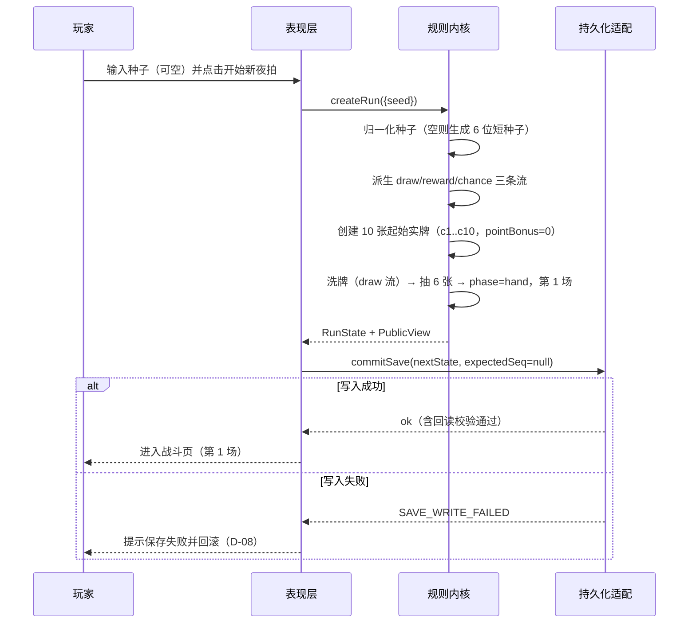
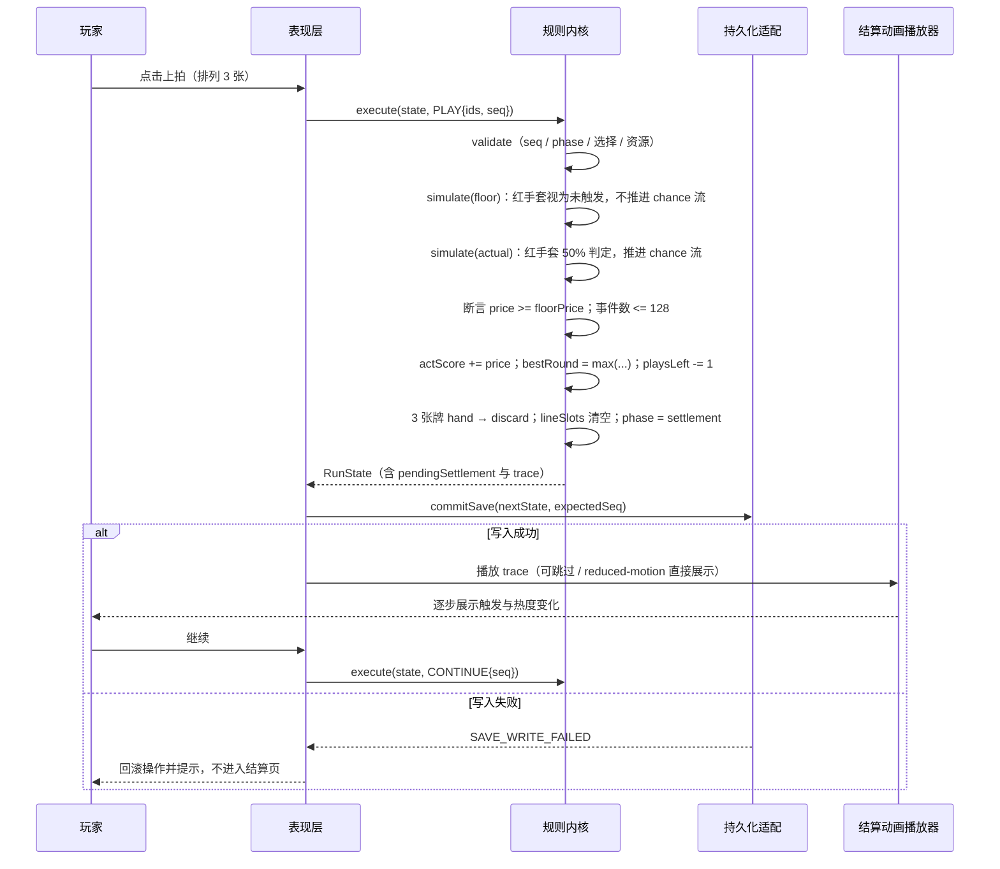
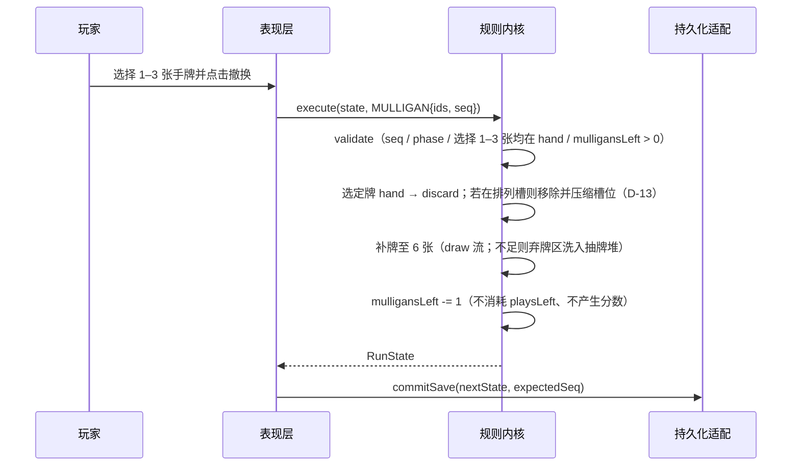
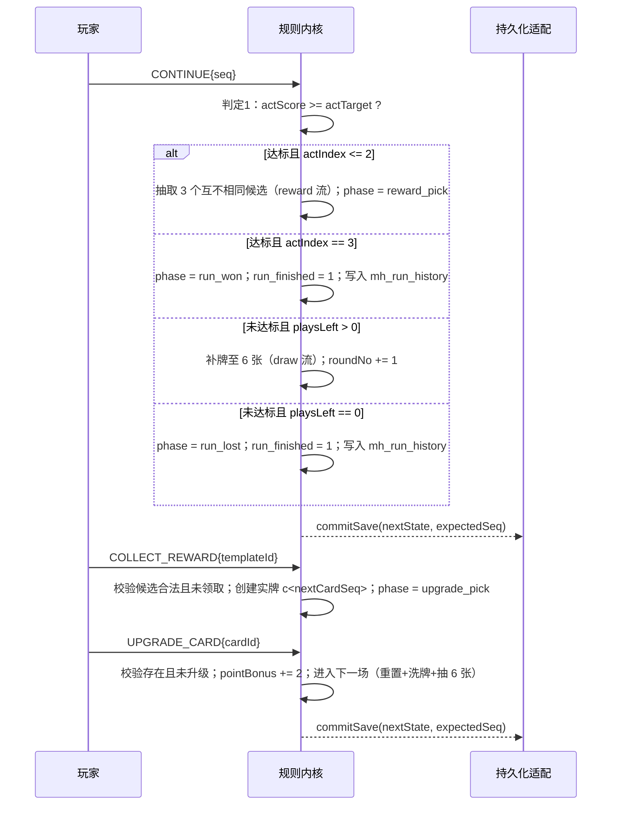
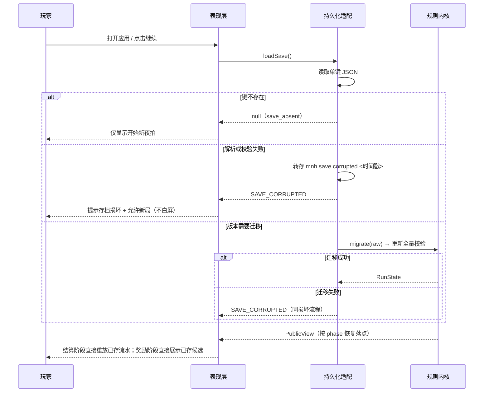
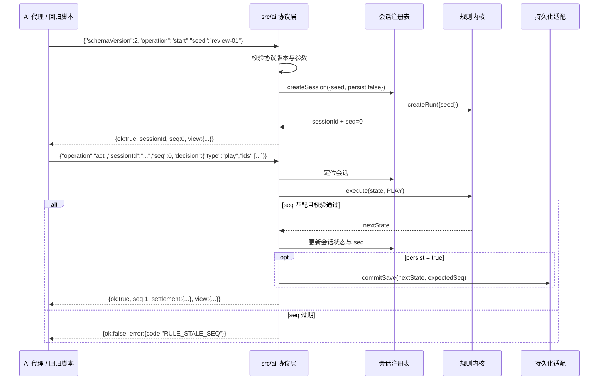

# Design: 午夜落槌 · 藏品连锁（三场卡牌肉鸽原型）

> spec 回答 What/Why，design 回答 How。标识符（REQ/NFR/API/FIELD/STATE/TASK/TC）与 `midnight-hammer-spec.md` 完全一致，不重编号。
> spec 与 design 冲突时以 spec 为准。

## 本次范围

全部 6 个模块：M1 规则内核、M2 存档与持久化、M3 本地 AI 接口与批量回归、M4 界面与交互、M5 测试与验收、M6 桌面离线壳与打包（即 PRD 全量交付范围，用户决策 U-01）。

---

# 1. 概览

## 1.1 核心链路全景

```plain
┌────────────────────────┐          ┌───────────────────────────────────────────┐
│  玩家（鼠标 / 键盘）    │          │  本地 AI 代理 / 批量回归脚本               │
└───────────┬────────────┘          └───────────────────┬───────────────────────┘
            │ 点击/操作                                │ JSON 请求（schemaVersion=2）
┌───────────▼──────────────────────────┐  ┌─────────────▼─────────────────────────┐
│  src/app/  表现层（React 18）         │  │  src/ai/  本地 AI 接口                 │
│  首页·战斗·结算·奖励·升级·通关·失败    │  │  会话注册表 · 协议编解码 · JSONL CLI    │
└───────────┬──────────────────────────┘  └─────────────┬─────────────────────────┘
            │ Command                                    │ Command
            └──────────────────┬─────────────────────────┘
                               ▼
              ┌────────────────────────────────────────────────┐
              │  src/kernel/  规则内核（纯 TypeScript，零 DOM） │
              │  随机流 · 牌区 · 触发调度 · 结算算法 · 状态机    │
              │  · 卡牌配置/能力注册表 · 视图投影 · 存档序列化   │
              └───────────────────┬────────────────────────────┘
                                  │ SaveSnapshot（单键原子写入 + 回读校验）
              ┌───────────────────▼────────────────────────────┐
              │  src/platform/  持久化适配（按载体二选一）        │
              │  LocalStorageAdapter（浏览器版唯一载体）          │
              │  SqliteAdapter（桌面壳唯一载体 · 同一份 DDL，U-07）│
              └────────────────────────────────────────────────┘
                                  ▲
              ┌───────────────────┴────────────────────────────┐
              │  src-tauri/  Tauri v2 壳（加载本地构建产物）     │
              │  单窗口 · 强制 SQLite（禁用 localStorage 存档）  │
              └────────────────────────────────────────────────┘
```

**已有能力简述**：本项目为 0→1 全新工程，无既有能力可复用（无服务端、无中间件、无既有 SDK、无设计系统）。

## 1.2 模块与项目矩阵

| 模块 | 业务 | 所属项目 | 开发 |
| --- | --- | --- | --- |
| M1 规则内核 | 确定性结算、状态机、随机流、卡牌能力 | `roguelike-card-game`（单一前端工程） | 前端（TypeScript） |
| M2 存档与持久化 | 原子快照、全量校验、迁移、并发检测 | `roguelike-card-game` | 前端 + 桌面壳工程（SQLite 适配器） |
| M3 本地 AI 接口 | 本地 JSON 协议与批量回归入口 | `roguelike-card-game` | 前端（Node CLI 入口） |
| M4 界面与交互 | 7 页面 + 2 弹窗 + 动效 | `roguelike-card-game` | 前端（React） |
| M5 测试与验收 | 单元/属性/端到端/基准测试 | `roguelike-card-game` | 测试（QA） |
| M6 桌面离线壳 | Tauri v2 打包与安全策略 | `roguelike-card-game` + `src-tauri` | 桌面壳工程 |

## 1.3 接口速览

#### M3 本地 AI 接口

| 接口 | 方法 | 说明 | 触发方 | 关联流程 |
|------|------|------|--------|----------|
| `auction.ai.start` | 本地 JSON | 创建新局并返回会话 ID 与公开视图 | 本地 AI 代理 / 回归脚本 | → 5.1 开局流程 |
| `auction.ai.observe` | 本地 JSON | 观察公开状态（不改变状态） | 本地 AI 代理 / 回归脚本 | → 5.6 AI 会话流程 |
| `auction.ai.preview` | 本地 JSON | 保底预览（不推进随机流） | 本地 AI 代理 / 回归脚本 | → 5.2 出牌与结算流程 |
| `auction.ai.act.play` | 本地 JSON | 顺序出牌并实际结算、入账 | 本地 AI 代理 / 回归脚本 | → 5.2 出牌与结算流程 |
| `auction.ai.act.mulligan` | 本地 JSON | 撤换 1–3 张手牌并补牌 | 本地 AI 代理 / 回归脚本 | → 5.3 撤换流程 |
| `auction.ai.act.continue` | 本地 JSON | 结算继续并按序判定 | 本地 AI 代理 / 回归脚本 | → 5.4 场次判定与奖励升级 |
| `auction.ai.act.collect` | 本地 JSON | 领取三选一奖励 | 本地 AI 代理 / 回归脚本 | → 5.4 场次判定与奖励升级 |
| `auction.ai.act.upgrade` | 本地 JSON | 实牌永久 +2 点并进入下一场 | 本地 AI 代理 / 回归脚本 | → 5.4 场次判定与奖励升级 |
| `auction.ai.history` | 本地 JSON | 返回结算流水历史 | 本地 AI 代理 / 回归脚本 | → 5.6 AI 会话流程 |
| `auction.ai.close` | 本地 JSON | 关闭会话（不影响存档） | 本地 AI 代理 / 回归脚本 | → 5.6 AI 会话流程 |
| `npm run ai -- --jsonl` | CLI JSONL | 批量回归入口 | 回归脚本 | → 5.6 AI 会话流程 |

#### M1 规则内核（内部契约，非对外接口）

| 接口 | 方法 | 说明 | 触发方 | 关联流程 |
|------|------|------|--------|----------|
| `createRun(input)` | 内部 | 创建新局 | 表现层 / AI 接口 | → 5.1 |
| `execute(state, command)` | 内部 | 校验 + 应用，纯函数 | 表现层 / AI 接口 | → 5.2–5.4 |
| `projectView(state)` | 内部 | 公开视图投影 | 表现层 / AI 接口 | → 5.6 |
| `simulate(ids, state, mode)` | 内部 | 保底/实际结算模拟 | 表现层 / AI 接口 | → 5.2 |
| `serialize/deserialize` | 内部 | 存档编解码与校验 | 持久化适配 | → 5.5 |

#### M2 持久化 / M4 界面 / M5 测试 / M6 打包

- M2：无对外接口（仅 `PersistenceAdapter` 内部契约）
- M4：无对外接口（消费 M1 契约）
- M5：CLI 入口 `npm test`、`npm run test:coverage`
- M6：CLI 入口 `npm run build`、`npm run tauri build`

## 1.4 对齐结论摘要

### 产品向业务约束

| 约束/决策 | 结论 | 技术影响 | 来源 |
| --- | --- | --- | --- |
| 交付范围 | 全量交付，PRD §19 全部用例通过为完成标准 | 单期实现全部 6 模块；无裁剪路径 | 用户确认 U-01 |
| 规则内核与 UI 解耦 | 内核不得依赖 DOM / 桌面壳 / 平台 API，UI 与 AI 接口共用同一规则 | 目录分层 + ESLint 依赖约束 + 内核测试在 node 环境运行 | 用户确认（PRD §18）+ 继承 |
| 确定性可复现 | 同种子 + 同操作序列 → 相同抽牌/奖励/概率结果（同一 rulesVersion 内） | 三条独立可序列化随机流随快照保存 | 用户确认（PRD §6.1、§16） |
| 保底承诺 | 实际成交价不得低于同顺序保底价 | 结算器支持 `floor`/`actual` 双模式 + 运行时断言 | 用户确认（PRD §10） |
| 存档恢复语义 | 恢复结算不重新判定概率、不重复入账 | 结算结果与入账在同一快照内提交 | 用户确认（PRD §15.3） |
| 离线与隐私 | 无网络、无个人信息采集、无大模型调用 | 无网络调用（静态检查）+ CSP + Tauri 导航拦截 | 用户确认（PRD §18） |
| 木槌计数口径（D-01） | 计数在额外触发派发时 +1；木槌读取本次触发开始前的快照（不计入自身） | 结算算法中 `countBefore` 快照位置固定；影响 `木槌→镜子→镜子` 结果（54） | **用户确认 U-06（2026-09-20）** |
| 持久化口径（D-04，按 U-07 修订） | **浏览器版 = localStorage 单键 JSON；桌面壳 = 强制 SQLite（唯一载体）** | 适配器层抽象；两载体共享 `saveSchemaVersion`、迁移链与字段映射；差异仅限 `src/platform/` | **用户确认 U-03/U-04/U-07** |

### 技术向核心决策

| 设计点 | 决策 | 技术影响 | 来源 |
| --- | --- | --- | --- |
| 随机数 | 三条独立流 `draw`/`reward`/`chance`，`hash(seed + "#<流名>")` 派生，状态可序列化 | 预览/观察零副作用；奖励候选可复现；存档可完整恢复 | Agent 默认决策 D-02 |
| 结算引擎 | 单一纯函数 `simulate(line, state, mode)` 支持双模式 | 保底与实际共用同一算法，天然保证一致；不变量可断言 | Agent 默认决策 D-03 |
| 提交模型 | 校验 → 计算 → 自检 → 落盘（含回读）→ 提交内存 | 内存与存档强一致；崩溃最坏为"操作未生效" | Agent 默认决策 D-08 |
| 并发控制 | 写入前比对存储 `op_seq` 的乐观锁 | 多标签页不静默覆盖，返回 `SAVE_CONFLICT` | Agent 默认决策 D-10 |
| 桌面壳持久化 | SQLite 单事务 + 整表替换派生表 + `op_seq` 事务内校验 + 提交后回读 | 写入原子性由事务保证；失败 `ROLLBACK`，内存不变 | **用户确认 U-07**（Spec §12.3.1、`data-model.md` §6.6） |
| 视图投影 | 白名单投影 `projectView`，UI 与 AI 共用；AI 额外排除内部字段 | 杜绝未来牌序与随机状态泄露 | 用户确认（PRD §17） |
| 能力扩展 | `CARD_TEMPLATES` 配置 + `ABILITY_REGISTRY` 注册表 | 新增卡牌不改调度器 | Agent 默认决策（PRD §9 隐含） |
| 路由 | 单入口应用壳 + `phase` 驱动 + hash 路由 | 刷新恢复以存档为准 | Agent 默认决策 D-06 |
| 动画 | 动画播放器只消费已提交流水 | 跳过/中断/刷新均不改变结果 | Agent 默认决策（PRD §13.4） |

### 技术方案选型与一致性闭环

| 核心流程 | 推荐实现路径 | 不采用的路径及原因 | 一致性/失败兜底 |
| --- | --- | --- | --- |
| 出牌结算与入账 | 同步纯函数结算（保底 + 实际）→ 结果与入账写入同一快照 → 落盘（回读校验）→ 提交内存 → 动画播放 | 不采用"先播动画后入账"（刷新会丢结果）；不采用"先改内存后异步落盘"（崩溃会内存/存档分叉） | 落盘失败 → 回滚操作 + `SAVE_WRITE_FAILED` + 重试；128 上限与保底违例 → 拒绝出牌 |
| 存档写入（浏览器版） | 单键整体覆盖（原子替换）+ 写入前 `op_seq` 乐观锁 + 写入后回读校验 | 不采用多键分片写（非原子、易半写入）；不采用 IndexedDB 事务（数据量小、复杂度收益比低） | 写失败回滚；损坏原文转存 `mnh.save.corrupted.*`；损坏不白屏 |
| 存档写入（桌面壳） | **单个 SQLite 事务**：`BEGIN IMMEDIATE` → 更新主表 → 按 `save_id` 整表替换派生表 → `COMMIT` → 提交后回读比对 | 不采用逐行 diff 子表（复杂度高且无收益）；不采用 localStorage（U-07 明确排除）；不采用异步队列（顺序错乱风险） | 事务失败 `ROLLBACK`（内存不变）+ `SAVE_WRITE_FAILED`；库文件损坏转存 `.db` 副本 |
| 随机消费 | 三条独立流；预览不消费；观察不消费 | 不采用单一全局流（抽牌会扰动概率，破坏确定性语义） | 流状态随快照同事务保存，恢复后序列一致 |
| AI 会话 | 进程内会话注册表，默认不写玩家存档；JSONL 逐行驱动 | 不采用"AI 直接操作 UI 状态"（耦合且不可测）；不采用 HTTP 服务（PRD 要求完全离线） | `seq` 过期拒绝；协议/会话错误结构化返回 |
| 桌面壳 | Tauri v2 加载本地静态产物；**强制 SQLite 为唯一持久化载体**（U-07），库文件置于应用数据目录、单窗口运行 | 不采用 Electron（体积与安全配置成本更高）；不采用远程加载（违反离线要求）；**不采用 localStorage 存档**（U-07） | 导航拦截 + CSP + SEC-08；SQLite 事务回滚；构建失败不影响浏览器版交付 |

---

# 2. 系统架构

## 2.1 分层架构

```plain
┌────────────────────────────────────────────────────────────────────────┐
│  表现层 src/app/（React 18 + CSS）                                      │
│  应用壳（phase 路由）→ 页面组件 → 展示组件（卡牌/槽位/流水/弹窗）          │
│  仅做：渲染、事件派发、动画编排、可访问性                                 │
│  禁止：任何规则判定、任何存档读写                                         │
└───────────────────────────┬────────────────────────────────────────────┘
                            │ Command / PublicView（不可变数据）
┌───────────────────────────▼────────────────────────────────────────────┐
│  规则内核 src/kernel/（纯 TypeScript）                                   │
│  ┌───────────┐ ┌───────────┐ ┌───────────┐ ┌───────────┐               │
│  │ 随机流     │ │ 牌区模型   │ │ 触发调度   │ │ 卡牌配置   │               │
│  │ rng/      │ │ zones/    │ │ engine/   │ │ cards/    │               │
│  └───────────┘ └───────────┘ └───────────┘ └───────────┘               │
│  ┌───────────┐ ┌───────────┐ ┌───────────┐ ┌───────────┐               │
│  │ 状态机     │ │ 命令校验   │ │ 视图投影   │ │ 存档契约   │               │
│  │ machine/  │ │ commands/ │ │ view/     │ │ save/     │               │
│  └───────────┘ └───────────┘ └───────────┘ └───────────┘               │
└───────────────────────────┬────────────────────────────────────────────┘
                            │ SaveSnapshot
┌───────────────────────────▼────────────────────────────────────────────┐
│  持久化 src/platform/                                                   │
│  PersistenceAdapter（接口，按载体二选一，不同时启用）                      │
│    ├─ LocalStorageAdapter（浏览器版唯一载体 · 原子单键 + 回读校验 + op_seq）│
│    └─ SqliteAdapter（桌面壳唯一载体 · 单事务 + 执行 data-model.md 第四章 DDL）│
└────────────────────────────────────────────────────────────────────────┘
```

## 2.2 关键组件设计

**触发调度器（`src/kernel/engine/`）**：以深度优先方式展开普通触发与额外触发，是全部计分语义的唯一实现处。

```plain
fire(slot, type, sourceCardId)
  ├─ 事件计数 +1 → 超过 128 抛 RULE_TRIGGER_LIMIT_EXCEEDED
  ├─ countBefore = extraCount            ← D-01 快照点（唯一）
  ├─ if type == extra: extraCount += 1
  ├─ points += cp(line[slot])            ← 贡献当前点数
  ├─ emit trigger/extra_trigger 事件
  └─ executeAbility(card, slot, countBefore)
        └─ ABILITY_REGISTRY[abilityKey](ctx)
              └─ 需要额外触发时递归调用 fire(slot-1 或 slot 0, 'extra', card.id)
```

**随机流（`src/kernel/rng/`）**：三条独立、可序列化、可快照的伪随机流。

```plain
seed ──hash("#draw")──►  draw 流  ──► 洗牌 / 抽牌 / 补牌
seed ──hash("#reward")─►  reward 流 ──► 奖励候选抽取
seed ──hash("#chance")─►  chance 流 ──► 红手套 50% 判定
状态表达：state:increment（字符串，随快照持久化）
约束：floor 模式与 observe/preview 绝不调用 next()
```

**提交管线（`src/kernel/commands/` + `src/platform/`）**：所有变更类操作的唯一入口。

```plain
Command ──► validate ──► apply(纯函数) ──► assertInvariants ──► persist ──► commit(内存)
              │              │                  │                  │
              │              │                  │                  └─ 失败 → 回滚，state 不变
              │              │                  └─ 失败 → RULE_STATE_INVARIANT_BROKEN
              │              └─ 失败 → RuleError（无副作用）
              └─ 失败 → RuleError（无副作用，随机流未推进）
```

---

# 3. 核心技术设计与扩展约束

## 3.1 设计点总览

| 设计点 | 类型 | 为什么单独设计 | 推荐实现形态 | 关联模块/流程 |
| --- | --- | --- | --- | --- |
| 确定性随机流管理 | 统一基础设施 | 抽牌/奖励/概率必须可保存、可隔离；写散会导致预览扰动抽牌、回归不可复现 | `RandomStream` 类 + 三条命名流 + 状态序列化 | M1、5.2、5.5 |
| 触发调度与能力注册表 | 强扩展点 | 12 种能力若写在调度器 `switch` 中，新增卡牌必改核心；且 128 上限与计数语义必须集中 | `TriggerScheduler` + `ABILITY_REGISTRY`（`abilityKey → ctx => void`） | M1、5.2 |
| 命令校验与规则错误码 | 横切能力 | "被拒绝的操作不得改变状态与随机序列"是全链路一致性承诺，必须统一入口 | `validate → apply → persist → commit` 管线 + `RULE_*` 错误码表 | M1、M2、5.2–5.4 |
| 存档契约与不可信输入校验 | 高敏能力 | 存档是本机可编辑文本；校验缺失会导致白屏、非法状态、结算异常 | `serialize/deserialize` + 13 项校验清单 + 迁移链 | M2、5.5 |
| 公开视图投影 | 高敏能力 | UI 与 AI 共用视图；若直接序列化内部状态会泄露未来牌序与随机状态 | 白名单投影函数 `projectView` + AI 侧二次过滤 | M1、M3、5.6 |
| 结算动画播放器 | 横切能力 | 动画若参与状态计算，会出现"刷新后结果变化"或重复入账 | 纯消费 `settlementTrace` 的播放器（可跳过/可重放） | M4、5.2 |
| 持久化适配器 | 统一基础设施 | 运行时 localStorage 与可选 SQLite 需共享同一 schema 与迁移链 | `PersistenceAdapter` 接口 + 两实现 | M2、M6、5.5 |

## 3.2 确定性随机流管理

**为什么单独设计**：确定性是本产品的第一验收口径（GOAL-003、TC-004）。若抽牌、奖励、概率共用一条流或散落调用 `Math.random()`，则"预览不改变状态""同种子可复现""恢复后概率一致"三条要求同时失效，且回归不可用。

| 组件/模式 | 职责 | 放置位置 | 调用方 | 禁止事项 |
| --- | --- | --- | --- | --- |
| `RandomStream` | 可序列化 PRNG（`next()`、`state`、`fromState()`） | `src/kernel/rng/` | 内核各模块 | 禁止在 `floor` 模式或 `observe/preview` 路径调用 `next()` |
| `deriveStreams(seed)` | 由种子派生三条命名流 | `src/kernel/rng/` | `createRun`、`deserialize` | 禁止使用非确定性熵源（短种子生成除外，见 D-14） |
| 流状态持久化 | `state:increment` 字符串随快照保存 | `src/kernel/save/` | 提交管线 | 禁止把流状态暴露到公开视图 |

**扩展方式**：
- 新增随机消费场景（如未来新增"概率型卡牌"）时，复用既有 `chance` 流并为其定义独立消费点，禁止新建隐式全局流。
- 新增随机流需同步更新：`data-model.md` 的 `rng_*` 字段、校验清单第 10 项、公开视图排除清单。

**失败与兜底**：
- 流状态格式非法 → 视为存档损坏（`SAVE_CORRUPTED`），走 §5.5 损坏流程，不尝试"修复猜测"。
- 严禁使用 `Math.random()`：ESLint 规则 `no-restricted-globals`/`no-restricted-properties` 拦截，构建期失败。

## 3.3 触发调度与能力注册表

**为什么单独设计**：结算语义是全产品价值核心（顺序触发、额外触发、热度乘数），也是回归测试的主战场。若能力实现散落在调度器或页面中，将导致：新增卡牌改动核心代码、128 上限与计数口径出现多处实现、UI 与 AI 结果不一致。

| 组件/模式 | 职责 | 放置位置 | 调用方 | 禁止事项 |
| --- | --- | --- | --- | --- |
| `CARD_TEMPLATES` | 12 个模板静态配置（ID/名称/基础点数/类别/`abilityKey`/文案） | `src/kernel/cards/` | 调度器、视图投影、AI 视图 | 禁止在表现层硬编码数值或文案 |
| `ABILITY_REGISTRY` | `abilityKey → (ctx) => void` | `src/kernel/abilities/` | `TriggerScheduler` | 禁止能力实现直接读写存档、禁止调用 `next()`（红手套除外，且必须经 `ctx.chanceStream`） |
| `TriggerScheduler` | 顺序触发 + 深度优先额外触发 + 计数 + 128 上限 + 事件发射 | `src/kernel/engine/` | `simulate` | 禁止出现 `switch(templateId)` 业务分支 |
| `SettlementContext` | 向能力暴露只读上下文（`line`、`slot`、`countBefore`、`heat`、`points`、`emit`、`chanceStream`） | `src/kernel/engine/` | 能力实现 | 禁止能力直接修改 `points`（点数只由 `fire` 贡献） |

**扩展方式**：
- 新增卡牌（同语义，如"热度 +N"）→ 仅追加 `CARD_TEMPLATES` 一条配置 + 复用既有 `abilityKey`。
- 新增能力语义 → 追加 `ABILITY_REGISTRY` 一条实现 + 新 `abilityKey`；若语义需要"向左触发"，必须通过 `ctx.fireLeft()` 复用调度器，禁止自行递归。
- 新增统计型能力（如"统计本轮触发次数"）→ 在 `SettlementContext` 增加只读字段，保持能力实现无副作用。

**失败与兜底**：
- `abilityKey` 未注册 → 抛 `RULE_STATE_INVARIANT_BROKEN`；开发/测试环境直接失败，生产环境拒绝本次出牌并提示（不产生半结算状态）。
- 事件数超 128 → 抛 `RULE_TRIGGER_LIMIT_EXCEEDED`，由命令管线转为拒绝（不消耗出牌次数）。
- 保底违例（`price < floorPrice`）→ 抛 `RULE_FLOOR_VIOLATION`，拒绝出牌并记录调试信息（视为实现缺陷）。

## 3.4 命令校验与规则错误码

**为什么单独设计**：REQ-015 要求"序号过期、阶段错误、ID 不存在、ID 重复或资源不足时拒绝操作，且被拒绝的操作不改变状态或随机序列"。这要求所有变更路径经过同一管线，否则必然出现某条分支"先改状态后校验"。

| 组件/模式 | 职责 | 放置位置 | 调用方 | 禁止事项 |
| --- | --- | --- | --- | --- |
| `validate(state, command)` | 全部前置校验（seq/phase/选择/资源/存在性） | `src/kernel/commands/` | 表现层、AI 接口 | 禁止在页面组件中重复实现校验分支 |
| `apply(state, command)` | 纯函数应用，返回新状态 | `src/kernel/commands/` | 命令管线 | 禁止修改入参；禁止副作用 |
| `RULE_ERRORS` | 错误码 → 文案/上下文映射 | `src/kernel/errors/` | 全模块 | 禁止裸字符串错误码 |
| 提交管线 | 校验 → 计算 → 自检 → 落盘 → 提交 | `src/app` 或 `src/ai` 的调用层 | 表现层、AI 接口 | 禁止跳过落盘直接提交内存 |

**扩展方式**：新增命令 = 在命令枚举、`validate`、`apply`、视图可用性表中各加一处；新增错误码 = 在 `RULE_ERRORS` 追加并在 spec §6.3 同步。

**失败与兜底**：任一环节失败 → 保持原 `state`（含随机流）不变，返回对应错误码；UI 与 AI 均只消费错误码与上下文，不做状态补偿。

## 3.5 存档契约与不可信输入校验

**为什么单独设计**：存档位于 localStorage（浏览器版）/ SQLite 库文件（桌面壳，U-07），用户可编辑、可截断、可被其他窗口或实例并发写；同时它又是"可复现性"的唯一载体（种子 + seq + 三条流状态）。校验缺失会直接导致白屏或非法状态。

| 组件/模式 | 职责 | 放置位置 | 调用方 | 禁止事项 |
| --- | --- | --- | --- | --- |
| `serialize/deserialize` | 状态 ↔ 快照互转 | `src/kernel/save/` | 持久化适配 | 禁止在快照中存入非契约字段 |
| `validateSnapshot(raw)` | 13 项结构/值域/交叉校验 | `src/kernel/save/` | 加载流程 | 禁止"校验失败仍继续加载" |
| `migrate(raw)` | 纯函数迁移链，逐级迁移后重新校验 | `src/kernel/save/` | 加载流程 | 禁止在迁移中做业务推断 |
| `PersistenceAdapter` | `load/commit` 抽象（含 `op_seq` 乐观锁与回读校验）；浏览器版 `LocalStorageAdapter` / 桌面壳 `SqliteAdapter`（U-07，按载体二选一） | `src/platform/` | 表现层、AI 接口 | 禁止静默吞掉写入异常；禁止同一载体同时启用两个适配器 |

**扩展方式**：新增字段 = 更新快照契约 + 校验清单 + `data-model.md` 字段映射；`saveSchemaVersion` 递增并注册迁移函数与单测样本。

**失败与兜底**：
- 解析/校验/迁移失败 → 转存损坏原文（浏览器版键 `mnh.save.corrupted.<时间戳>`；桌面壳库文件副本 `save.corrupted.<时间戳>.db`，各最多 3 份）→ 进入 `save_corrupted` → 首页提示 + 允许新局，不白屏。
- 写入失败（浏览器配额/隐私模式；桌面壳磁盘满/占用/只读）→ 事务或写入回滚，本次操作撤销（内存与存档一致）+ 载体对应提示 + 重试入口。
- 并发写 → `SAVE_CONFLICT` + 提示重载。

## 3.6 公开视图投影

**为什么单独设计**：PRD §17 明确"只返回公开手牌、收藏、奖励和结算，不返回未来牌序与随机状态"。UI 与 AI 共用内核，若直接在调用层序列化 `RunState`，泄露风险高且难以审查。

| 组件/模式 | 职责 | 放置位置 | 调用方 | 禁止事项 |
| --- | --- | --- | --- | --- |
| `projectView(state)` | 白名单投影公开字段 | `src/kernel/view/` | 表现层、AI 接口 | 禁止透传 `draw` 堆顺序、弃牌区顺序、`rng*`、`nextCardSeq` |
| `projectAiView(view)` | AI 侧二次过滤与字段命名 | `src/ai/` | AI 协议层 | 禁止绕过白名单直接序列化内核状态 |

**扩展方式**：新增公开字段 = 同步更新 spec §8.2 视图表 + `api-spec.md` + TC-046 断言。

**失败与兜底**：TC-046 以"白名单断言"方式测试（对比实际键集合），新增字段若未登记即测试失败。

## 3.7 结算动画播放器

**为什么单独设计**：PRD §13.4 要求"刷新后恢复相同完整结算，不重新判定概率或入账"。若动画自行计算或推进状态，刷新/跳过都会产生不一致。

| 组件/模式 | 职责 | 放置位置 | 调用方 | 禁止事项 |
| --- | --- | --- | --- | --- |
| `SettlementPlayer` | 按 `settlementTrace` 逐事件推进播放进度（纯 UI 状态） | `src/app/` | 结算页 | 禁止参与任何规则计算或随机消费 |
| 减少动效分支 | `prefers-reduced-motion` 时直接展示完整结果 | `src/app/` | 结算页 | 禁止因此改变结算数据 |
| 降级保护 | 动画异常时直接展示完整结果 | `src/app/` | 结算页 | 禁止抛出导致白屏 |

**扩展方式**：新增事件类型（如未来的新视觉反馈）→ 在事件渲染表中追加映射，不改播放器控制流。

**失败与兜底**：动画渲染异常 → try/catch 降级为静态完整结果（FR-13）；播放进度不持久化（刷新后从头播放，但数据不变）。

---

# 4. 数据模型

## 4.1 核心 ER

```plain
mh_card_template (卡牌模板 · 12 条)
        ▲ template_id
        │
mh_save_slot (存档槽 · save_id = auto)
   ├── save_id ──► mh_save_card (实牌 · card_id = c1..cN · zone/zone_order)
   ├── save_id ──► mh_save_line_slot (排列槽 · slot_index 0..2 → card_id)
   ├── save_id ──► mh_save_reward_candidate (奖励候选 · candidate_index 0..2 → template_id)
   └── save_id ──► mh_save_settlement_event (结算流水 · event_index 递增)
mh_run_history (对局历史 · run_id · seed)
```

**关联方式**：全部表间关联使用业务编码（`save_id`、`card_id`、`template_id`），**禁止物理外键**；浏览器版以 localStorage 单键 JSON 快照承载同一结构，桌面壳直接以这些表为生产 schema（U-07）；字段映射见 `data-model.md` §6，写入契约见 §6.6。

## 4.2 表结构速览

#### 配置域

| 表 | 用途 | 业务主键 | 核心字段 | 关联 |
| --- | --- | --- | --- | --- |
| `mh_card_template` | 12 种卡牌模板配置 | `template_id` | `name`、`base_points`、`category`、`ability_key`、`ability_text`、`enabled` | → `mh_save_card`、`mh_save_reward_candidate` |

#### 对局域

| 表 | 用途 | 业务主键 | 核心字段 | 关联 |
| --- | --- | --- | --- | --- |
| `mh_save_slot` | 对局主表（存档槽） | `save_id` | `seed`、`op_seq`、`phase` ★、`act_index`、`act_score`、`round_no`、`plays_left`、`mulligans_left`、`best_round`、`next_card_seq`、`rng_draw_state`/`rng_reward_state`/`rng_chance_state`、`pending_points`/`pending_heat`/`pending_price`、`floor_price`、`collected_reward` ★、`upgraded` ★、`run_finished` ★ | → `mh_save_card`、`mh_save_line_slot`、`mh_save_reward_candidate`、`mh_save_settlement_event` |
| `mh_save_card` | 实牌 | `card_id`（+`save_id`） | `template_id`、`point_bonus`、`zone` ★、`zone_order` | → `mh_save_slot`、`mh_save_line_slot` |
| `mh_save_line_slot` | 本轮排列槽 | `line_slot_id` | `slot_index`（0–2）、`card_id` | → `mh_save_card` |
| `mh_save_reward_candidate` | 奖励三选一候选 | `candidate_id` | `candidate_index`（0–2）、`template_id`、`picked` ★ | → `mh_card_template` |
| `mh_save_settlement_event` | 结算流水 | `event_id` | `act_index`、`round_no`、`event_index`、`event_type` ★、`card_id`、`slot_index`、`source_card_id`、`points_delta`、`total_points_after`、`heat_delta`、`heat_after`、`extra_count_after`、`effect_text`、`roll_success` | → `mh_save_card` |

#### 历史域

| 表 | 用途 | 业务主键 | 核心字段 | 关联 |
| --- | --- | --- | --- | --- |
| `mh_run_history` | 已结束对局统计 | `run_id` | `seed`、`rules_version`、`outcome` ★、`best_round`、`collection_size`、`final_act_index`、`finished_time` | → 通过 `seed` 关联对局 |

#### 已有表（不改造，仅关联）

无（全新项目，无既有表）。

## 4.3 查询与索引评估

> 桌面壳强制以 SQLite 为唯一载体（U-07），故以下索引即**生产索引**；浏览器版走 localStorage 单键 JSON（无 SQL 查询），不涉及索引。索引按实际访问场景评估，遵循最小索引原则。

| 表 | 业务查询场景 | 查询/排序字段 | 索引结论 | 必要性 |
| --- | --- | --- | --- | --- |
| `mh_save_slot` | 按 `save_id` 读取唯一存档（每次加载/提交） | `save_id` | 复用 `UNIQUE(save_id)` | 唯一约束即访问路径，无需额外索引 |
| `mh_save_slot` | 规范强制的 `create_time` 索引 | `create_time` | 复用 `idx_mh_save_slot_createtime` | `ddl-conventions.md` 强制项（索引名按 SQLite 库级唯一约束前缀化，见 `data-model.md` §1.3） |
| `mh_save_card` | 按存档读取全部实牌并按牌区恢复顺序 | `save_id`、`zone` | 新增 `idx_saveid_zone`（`save_id, zone`） | 每次加载/恢复都按牌区取牌，业务必需 |
| `mh_save_card` | 按 `card_id` 定位实牌（出牌/升级/撤换） | `save_id`、`card_id` | 复用 `UNIQUE(save_id, card_id)` | 唯一约束即访问路径 |
| `mh_save_line_slot` | 按存档读取排列槽 | `save_id`、`slot_index` | 复用 `UNIQUE(save_id, slot_index)` | 唯一约束即访问路径 |
| `mh_save_reward_candidate` | 按存档读取 3 个候选 | `save_id`、`candidate_index` | 复用 `UNIQUE(save_id, candidate_index)` | 唯一约束即访问路径 |
| `mh_save_settlement_event` | 按存档+场次+轮次读取流水并顺序回放 | `save_id`、`act_index`、`round_no`、`event_index` | 新增 `idx_saveid_actindex_roundno`（`save_id, act_index, round_no`） | 结算页与 AI `history` 按轮次取流水，业务必需；`event_index` 已含在唯一约束中 |
| `mh_run_history` | 按种子查询历史对局（回归比对） | `seed` | 新增 `idx_seed`（`seed`） | 回归按种子比对，业务必需 |
| 全部表 | 规范强制的 `create_time` 索引 | `create_time` | `idx_<表名>_createtime`（每表一个） | `ddl-conventions.md` 强制项；SQLite 索引名库级唯一，故加表名前缀（见 `data-model.md` §1.3） |

**新增索引清单**：
- `idx_saveid_zone` ON `mh_save_card` (`save_id`, `zone`)
- `idx_saveid_actindex_roundno` ON `mh_save_settlement_event` (`save_id`, `act_index`, `round_no`)
- `idx_seed` ON `mh_run_history` (`seed`)
- 各表 `idx_<表名>_createtime`（规范强制，SQLite 下需库级唯一命名）

> 除上述索引外不新增任何索引（无预防性优化）；localStorage 路径不涉及索引。

## 4.4 核心状态机

### 4.4.1 对局阶段状态机（`phase`）

```plain
        ┌──────────────────────────────────────────┐
        │                                          │
 [home] ─► hand ──上拍──► settlement ──继续──┬─► hand（下一轮，补牌）
              ▲  ▲                            ├─► reward_pick ──领取──► upgrade_pick ──► hand（下一场）
              │  └──撤换（同轮）               ├─► run_won（第 3 场达标）
              │                               └─► run_lost（次数耗尽未达标）
              └──────────── run_won / run_lost ──随机开始新局
```

#### 状态流转明细（含触发过程 + 接口关联）

**从 `home` 出发**

| 目标状态 | 触发场景 | 触发入口 | 关联流程 | 前置条件 |
|----------|----------|----------|----------|----------|
| → `hand` | 玩家开始新局 | 首页"开始新夜拍" — **复用：`auction.ai.start` / `createRun`** | → 5.1 | 种子长度 ≤ 100；有存档时二次确认 |
| → `hand` | 玩家继续存档 | 首页"继续" — **复用：`loadSave`** | → 5.5 | 存档通过全量校验 |

**从 `hand` 出发**

| 目标状态 | 触发场景 | 触发入口 | 关联流程 | 前置条件 |
|----------|----------|----------|----------|----------|
| → `hand` | 排列编辑（选择/移动/移除/清空） | 战斗页槽位 — **内部：`SET_LINE`** | → 5.2 | `phase = hand` |
| → `hand` | 撤换 | 战斗页"撤换" — **复用：`auction.ai.act.mulligan`** | → 5.3 | 选择 1–3 张手牌；`mulligansLeft > 0` |
| → `settlement` | 上拍 | 战斗页"上拍" — **复用：`auction.ai.act.play`** | → 5.2 | 排列 3 张；`playsLeft > 0`；事件数 ≤ 128 |

**从 `settlement` 出发**

| 目标状态 | 触发场景 | 触发入口 | 关联流程 | 前置条件 |
|----------|----------|----------|----------|----------|
| → `hand` | 未达标且仍有出牌次数 | 结算页"继续" — **复用：`auction.ai.act.continue`** | → 5.4 | `actScore < actTarget` 且 `playsLeft > 0` |
| → `reward_pick` | 第 1/2 场达标 | 结算页"继续" — **复用：`auction.ai.act.continue`** | → 5.4 | `actScore ≥ actTarget` 且 `actIndex ∈ {1,2}` |
| → `run_won` | 第 3 场达标 | 结算页"继续" — **复用：`auction.ai.act.continue`** | → 5.4 | `actScore ≥ actTarget` 且 `actIndex = 3` |
| → `run_lost` | 次数耗尽且未达标 | 结算页"继续" — **复用：`auction.ai.act.continue`** | → 5.4 | `actScore < actTarget` 且 `playsLeft = 0` |

**从 `reward_pick` 出发**

| 目标状态 | 触发场景 | 触发入口 | 关联流程 | 前置条件 |
|----------|----------|----------|----------|----------|
| → `upgrade_pick` | 领取 1 个候选模板 | 奖励页选择 — **复用：`auction.ai.act.collect`** | → 5.4 | `templateId ∈ rewardCandidates` 且未领取 |

**从 `upgrade_pick` 出发**

| 目标状态 | 触发场景 | 触发入口 | 关联流程 | 前置条件 |
|----------|----------|----------|----------|----------|
| → `hand` | 选择 1 张实牌 +2 点 | 升级页选择 — **复用：`auction.ai.act.upgrade`** | → 5.4 | `cardId` 存在于收藏且本场未升级 |

**从 `run_won` / `run_lost` 出发**

| 目标状态 | 触发场景 | 触发入口 | 关联流程 | 前置条件 |
|----------|----------|----------|----------|----------|
| → `hand` | 随机开始新局 | 结果页"随机开始新局" — **复用：`createRun`（随机短种子）** | → 5.1 | 无 |
| → `home` | 返回首页 | 结果页"返回首页" — **内部：`BACK_HOME`** | — | 无 |

#### 对局阶段状态机 → 需开发接口清单

| 需开发接口 | 职责 | 驱动的状态流转 | 触发方 |
|-----------|------|---------------|--------|
| **`auction.ai.start` / `createRun`** | 创建新局并初始化随机流与收藏 | `home → hand` | 玩家 / AI 代理 |
| **`auction.ai.act.play`** | 结算并入账 | `hand → settlement` | 玩家 / AI 代理 |
| **`auction.ai.act.mulligan`** | 撤换补牌 | `hand → hand` | 玩家 / AI 代理 |
| **`auction.ai.act.continue`** | 判定并推进 | `settlement → hand/reward_pick/run_won/run_lost` | 玩家 / AI 代理 |
| **`auction.ai.act.collect`** | 领取奖励 | `reward_pick → upgrade_pick` | 玩家 / AI 代理 |
| **`auction.ai.act.upgrade`** | 升级并进入下一场 | `upgrade_pick → hand` | 玩家 / AI 代理 |
| **`loadSave` / `commitSave`** | 存档加载与原子提交 | `save_* → save_*` | 表现层 / AI 代理 |

### 4.4.2 存档状态机

```plain
[首次启动] ─► save_absent ──创建新局──► save_valid ──每次提交──► save_valid
                                              │
                                       解析/校验失败
                                              ▼
                                        save_corrupted ──开始新局──► save_valid
```

| 当前状态 | 触发事件 | 目标状态 | 说明 |
| --- | --- | --- | --- |
| `save_absent` | 创建新局 | `save_valid` | 首次运行或存档被清除 |
| `save_valid` | 任一命令提交 | `save_valid` | 覆盖写 + `op_seq` 递增 |
| `save_valid` | 读取解析/校验/迁移失败 | `save_corrupted` | 转存原文，进入损坏流程 |
| `save_valid` | 存储 `op_seq` ≠ 内存 `opSeq` | 保持 `save_valid` | 拒绝本次写入（`SAVE_CONFLICT`） |
| `save_corrupted` | 玩家开始新局 | `save_valid` | 覆盖主键 |

## 4.5 关键设计约定

| 约定 | 说明 |
| --- | --- |
| 枚举语义 | 快照 JSON 使用语义枚举（`hand`/`draw`/`discard`、`trigger`/`extra_trigger`/`heat`/`roll`），SQLite 使用数值枚举（注释列明取值）；转换在内核 `save/` 层完成 |
| 结算与入账原子性 | `pendingPrice`/`pendingPoints`/`pendingHeat`/`floorPrice` 与 `actScore` 在同一快照内提交 |
| 流水可回放 | 每条事件携带 `totalPointsAfter`/`heatAfter`/`extraCountAfter`，播放器与 AI `history` 无需重算 |
| 索引最小化 | 仅保留唯一约束、规范强制的 `idx_<表名>_createtime` 与 3 个业务必需索引（§4.3） |
| 软删除 | 记录可逻辑删除的业务表（`mh_save_slot`、`mh_save_card`）使用 `is_del INTEGER NOT NULL DEFAULT 0`（`0=未删除，1=已删除`）；整体重建的派生表与只插不改的追加型表不加 `is_del`（见 `data-model.md` §1.3 适用范围）；运行时快照不含该字段（单槽固定 `auto`） |
| 无物理外键 | 全部关联以业务编码表达，禁止 `FOREIGN KEY` |

---

# 5. 核心流程

## 5.1 开局流程



#### 技术实现路径

| 环节 | 实现路径 | 选择理由 | 一致性/兜底 |
| --- | --- | --- | --- |
| 开局创建 | 同步纯函数 + 单键快照落盘 | 数据量小、无外部依赖；同步即可保证一致性 | 落盘失败回滚；无半写入风险 |
| 随机初始化 | 三条流由种子派生并随快照保存 | 保证可复现与流隔离 | 流状态非法视为存档损坏 |
| 短种子生成 | 平台密码学随机源 | 不占用游戏随机流，保持确定性语义（D-14） | 生成后立即随快照保存，保证可复现 |

#### 操作步骤

**Step 1 · 种子校验与归一化**

| 校验项 | 通过 | 不通过 |
|--------|------|--------|
| 去首尾空白后长度 ≤ 100 | 继续 | 返回 `RULE_INVALID_SEED`，不改变状态 |
| 去首尾空白后非空 | 使用该种子 | 生成 6 位 `A-Z0-9` 短种子 |

**Step 2 · 初始化对局状态** `事务: 单快照提交`

- `INSERT` **mh_save_slot**（快照 `saveId = auto`）

| 字段 | 值 | 说明 |
|------|---|------|
| `save_id` | `auto` | 单槽 |
| `seed` | 归一化后的种子 | 1–100 字符 |
| `op_seq` | `0` | 首个变更操作携带 0 |
| `phase` | `1`（hand） | 直接进入第 1 场 |
| `act_index` | `1` | 开门试拍 |
| `plays_left` / `mulligans_left` | `4` / `2` | 场次资源 |
| `next_card_seq` | `11` | 下一个实牌序号 |
| `rng_draw_state` / `rng_reward_state` / `rng_chance_state` | 派生后的流状态 | `state:increment` |
| `run_finished` | `0` | 进行中 |

- `INSERT` **mh_save_card** × 10（快照 `collection[]`）：`card_id = c1..c10`、`template_id` 按起始收藏配置、`point_bonus = 0`、`zone = 2`（hand，抽中的 6 张）/ `zone = 1`（draw，剩余 4 张）、`zone_order` 按洗牌结果

> 事务异常：序列化/写入/回读任一失败 → 内存状态丢弃，返回 `SAVE_WRITE_FAILED`，不进入战斗页。

## 5.2 出牌与结算流程



#### 技术实现路径

| 环节 | 实现路径 | 选择理由 | 一致性/兜底 |
| --- | --- | --- | --- |
| 保底计算 | 纯函数 `simulate(floor)`，不消费随机流 | 预览必须零副作用 | 与 actual 共用算法，保证同口径 |
| 实际结算 | 纯函数 `simulate(actual)`，消费 `chance` 流 | 概率结果需可保存、可复现 | 流状态随快照提交 |
| 入账与落盘 | 结算结果与 `actScore` 写入同一快照后落盘 | 避免"刷新后重复入账/丢流水" | 落盘失败 → 整体回滚 |
| 动画播放 | 播放器只消费已提交 `trace` | 动画不得成为状态真相源 | 跳过/刷新/异常降级均不改变结果 |

#### 操作步骤

**Step 1 · 参数与阶段校验**

| 校验项 | 通过 | 不通过 |
|--------|------|--------|
| `seq` = 当前序号 | 继续 | 返回 `RULE_STALE_SEQ`，状态与随机流不变 |
| `phase = hand` | 继续 | 返回 `RULE_INVALID_PHASE` |
| `ids` 恰好 3 个、互不相同、全部在 `hand` | 继续 | 返回 `RULE_INVALID_SELECTION` |
| `playsLeft > 0` | 继续 | 返回 `RULE_RESOURCE_EXHAUSTED` |

**Step 2 · 双模式结算（无外部调用）**

| 结果 | 处理 |
|------|------|
| 事件数 ≤ 128 且 `price ≥ floorPrice` | 继续入账 |
| 事件数 > 128 | 返回 `RULE_TRIGGER_LIMIT_EXCEEDED`，不改变状态、不消耗次数 |
| `price < floorPrice` | 返回 `RULE_FLOOR_VIOLATION`，不改变状态，记录缺陷上下文 |

**Step 3 · 入账与状态提交** `事务: 单快照提交`

- `UPDATE` **mh_save_slot** SET `act_score = act_score + price`、`best_round = max(best_round, price)`、`plays_left = plays_left - 1`、`pending_points/pending_heat/pending_price/floor_price`、`phase = 2`、`op_seq = op_seq + 1`

| 字段 | 值 | 说明 |
|------|---|------|
| `act_score` | 旧值 + `price` | 每轮仅入账一次 |
| `best_round` | `max(旧值, price)` | 本局最高单轮 |
| `plays_left` | 旧值 − 1 | 消耗 1 次 |
| `pending_price` / `pending_points` / `pending_heat` | 本次结算结果 | 供结算页与恢复 |
| `floor_price` | 本次保底价 | 不变量基准 |
| `phase` | `2`（settlement） | — |

- `UPDATE` **mh_save_card** SET `zone = 3`（discard）、`zone_order = ...` WHERE `card_id IN (ids)`
- `INSERT` **mh_save_settlement_event** × N（快照 `pendingSettlement.trace`）
- `DELETE` **mh_save_line_slot**（快照 `lineSlots = []`）

> 事务异常：任一写入失败或回读不一致 → 内存状态回滚为结算前状态，返回 `SAVE_WRITE_FAILED`；本次出牌不计入 `actScore`、不消耗 `playsLeft`。

## 5.3 撤换流程



#### 技术实现路径

| 环节 | 实现路径 | 选择理由 | 一致性/兜底 |
| --- | --- | --- | --- |
| 撤换 | 同步命令 + 单快照落盘 | 逻辑简单、无外部依赖 | 落盘失败回滚，撤换次数不消耗 |
| 补牌 | `draw` 流；不足时洗弃牌区 | 与开局抽牌同源，保证可复现 | 弃牌区也空则保持当前手牌数 |

#### 操作步骤

**Step 1 · 校验**

| 校验项 | 通过 | 不通过 |
|--------|------|--------|
| `seq` = 当前序号 | 继续 | `RULE_STALE_SEQ` |
| `phase = hand` | 继续 | `RULE_INVALID_PHASE` |
| `ids` 数量 1–3、互不相同、均在 `hand` | 继续 | `RULE_INVALID_MULLIGAN` |
| `mulligansLeft > 0` | 继续 | `RULE_RESOURCE_EXHAUSTED` |

**Step 2 · 状态变更** `事务: 单快照提交`

- `UPDATE` **mh_save_card** SET `zone = 3`（discard）WHERE `card_id IN (ids)`
- `DELETE` **mh_save_line_slot** WHERE `card_id IN (ids)`（其余槽位保持相对顺序）
- `UPDATE` **mh_save_card** SET `zone = 2`（hand）、`zone_order = ...`（补牌结果，消费 `draw` 流）
- `UPDATE` **mh_save_slot** SET `mulligans_left = mulligans_left - 1`、`op_seq = op_seq + 1`

> 事务异常：回滚，`mulligansLeft` 不消耗。

## 5.4 场次判定与奖励升级流程



#### 技术实现路径

| 环节 | 实现路径 | 选择理由 | 一致性/兜底 |
| --- | --- | --- | --- |
| 判定 | 同步纯函数，严格按序（达标优先于次数耗尽） | 避免"最后一轮达标被误判失败" | 单测 TC-036 锁定边界 |
| 奖励抽取 | `reward` 流，3 个互不相同模板 | 与抽牌隔离，保证候选可复现 | 领取由 `phase` + `collectedReward` 双重保护 |
| 升级 | 同步命令，`pointBonus += 2` | 立即影响后续点数条件 | 由 `phase` + `upgraded` 双重保护 |
| 下一场重置 | 全量洗牌 + 抽 6 张 + 资源重置 | PRD §6.2 要求 | 单快照提交 |

#### 操作步骤

**Step 1 · 结算继续判定**

| 校验项 | 通过 | 不通过 |
|--------|------|--------|
| `phase = settlement` | 继续 | `RULE_INVALID_PHASE` |
| `seq` = 当前序号 | 继续 | `RULE_STALE_SEQ` |

**Step 2 · 分支处理**

| 分支 | 条件 | 处理 |
|------|------|------|
| 下一轮 | `actScore < actTarget` 且 `playsLeft > 0` | 补牌至 6 张、`roundNo += 1`、`phase = hand` |
| 奖励 | `actScore ≥ actTarget` 且 `actIndex ∈ {1,2}` | `rewardCandidates` = 3 个不同模板、`collectedReward = 0`、`phase = reward_pick` |
| 通关 | `actScore ≥ actTarget` 且 `actIndex = 3` | `phase = run_won`、`run_finished = 1`、写 `mh_run_history` |
| 失败 | `actScore < actTarget` 且 `playsLeft = 0` | `phase = run_lost`、`run_finished = 1`、写 `mh_run_history` |

**Step 3 · 奖励与升级** `事务: 各一次单快照提交`

- `INSERT` **mh_save_card**（领取奖励）：`card_id = c<next_card_seq>`、`template_id` = 选中候选、`point_bonus = 0`、`zone = 1`（draw，等待下一场洗牌）
- `UPDATE` **mh_save_slot** SET `next_card_seq += 1`、`collected_reward = 1`、`phase = 4`
- `UPDATE` **mh_save_card** SET `point_bonus = point_bonus + 2`（升级目标）
- `UPDATE` **mh_save_slot** SET `upgraded = 1`、`act_index += 1`、`act_score = 0`、`round_no = 1`、`plays_left = 4`、`mulligans_left = 2`、`collected_reward = 0`、`upgraded = 0`、`phase = 1`
- `UPDATE` **mh_save_card** SET `zone/zone_order`（全部洗入抽牌堆后抽 6 张）

> 事务异常：回滚；重复领取/重复升级被 `phase` 校验拒绝。

## 5.5 存档恢复流程



#### 技术实现路径

| 环节 | 实现路径 | 选择理由 | 一致性/兜底 |
| --- | --- | --- | --- |
| 读取与校验 | 同步读取 + 13 项校验 | 数据量小；同步即可 | 失败走损坏流程，不尝试修复 |
| 迁移 | 纯函数迁移链 | 结构转换与业务逻辑分离 | 迁移后重新全量校验 |
| 恢复落点 | 由 `phase` 决定 | URL 不作状态真相源（D-06） | 结算阶段重放已存流水，不重判概率 |
| 并发 | 提交时 `op_seq` 比对 | 多标签页保护 | `SAVE_CONFLICT` + 提示重载 |

#### 操作步骤

**Step 1 · 读取与解析**

| 校验项 | 通过 | 不通过 |
|--------|------|--------|
| 键存在且 JSON 可解析 | 继续 | `save_absent`（键不存在）/ `SAVE_CORRUPTED`（解析失败） |

**Step 2 · 版本与迁移**

| 校验项 | 通过 | 不通过 |
|--------|------|--------|
| `saveSchemaVersion` = 当前 | 直接校验 | 低于当前且有迁移链 → 迁移后重新校验 |
| 版本高于当前 | — | `SAVE_CORRUPTED`（提示来自更高版本） |

**Step 3 · 全量校验与恢复** `事务: 只读，无写入`

- 校验项：`data-model.md` §6.4 的 13 项（结构、类型、值域、ID 唯一、牌区并集、`lineSlots ⊆ hand`、随机流格式、`price = points × heat` 等）
- 恢复落点：`hand` → 战斗页；`settlement` → 结算页（重放 `trace`）；`reward_pick` → 奖励页（沿用已存候选）；`upgrade_pick` → 升级页；`run_won`/`run_lost` → 结果页

> 事务异常：校验失败 → 转存原文并进入 `save_corrupted`；主键不主动删除。

## 5.6 本地 AI 会话流程



#### 技术实现路径

| 环节 | 实现路径 | 选择理由 | 一致性/兜底 |
| --- | --- | --- | --- |
| 会话管理 | 进程内注册表（内存 + 可选独立键） | 回归不应污染玩家存档（D-05） | 会话缺失返回 `SESSION_NOT_FOUND` |
| 协议编解码 | 同步 JSON 编解码 + 版本校验 | 本地无网络，无需异步 | 版本/参数错误结构化返回 |
| 公开视图 | 白名单投影 + AI 二次过滤 | 防止泄露未来牌序与随机状态 | TC-046 键集合断言 |
| 批量回归 | JSONL 逐行处理，同一进程保持会话 | 便于脚本驱动与结果比对 | 退出码 0/1/2 |

#### 操作步骤

**Step 1 · 协议校验**

| 校验项 | 通过 | 不通过 |
|--------|------|--------|
| `schemaVersion = 2` | 继续 | `PROTOCOL_VERSION_UNSUPPORTED` |
| `operation` 已知 | 继续 | `PROTOCOL_VERSION_UNSUPPORTED`（未知操作） |
| 变更类操作携带 `sessionId` + `seq` | 继续 | `SESSION_NOT_FOUND` / `RULE_STALE_SEQ` |

**Step 2 · 命令执行与视图返回**

- 复用内核 `execute` / `projectView`，不新增任何规则实现
- `preview` / `observe` / `history` 为只读路径，不推进随机流、不写存档

> 事务异常：`persist = true` 时落盘失败 → 回滚会话状态，返回 `SAVE_WRITE_FAILED`。

---

# 6. 关键风险与应对

| # | 风险 | 概率 | 影响 | 应对 |
| --- | --- | --- | --- | --- |
| R1 | D-01 木槌计数口径与策划预期不一致（54 vs 90） | 低 | 中 | **已关闭**：用户确认 U-06 采纳"不计入自身"（54）；TC-006 锁定该口径 |
| R2 | 双载体实现分叉（浏览器 localStorage 与桌面壳 SQLite 行为不一致） | 中 | 中 | **已定调（U-07）**：两载体共享同一 `saveSchemaVersion`、迁移链与字段映射；TC-054（双载体快照往返等价）作防分叉门禁；差异仅限 `src/platform/` |
| R3 | 数值曲线不可达（150/260/420 在 4 轮内） | 中 | 中 | 场次目标与卡牌点数全部配置化；调参不改结构；可用 AI 批量回归快速试算 |
| R4 | 红手套递归导致结算耗时或事件膨胀 | 低 | 低 | 128 事件上限 + 能力只向左触发（链深有界）+ 性能基准 TC（< 16 ms） |
| R5 | 多标签页并发写丢失进度 | 中 | 中 | `op_seq` 乐观锁 + `SAVE_CONFLICT` + 提示重载 |
| R6 | 存档写入失败（浏览器 localStorage 被禁用/配额不足；桌面壳磁盘满/库文件被占用或只读） | 低 | 中 | 回滚 + 载体对应提示 + 重试入口；桌面壳由单事务保证不半写；不静默失败 |
| R7 | 存档被外部篡改导致白屏或非法状态 | 低 | 中 | 13 项全量校验 + 损坏流程（保留原文、允许新局） |
| R8 | 动画层兼容问题 | 低 | 低 | try/catch 降级为静态结果展示；`prefers-reduced-motion` 支持 |
| R9 | 界面层意外写入规则判定导致 UI/AI 结果分叉 | 低 | 高 | 目录分层 + ESLint 依赖约束 + TC-071 评审检查 |
| R10 | 规则版本升级后旧存档结算口径变化 | 低 | 低 | 存档记录 `rulesVersion`；§17.3 提示版本变化；可复现性声明限定同版本 |
| R11 | 桌面壳工具链（Rust / SQLite 插件）在交付环境不可用 | 中 | 低 | M6 收尾且可后置；浏览器版与内核交付不受影响（PRE-04） |
| R15 | `SqliteAdapter` 实现复杂度（事务、整表替换、枚举转换、迁移、回读）推高 M2/M6 工作量 | 中 | 中 | 契约已固化（Spec §12.3.1、`data-model.md` §6.6）；DDL 已实测可执行；TC-051–TC-054 覆盖；适配器只依赖内核序列化契约，不侵入内核 |

## 6.1 已知不可规避风险

| # | 风险场景 | 后果 | 原因 |
| --- | --- | --- | --- |
| R12 | 用户手动编辑 localStorage 存档（例如把 `point_bonus` 改成极大值） | 通过校验后游戏会以被篡改的数值继续运行 | 单机离线、无服务端校验，存档必然对玩家可写；本项目只保证"不崩溃、不白屏、不越界"，不保证"防作弊"（PRD 未要求反作弊） |
| R13 | 浏览器与桌面壳存档不互通 | 同一玩家在两个环境进度独立 | 两者载体相互独立（localStorage 键 vs 本地 SQLite 库文件），PRD 未要求互通（NG-010） |
| R14 | 清除浏览器数据导致进度丢失 | 进度不可恢复 | 本地单机无云端备份，PRD 未要求云存档 |

> 风险根因总结：本产品为完全离线单机应用，持久化与随机状态都在客户端，因此"防篡改""跨环境同步""云端备份"不在设计目标内；设计目标聚焦于**确定性、可恢复、不崩溃**三项。

---

> 基于：《午夜落槌 · 藏品连锁》从0到1产品需求文档（2026-09-20）；`../midnight-hammer-spec.md`；`../data-model.md`；`../task-split/task.md`；`../task-split/decision-log.md`；用户 Human In Loop 决策 U-01–U-09（第 2 轮：U-06 木槌口径、U-07 桌面壳强制 SQLite、U-08 规则弹窗范围、U-09 编码授权）。
